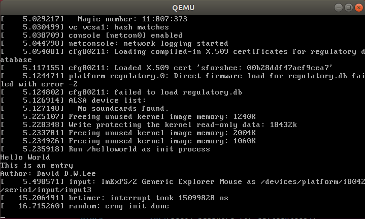

# Kernel Debug

* [Kernel Programming - Debug Tools](../../Notes/KernelProgramming#Debug-Tools)

## Install Tools

### qemu - x86 Emulation

> A fast and popular x86 platform and CPU emulator.

This program is used to *simulate hardware*. Since in the old school way we need to use two machine to use `kgdb` debug kernel.

```sh
sudo apt-get install qemu
```

* [QEMU - User Manual](https://wiki.qemu.org/Qemu-doc.html)

Another option is [**Bochs**](http://bochs.sourceforge.net/) - A more mature, but quirkier and much slower x86 emulator. Bochs is generally a more faithful emulator of real hardware than QEMU.

* [Bochs - User Manual](http://bochs.sourceforge.net/doc/docbook/user/index.html)
* [Bochs - Debugger Reference](http://bochs.sourceforge.net/doc/docbook/user/internal-debugger.html)

#### Some notes for debug

```sh
$ man qemu-system-x86_64

$ qemu-system-x86_64 -h
```

### busybox

This program is used to make a *disk image*.

> I'm using version 1.30.1 here.

1. Download from [busybox official website](https://www.busybox.net/)
   * `wget https://www.busybox.net/downloads/busybox-1.30.1.tar.bz2`
2. Unpack the compressed file
   * `tar jxf busybox-1.30.1.tar.bz2`
3. cd `busybox-1.30.1`
4. Use `make menuconfig` to configure
   * Make sure `Build static binary (no shared libs)` option is on
      1. In `Settings  --->` (at the top)
      2. Find `Build static binary (no shared libs)` (right under `---BuildOptions`)
      3. Press Y to select (N is disselect)
      4. Save & Exit
5. `make` and then `sudo make install`

* `busybox` executable will be right under the directory
* and a `_install` folder

### ddd (optional)

DDD (Data Display Degubber)

> GUI gdb

```sh
sudo apt-get install ddd
```

* [Official website](https://www.gnu.org/software/ddd/)
* [wiki - Data Display Debugger](https://en.wikipedia.org/wiki/Data_Display_Debugger)

## Setup Things Together

The experiment directory use `~/kDebug` here.

### Compile Kernel with KGDB support

> In this part we don't need to `make install` as Week0 did.
> But if you don't have `/boot/initrd.img-4.19.23` already,
> ~~you have to do it after step 3~~
> you can use [`mkinitramfs`](../../Subject/Week0_CompileLinuxKernel/CompileLinuxKernel.md#mkinitrd-/-mkinitramfs) to build the initial ramdisk image!

> Use `make tinyconfig` as `.config` template won't work (In my case `vmlinux` will be only 34MB)

1. Go to directory of the Linux 4.19.23 kernel source code
2. Use `make menuconfig` to configure (I recommend run `make x86_64_defconfig` first.)
   * Make sure KGDB option is on
      1. In `Kernel hacking  --->` (at the bottom)
      2. Find `KGDB: kernel debugger` (about in the middle) and turn it on
   * And so does `debug info`
      1. In `Kernel hacking  --->`
      2. `Compile-time checks and compiler options`
      3. Enable `Compile the kernel with debug info`
3. Compile it with `make -j4`
4. Copy `bzImage`, `vmlinux`, `initrd.img-4.19.23` into experiment directory
   * `cp vmlinux arch/x86/boot/bzImage /boot/initrd.img-4.19.23 ~/kDebug`

### Make a disk image file system with Busybox

1. Create a file in the experiment directory named `busybox.img` with size *100MB*.
    ```txt
    $ dd if=/dev/zero of=./busybox.img bs=1M count=100
    100+0 records in
    100+0 records out
    104857600 bytes (105 MB, 100 MiB) copied, 0.357913 s, 293 MB/s
    ```
   ([wiki - `/dev/zero`](https://en.wikipedia.org/wiki//dev/zero))
2. Format it to *ext3*
    ```txt
    $ mkfs.ext3 busybox.img
    mke2fs 1.44.1 (24-Mar-2018)
    Discarding device blocks: done
    Creating filesystem with 102400 1k blocks and 25688 inodes
    Filesystem UUID: b158828a-2bc7-4c31-95c9-b1789a0de2ca
    Superblock backups stored on blocks:
        8193, 24577, 40961, 57345, 73729

    Allocating group tables: done
    Writing inode tables: done
    Creating journal (4096 blocks): done
    Writing superblocks and filesystem accounting information: done
    ```
3. Mount this virtual disk image to local file system (in order to access it like accessing local documents)
    ```sh
    sudo mkdir /mnt/disk
    sudo mount -o loop ./busybox.img /mnt/disk
    ```
   * `mount -o`: specify file system
   * [Loop Device](https://en.wikipedia.org/wiki/Loop_device): generally provides an interface to access a file as a file-system
4. Copy generated busybox files into `/mnt/disk` file
    ```sh
    sudo cp -rf path/to/busybox-1.30.1/_install/* /mnt/disk
    ```
5. Create file system diretory
    ```sh
    cd /mnt/disk
    sudo mkdir dev sys proc etc lib mnt
    ```
6. Create `rcS` file under `init.d` folder
    ```sh
    sudo mkdir etc/init.d
    sudo touch etc/init.d/rcS
    ```
7. Paste the following content into `rcS` file
    ```sh
    #! /bin/sh
    /bin/mount -a
    /bin/mount -t sysfs sysfs /sys
    /bin/mount -t tmpfs tmpfs /dev
    # Add device in virtual machine environment dynamically
    /sbin/mdev -s
    ```
8. Add execute permission on `rcS`
    ```sh
    sudo chmod +x etc/init.d/rcS
    ```
9. Then we can unmount the disk (don't forget to exit the disk first)
    ```sh
    sudo umount /mnt/disk
    ```

---

### Checkpoint: Content in experiment workdir

* `vmlinux`:
  * from `linux-4.19.23/`
  * [wiki - Vmlinux](https://en.wikipedia.org/wiki/Vmlinux)
    > vmlinux is a statically linked executable file that contains the Linux kernel in one of the object file formats supported by Linux, which includes ELF, COFF and a.out
    
* `bzImage`
  * from `linux-4.19.23/arch/x86/boot/bzImage`
  * [wiki - Vmlinux - bzImage](https://en.wikipedia.org/wiki/Vmlinux#bzImage)
    
* `initrd.img-4.19.23`
  * either from `/boot` (if you've `make install`) or from `linux-4.19.23/` (if you use `mkinitramfs`)
  * initrd is used by kernel as temporary root file system until kernel is booted and the real root file system is mounted
  * [wiki - Initial ramdisk](https://en.wikipedia.org/wiki/Initrd)
    > initrd (initial ramdisk) is a scheme for loading a temporary root file system into memory, which may be used as part of the Linux startup process.
  * [Debian Initrd](https://wiki.debian.org/Initrd)
  * [IBM - Linux initial RAM disk (initrd) overview](https://www.ibm.com/developerworks/library/l-initrd/index.html)
* `busybox.img`
  * virtual disk we've built

---

### gdb + kgdb Debug Kernel

1. Power up the virtual **target machine** by using `qemu`
   * There are two ways to add attribute
     * While powering up the kernel (we are doing this here)
     * After powering up the kernel, `echo kgdboc` module's attribute

    ```sh
    $ sudo qemu-system-x86_64 -kernel bzImage -initrd initrd.img-4.19.23 -append "root=/dev/sda nokaslr kgdboc=ttyS0,115200 kgdbwait" -boot c -hda busybox.img -k en-us -m 1024 -serial tcp::4321,server
    WARNING: Image format was not specified for 'busybox.img' and probing guessed raw.
            Automatically detecting the format is dangerous for raw images, write operations on block 0 will be restricted.
            Specify the 'raw' format explicitly to remove the restrictions.
    qemu-system-x86_64: -serial tcp::4321,server: info: QEMU waiting for connection on: disconnected:tcp:0.0.0.0:4321,server
    ```

    > Make sure you give enough space after the memory option `-m` (In my case, my `vmlinux` size is 577MB, and I give it 1024MB is totally fine.)

2. Debug in the **development machine**

    ```sh
    $ gdb vmlinux
    GNU gdb (Ubuntu 8.1-0ubuntu3) 8.1.0.20180409-git
    Copyright (C) 2018 Free Software Foundation, Inc.
    License GPLv3+: GNU GPL version 3 or later <http://gnu.org/licenses/gpl.html>
    This is free software: you are free to change and redistribute it.
    There is NO WARRANTY, to the extent permitted by law.  Type "show copying"
    and "show warranty" for details.
    This GDB was configured as "x86_64-linux-gnu".
    Type "show configuration" for configuration details.
    For bug reporting instructions, please see:
    <http://www.gnu.org/software/gdb/bugs/>.
    Find the GDB manual and other documentation resources online at:
    <http://www.gnu.org/software/gdb/documentation/>.
    For help, type "help".
    Type "apropos word" to search for commands related to "word"...
    Reading symbols from vmlinux...(no debugging symbols found)...done.
    (gdb)
    ```

    ```sh
    $ ddd vmlinux
    ```

3. Connect to the target machine

    ```sh
    # Alternative:
    # (gdb) target remote:4321
    (gdb) target remote localhost:4321
    Remote debugging using localhost:4321
    Bogus trace status reply from target: OK

    # You'll see
    # KGDB: waiting for connection from remote gdb
    # then connect again

    (gdb) target remote localhost:4321
    kgdb_breakpoint () at kernel/debug/debug_core.c:1077
    1077		wmb(); /* Sync point after breakpoint */

    # Then you can use next or n to navigate
    (gdb) next
    1078		atomic_dec(&kgdb_setting_breakpoint);
    ```

    > If the connection fail in the first time, just run `target remote localhost:4321` again

4. Watch variable (optional)
   * You can use `watch variable` to monitor the current variable
   * Then you can use `print variable` to print out its value

Example: `watch configure`

```txt
190		configured = 1;
(gdb) watch configured
Hardware watchpoint 1: configured
(gdb) print configured
$1 = -1
(gdb) n
debug () at arch/x86/entry/entry_64.S:1150
1150	idtentry debug			do_debug		has_error_code=0paranoid=1 shift_ist=DEBUG_STACK
(gdb) print configured
$2 = 1
```

Example: `watch fn` in the for loop of `do_initcall_level()`

```txt
do_initcall_level (level=<optimized out>) at init/main.c:953
953			do_one_initcall(initcall_from_entry(fn));
(gdb) n
952		for (fn = initcall_levels[level]; fn < initcall_levels[level+1]; fn++)
(gdb) watch fn
Watchpoint 1: fn
(gdb) n

Thread 2 hit Watchpoint 1: fn

Old value = (initcall_entry_t *) 0xffffffff82867f5c
New value = (initcall_entry_t *) 0xffffffff82867f60
do_initcall_level (level=<optimized out>) at init/main.c:953
953			do_one_initcall(initcall_from_entry(fn));
```

> But the rest of the `next` command in gdb will stuck...
>
> Then I use `Ctrl + c` to continue
>
> ```txt
> (gdb) n
> ^CInterrupted while waiting for the program.
> Give up waiting? (y or n) Error evaluating expression for watchpoint 1
> Quit
> ```

#### Trouble Shooting

If gdb showing the similar message as following

```txt
warning: No executable has been specified and target does not support
determining executable automatically.  Try using the "file" command.
0x00000086 in ?? ()
```

* ~~Give larger memory to QEMU~~
* Because you only type `gdb` rather than `gdb vmlinux` = =

```txt
0xffffffff8110940b in __lock_text_start ()
(gdb) next
Single stepping until exit from function __lock_text_start,
which has no line number information.
0xffffffff8145faca in ?? ()
```

* Maybe you've compiled the new files but [some of them](#Checkpoint:-Content-in-experiment-workdir) in the workdir were outdated.

## Experiment

### 1. Assign HelloWorld as entrance of system init

1. Create `helloworld.c`
    ```c
    /* helloworld.c */
    #include <stdio.h>

    void main()
    {
        printf("Hello World\n");
        printf("This is an entry\n");
        printf("Author: David D.W.Lee\n");
        fflush(stdout);
        while(1);
    }
    ```
2. Compile by gcc
    ```sh
    gcc -static -o helloworld helloworld.c
    ```
3. Make binary into cpio
    ```sh
    $ echo helloworld | cpio -o --format=newc > hellofs
    1651 blocks
    ```
   * cpio - copy files to and from archives
   * newc - The new (SVR4) portable format, which supports file systems having more than 65536 i-nodes. (4294967295 bytes)
4. List hellofs
    ```sh
    $ ls -lah hellofs
    -rw-r--r-- 1 daviddwlee84 daviddwlee84 826K  三  14 17:19 hellofs
    ```
5. Startup target machine by qemu to check the result
    ```sh
    sudo qemu-system-x86_64 -kernel bzImage -initrd hellofs -append "root=/dev/sda rdinit=/helloworld"
    ```

Output of qemu



Reboot the target machine by using debug mode and add break point

```sh
$ sudo qemu-system-x86_64 -kernel bzImage -initrd hellofs -append "root=/dev/sda rdinit=/helloworld nokaslr kgdboc=ttyS0,115200 kgdbwait" -k en-us -m 1024 -serial tcp::4321,server

$ gdb vmlinux
```

Trace code

```txt
1059 static int __ref kernel_init(void *unused){
1103     if (!try_to_run_init_process("/sbin/init") ||

1011 static int try_to_run_init_process(const char *init_filename){
1015     ret = run_init_process(init_filename);

1002 static int run_init_process(const char *init_filename){
1006     return do_execve(getname_kernel(init_filename),
```

Try to find the entry point of our helloworld program

```txt
(gdb) target remote:4321
Remote debugging using :4321
kgdb_breakpoint () at kernel/debug/debug_core.c:1077
1077		wmb(); /* Sync point after breakpoint */
(gdb) break init/main.c:739
Breakpoint 2 at 0xffffffff8275ef33: file init/main.c, line 739.
(gdb) break init/main.c:1103
Breakpoint 3 at 0xffffffff819d11bb: file init/main.c, line 1103.
(gdb) break init/main.c:1006
Breakpoint 4 at 0xffffffff810003ea: file init/main.c, line 1006.
(gdb) continue
Continuing.
[New Thread 872]
[New Thread 873]
[New Thread 877]
[New Thread 878]
[New Thread 900]
[New Thread 905]
[New Thread 997]

Thread 2 hit Breakpoint 4, run_init_process (
    init_filename=0xffff88803ff07755 "/helloworld") at init/main.c:1006
1006		return do_execve(getname_kernel(init_filename),
(gdb) list
1001	
1002	static int run_init_process(const char *init_filename)
1003	{
1004		argv_init[0] = init_filename;
1005		pr_info("Run %s as init process\n", init_filename);
1006		return do_execve(getname_kernel(init_filename),
1007			(const char __user *const __user *)argv_init,
1008			(const char __user *const __user *)envp_init);
1009	}
1010	
```

After adding the candidate breakpoints, I've found it's in `run_init_process`.
It has called `do_execve()` and then lead to our helloworld.

#### 1-1. What's the startup process of Linux system?

* The startup function for the kernel (also called the swapper or process 0)
  * establishes memory management (paging tables and memory paging)
  * detects the type of CPU and any additional functionality
    * (e.g.  floating point capabilities)
  * switches to non-architecture specific Linux kernel functionality
    * via a call to `start_kernel()`

> Note: the kernel startup process also mounts the initial RAM disk (`initrd`) that was loaded previously as the temporary root file system during the boot phase
>
> The `initrd` allows driver modules to be loaded directly from memory, without reliance upon other devices (e.g. a hard disk) and the drivers that are needed to access them (e.g. a SATA driver).
> (This split of some drivers statically compiled into the kernel and other drivers loaded from `initrd` allows for a smaller kernel.)

* `start_kernel()` executes a wide range of initialization functions
  * sets up interrupt handling (IRQs)
  * configures memory
  * starts the Init process (the first user-space process)
  * starts the idle task via `cpu_idle()`
  * The root file system is later switched (from `initrd`) via a call to `pivot_root()`
    * unmounts the temporary root file system (`initrd`) and replaces it with the use of the real one
* The kernel initializes devices
  * mounts the root filesystem specified by the boot loader as read only
  * runs Init (/sbin/init) which is designated as the first process run by the system (PID = 1)

```sh
# The init process
$ ps -ef | grep init
root         1     0  0 16:41 ?        00:00:03 /sbin/init splash
```

* [6 Stages of Linux Boot Process (Startup Sequence)](https://www.thegeekstuff.com/2011/02/linux-boot-process/)
* [Wiki - Linux startup process](https://en.wikipedia.org/wiki/Linux_startup_process)

#### 1-2. How start_kernel() function get into kernel_init()? (given the hierarchy structure) and what does kernel_init() do?

> Hint: in `init/main.c`

```txt
531     asmlinkage __visible void __init start_kernel(void){
739         rest_init();
                🡇
397     static noinline void __ref rest_init(void){
408         pid = kernel_thread(kernel_init, NULL, CLONE_FS);
                                    🡇
1059    static int __ref kernel_init(void *unused)
```

```c
static int __ref kernel_init(void *unused)

    int ret;

    kernel_init_freeable();
    /* need to finish all async __init code before freeing the memory */
    async_synchronize_full();
    ftrace_free_init_mem();
    jump_label_invalidate_initmem();
    free_initmem();
    mark_readonly();

    /*  
     * Kernel mappings are now finalized - update the userspace page-table
     * to finalize PTI.
     */
    pti_finalize();

    system_state = SYSTEM_RUNNING;
    numa_default_policy();

    rcu_end_inkernel_boot();

    if (ramdisk_execute_command) {
        ret = run_init_process(ramdisk_execute_command);
        if (!ret)
            return 0;
        pr_err("Failed to execute %s (error %d)\n",
               ramdisk_execute_command, ret);
    }

    /*
     * We try each of these until one succeeds.
     *
     * The Bourne shell can be used instead of init if we are
     * trying to recover a really broken machine.
     */
    if (execute_command) {
        ret = run_init_process(execute_command);
        if (!ret)
            return 0;
        panic("Requested init %s failed (error %d).",
              execute_command, ret);
    }
    if (!try_to_run_init_process("/sbin/init") ||
        !try_to_run_init_process("/etc/init") ||
        !try_to_run_init_process("/bin/init") ||
        !try_to_run_init_process("/bin/sh"))
        return 0;

    panic("No working init found.  Try passing init= option to kernel. "
          "See Linux Documentation/admin-guide/init.rst for guidance.");
}
```

### 2. Use Oops message to find out the error position in code

## Other Notes

### readelf

You can use `readelf` to show the information about the executable.

```sh
readelf -h executable_file
```

### GDB on normal C programming

Run `gcc` with `-g` flag to enable the debugging information while compilation

```sh
$ gcc -g test.c -o test.out
$ gdb test.out

(gdb) run
```

## Links

* [How to Debug the Linux Kernel with QEMU and Libvirt](https://www.apriorit.com/dev-blog/597-debug-linux-kernel-qemu-libvirt)
* [Debugging kernel and modules via gdb](https://landlock.io/linux-doc/landlock-v8/dev-tools/gdb-kernel-debugging.html)
