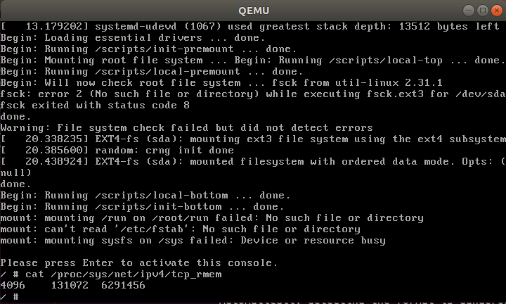

# Lab2

## Add Kernel Patch

Goal: Add patch to Linux 4.19.23 Kernel

> **Patch** is a document which store the difference between different version.
> Using patch to update source code, then you won't need to download the whole source code.
> i.e. update based on the basis of local source code

* [KernelNewbies](https://kernelnewbies.org/LinuxVersions) - Summary the main patch between each Linux kernel version
  * [Linux_4.20 - 10. Networking](https://kernelnewbies.org/Linux_4.20#Networking) - This Experiment
    * **TCP: up initial rmem to 128KB and SYN rwin to around 64KB**
    * [Update commit / patch](https://git.kernel.org/pub/scm/linux/kernel/git/torvalds/linux.git/commit/?id=a337531b942bd8a03e7052444d7e36972aac2d92)
    * TCP: Previously TCP initial receive buffer is ~87KB by default and the initial receive window is ~29KB (20 MSS). This patch changes the two numbers to 128KB and ~64KB (rounding down to the multiples of MSS) respectively commit.

### Prerequisite

#### diff command

For single file

```sh
# Find the difference between from-file and to-file
# Generate the patch which can update from from-file to to-file
diff -uN from-file to-file > x.patch
```

For multiple files in a folder (`-r`)

```sh
# Find the difference between from-directory and to-directory
# Generate the patch which can update from from-directory to to-directory
diff -uNr from-directory to-directory > x.patch
```

#### patch command

For single file

```sh
# Apply patch x to file called src and generate dst file
patch src < x.patch -o dst
```

For multiple files in a folder

```sh
# Apply patch x to current folder
patch -p0 < x.patch
```

> `-p0`: current folder

```txt
$ man patch
-pnum  or  --strip=num
          Strip the smallest prefix containing num leading slashes  from  each
          file  name found in the patch file.

setting -p0 gives the entire file name unmodified, -p1 gives without the leading slash.
```

> For practical example, see the step 5.

#### Patch Content

* `---`: source file
* `+++`: target file
* `@@ -x,y +m,n @@`
  * source file modified range from line x, total y lines
  * corresponding to target file start from line m, total n lines
* `+`: add one line
* `-`: subtract one line
* No sign: refer the original line

### Steps

> In this experiment the experiment directory is called `mylinux-patch` (`mylinux-patch/net/ipv4`)
>
> And the files given from TA is in `KernelPatch/net/ipv4` (Linux 4.20 TCP patch)

Check the initial TCP rmem value (default 87380)

```sh
$ cat /proc/sys/net/ipv4/tcp_rmem
4096	87380	6291456
```

1. Create experiment directory

    ```sh
    mkdir -p mylinux-patch/net/ipv4
    ```

2. Copy original linux kernel folder

    ```sh
    cp -a linux-4.19.23/net/ipv4/* mylinux-patch/net/ipv4/
    ```

3. Copy experiment folder to replace the origitnal one

    ```sh
    cp -a KernelPatch/net/ipv4/* mylinux-patch/net/ipv4/
    ```

4. Use `diff` to generate the patch file

    ```sh
    diff -auNr -x '\.*' linux-4.19.23/net/ipv4/ mylinux-patch/net/ipv4/ > net.patch
    ```

    ```txt
    # check the output
    $ head net.patch
    diff -auNr -x '\.*' linux-4.19.23/net/ipv4/tcp.c mylinux-patch/net/ipv4/tcp.c
    --- linux-4.19.23/net/ipv4/tcp.c	2019-02-15 16:09:54.000000000 +0800
    +++ mylinux-patch/net/ipv4/tcp.c	2019-03-18 09:02:46.509326247 +0800
    @@ -3889,8 +3889,8 @@
        init_net.ipv4.sysctl_tcp_wmem[2] = max(64*1024, max_wshare);

        init_net.ipv4.sysctl_tcp_rmem[0] = SK_MEM_QUANTUM;
    -	init_net.ipv4.sysctl_tcp_rmem[1] = 87380;
    -	init_net.ipv4.sysctl_tcp_rmem[2] = max(87380, max_rshare);
    +	init_net.ipv4.sysctl_tcp_rmem[1] = 131072;
    +   init_net.ipv4.sysctl_tcp_rmem[2] = max(131072, max_rshare);
    ```

5. Use `patch` to update with the patch file

    ```sh
    $ cd linux-4.19.23
    $ patch -p1 < ../net.patch
    patching file net/ipv4/tcp.c
    patching file net/ipv4/tcp_input.c
    patching file net/ipv4/tcp_output.c
    ```

    > The `-p` explain of patch command
    >
    > ```sh
    > $ cd linux-4.19.23/net
    > $ patch -p2 < ../../net.patch
    > ```

6. Re-compile the kernel

    ```sh
    make
    ```

Check the result with Qemu

> *initrd.img* is universal, we can use the old one `initrd.img-4.19.23` to boot with qemu.
> So copy the original *initrd.img*, *busybox.img* and the generated *bzImage* to wherever you like.
> Or execute them directly by specifying its route...

```sh
sudo qemu-system-x86_64 -kernel arch/x86/boot/bzImage \
                        -initrd /boot/initrd.img-4.19.23 \
                        -append "root=/dev/sda nokaslr" -boot c \
                        -hda busybox.img -k en-us -m 1024
```



> We can see that the default value is changed to 131072

## Read Process Info Module

Goal:

* Implement a kernel module which create `/proc/tasklist` document
* Read all the process information of system, and show its pid, state and name
