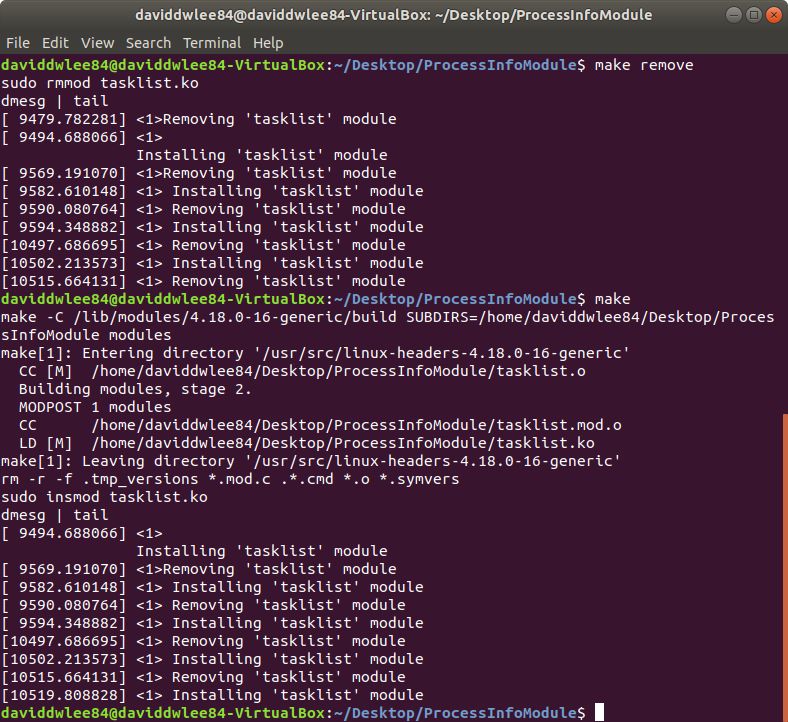
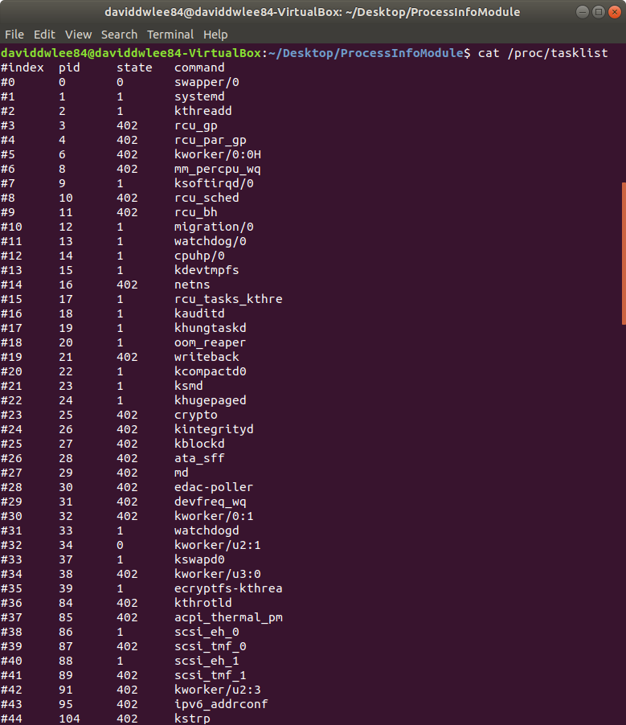

# Lab2: Add Kernel Patch and Build Process Info Reader

## 1. Add Kernel Patch

Goal: Add patch to Linux 4.19.23 Kernel

> **Patch** is a document which store the difference between different version.
> Using patch to update source code, then you won't need to download the whole source code.
> i.e. update based on the basis of local source code

* [KernelNewbies](https://kernelnewbies.org/LinuxVersions) - Summary the main patch between each Linux kernel version
  * [Linux_4.20 - 10. Networking](https://kernelnewbies.org/Linux_4.20#Networking) - This Experiment
    * **TCP: up initial rmem to 128KB and SYN rwin to around 64KB**
    * [Update commit / patch](https://git.kernel.org/pub/scm/linux/kernel/git/torvalds/linux.git/commit/?id=a337531b942bd8a03e7052444d7e36972aac2d92)
    * TCP: Previously TCP initial receive buffer is ~87KB by default and the initial receive window is ~29KB (20 MSS). This patch changes the two numbers to 128KB and ~64KB (rounding down to the multiples of MSS) respectively commit.

### Prerequisite

#### diff command

For single file

```sh
# Find the difference between from-file and to-file
# Generate the patch which can update from from-file to to-file
diff -uN from-file to-file > x.patch
```

For multiple files in a folder (`-r`)

```sh
# Find the difference between from-directory and to-directory
# Generate the patch which can update from from-directory to to-directory
diff -uNr from-directory to-directory > x.patch
```

#### patch command

For single file

```sh
# Apply patch x to file called src and generate dst file
patch src < x.patch -o dst
```

For multiple files in a folder

```sh
# Apply patch x to current folder
patch -p0 < x.patch
```

> `-p0`: current folder

```txt
$ man patch
-pnum  or  --strip=num
          Strip the smallest prefix containing num leading slashes  from  each
          file  name found in the patch file.

setting -p0 gives the entire file name unmodified, -p1 gives without the leading slash.
```

> For practical example, see the step 5.

#### Patch Content

* `---`: source file
* `+++`: target file
* `@@ -x,y +m,n @@`
  * source file modified range from line `x`, total `y` lines
  * corresponding to target file start from line `m`, total `n` lines
* `+`: add one line
* `-`: subtract one line
* No sign: refer the original line

### Steps

> In this experiment the experiment directory is called `mylinux-patch` (`mylinux-patch/net/ipv4`)
>
> And the files given from TA is in `KernelPatch/net/ipv4` (Linux 4.20 TCP patch)

Check the initial TCP rmem value (default 87380)

```sh
$ cat /proc/sys/net/ipv4/tcp_rmem
4096	87380	6291456
```

1. Create experiment directory

    ```sh
    mkdir -p mylinux-patch/net/ipv4
    ```

2. Copy original linux kernel folder

    ```sh
    cp -a linux-4.19.23/net/ipv4/* mylinux-patch/net/ipv4/
    ```

3. Copy experiment folder to replace the origitnal one

    ```sh
    cp -a KernelPatch/net/ipv4/* mylinux-patch/net/ipv4/
    ```

4. Use `diff` to generate the patch file

    ```sh
    diff -auNr -x '\.*' linux-4.19.23/net/ipv4/ mylinux-patch/net/ipv4/ > net.patch
    ```

    ```txt
    # check the output
    $ head net.patch
    diff -auNr -x '\.*' linux-4.19.23/net/ipv4/tcp.c mylinux-patch/net/ipv4/tcp.c
    --- linux-4.19.23/net/ipv4/tcp.c	2019-02-15 16:09:54.000000000 +0800
    +++ mylinux-patch/net/ipv4/tcp.c	2019-03-18 09:02:46.509326247 +0800
    @@ -3889,8 +3889,8 @@
        init_net.ipv4.sysctl_tcp_wmem[2] = max(64*1024, max_wshare);

        init_net.ipv4.sysctl_tcp_rmem[0] = SK_MEM_QUANTUM;
    -	init_net.ipv4.sysctl_tcp_rmem[1] = 87380;
    -	init_net.ipv4.sysctl_tcp_rmem[2] = max(87380, max_rshare);
    +	init_net.ipv4.sysctl_tcp_rmem[1] = 131072;
    +   init_net.ipv4.sysctl_tcp_rmem[2] = max(131072, max_rshare);
    ```

5. Use `patch` to update with the patch file

    ```sh
    $ cd linux-4.19.23
    $ patch -p1 < ../net.patch
    patching file net/ipv4/tcp.c
    patching file net/ipv4/tcp_input.c
    patching file net/ipv4/tcp_output.c
    ```

    > The `-p` explain of patch command (equivalent as above)
    >
    > ```sh
    > $ cd linux-4.19.23/net
    > $ patch -p2 < ../../net.patch
    > ```

6. Re-compile the kernel

    ```sh
    make
    ```

Check the result with Qemu

> *initrd.img* is universal, we can use the old one `initrd.img-4.19.23` to boot with qemu.
> So copy the original *initrd.img*, *busybox.img* and the generated *bzImage* to wherever you like.
> Or execute them directly by specifying its route...

```sh
sudo qemu-system-x86_64 -kernel arch/x86/boot/bzImage \
                        -initrd /boot/initrd.img-4.19.23 \
                        -append "root=/dev/sda nokaslr" -boot c \
                        -hda busybox.img -k en-us -m 1024
```


> We can see that the default value is changed to 131072

## 2. Read Process Info Module

Goal:

* Implement a kernel module which will create `/proc/tasklist` document
* Read all the process information of system and show its pid, state and name

### The /proc file system

* [GeeksforGeeks - proc file system in Linux](https://www.geeksforgeeks.org/proc-file-system-linux/)
* [Linux Filesystem Hierarchy - Ch1.14 /proc](https://www.tldp.org/LDP/Linux-Filesystem-Hierarchy/html/proc.html)

> A *virtual file system*. **Process information pseudo-file system** which can be regarded as a *control* and *information centre* for the kernel.
>
> Quite a lot of system utilities are simply calls to files in this directory
> (e.g. `lsmod` = `cat /proc/modules`, `lspci` = `cat /proc/pci`)

It doesn't contain 'real' files but runtime system information (e.g. system memory, devices mounted, hardware configuration, etc)

### Experiment Procedure

> There is no `/proc/tasklist` file before hand.

1. [Modify the given file and add functionality](#Step)
2. Compile using `make`
3. Add kernel module
   * `sudo insmod tasklist.ko`
4. Read kernel information using `tasklist` module
   * `cat /proc/tasklist`

> I've add `sudo insmod tasklist.ko` (and also `dmesg | tail`) in Makefile. Thus you can skip step 3 while it has done in step 2.

### Step

#### Task information

First, We need to locate the information which we want.

And I found:

* [task_struct](https://github.com/torvalds/linux/blob/master/include/linux/sched.h#L585) (start from line 585)
  * pid: `pid_t pid;` (line 739)
  * state: `volatile long state;` (line 594)
  * command: `char comm[TASK_COMM_LEN];` (line 840)

So extend the original `my_seq_show` in [`ProcessInfoModule/tasklist.c`](ProcessInfoModule/tasklist.c#L39)

(And I also add the title line in `my_seq_start`)

#### Next task

Figure out, how to iterate through the process `task_struct`

> * [Shichao's Notes Ch3 Process Management - The Process Family Tree](https://notes.shichao.io/lkd/ch3/#the-process-family-tree)
> * [Medium - Linux Kernel: Process](https://medium.com/hungys-blog/linux-kernel-process-99629d91423c)
> * [GitHubGist - an example using `for_each_process`](https://gist.github.com/anryko/c8c8788ccf7d553a140a03aba22cab88)

In [`include/linux/list.h` (line 489)](https://github.com/torvalds/linux/blob/master/include/linux/list.h#L489) define `list_for_each` macro

```c
/**
 * list_for_each	-	iterate over a list
 * @pos:	the &struct list_head to use as a loop cursor.
 * @head:	the head for your list.
 */
#define list_for_each(pos, head) \
	for (pos = (head)->next; pos != (head); pos = pos->next)
```

> But we want to forward one task each time

In [`include/linux/sched/signal.h` (line 540)](https://github.com/torvalds/linux/blob/master/include/linux/sched/signal.h#L540) define `next_task` macro

```c
#define next_task(p) \
	list_entry_rcu((p)->tasks.next, struct task_struct, tasks)
```

So extend the original `my_seq_next` in [`ProcessInfoModule/tasklist.c`](ProcessInfoModule/tasklist.c#L54)

#### Compile and Result

Then I've add `make remove` to remove the module.

> You can't install the module with same name while the old one exist (loaded).



Here is the result of `cat /proc/tasklist`:


