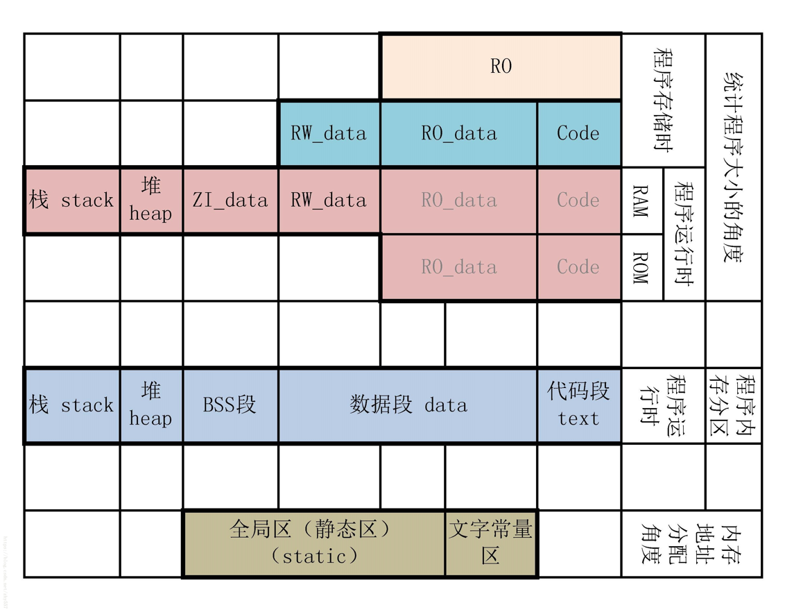

# Lab3: Observe Memory Mapping and Find Physical Address

## 1. Observe Memory Mapping

### Segments in Process

* [Memory Layout of C Programs](https://www.geeksforgeeks.org/memory-layout-of-c-program/)


* **BSS Segment** (BSS stands for Block Started by Symbol)

    Generally used to store "uninitialized global variable"

* **Data Segment**

    Generally used to store "intialized global variable"

* **Code/Text Segment**

    Generally used to store "executable code".

    This segment is confirmed before execution. And this segment is usually read-only. (but in some architecture is editable).

    In this segment is possible to contain some read-only variable, such as `const char* string`

* **Heap**

    This segment is used to store "dynamic allocate memory". The size is not fixed.

    * malloc
    * free

* **Stack**

    This segment is used to store "temporary local variable". When a function is been invoked, the parameter is push into the process stack. Until the invocation end, the return value will also be put into the stack.

    Because of the LIFO feature of stack, it is very suit to reserve/resume status.

### Segments in Program (ARM)

* [ROM and RAM in ARM](https://stackoverflow.com/questions/5430284/rom-and-ram-in-arm)

```txt
+-----------+ 0x1000 8000 \
|  Unused   |             |
+-----------+             |
|  ZI data  | <--(clear)  | RAM
+-----------+             |
|  RW data  | <--(copy)---|---+
+-----------+ 0x1000 0000 /   |
                              |
                              |
+-----------+ 0x0008 0000 \   |
|  Unused   |             |   |
+-----------+             |   |
|  RW init  |-------------|---+
+-----------+             |
|  RO data  |             | ROM (Flash)
+-----------+             |
| User code |             |
+-----------+             |
| Boot code |             |
+-----------+             |
|  Vectors  |             |
+-----------+ 0x0000 0000 /
```

* **RO**: Read only region
  * **Code**: Compiled machine code
  * **RO_data**: ReadOnly data, global variable
    * e.g. `const` global variable
* **RW_data**: ReadWrite data
  * The initial value is not 0.
  * e.g. global variable, static variable.
* **ZI_data**: ZeroInitialized data
  * The read-write data which initial value is 0.
  * Including uninitialized and initial-zero global variable.

When program store in ROM. The size is **Code** + **RO_data** + **RW_data**.

When program is executing, **RW_data** and **ZI_data** is in the RAM. **RO_data** and **Code** is in either ROM or RAM depending the CPU architecture (51, ARM, x86). Among them, **ZI_data** corresponds to **BSS Segment**, **RW_data** and **RO_data** corresponds to **Data Segment**, **Code** corresponds to **Code/Text Segment**.



### Additional Experiment

Observe the program segments

In `test_program_segment_size.sh` will compile 5 different program. And test the setion size using `size` command in Ubuntu.

Here is the result:

```txt
$ ./test_program_segment_size.sh
====================
The code:

#include <stdio.h>
  
int main(void)
{
    return 0;
}

The size of the program:
   text    data     bss     dec     hex filename
   1033     276       4    1313     521 a.out
====================
The code:

#include <stdio.h>
  
int global; /* Uninitialized variable stored in bss*/
  
int main(void)
{
    return 0;
}

The size of the program:
   text    data     bss     dec     hex filename
   1033     276       8    1317     525 a.out
====================
The code:

#include <stdio.h>
  
int global; /* Uninitialized variable stored in bss*/
  
int main(void)
{
    static int i; /* Uninitialized static variable stored in bss */
    return 0;
}

The size of the program:
   text    data     bss     dec     hex filename
   1033     276      12    1321     529 a.out
====================
The code:

#include <stdio.h>
  
int global; /* Uninitialized variable stored in bss*/
  
int main(void)
{
    static int i = 100; /* Initialized static variable stored in DS*/
    return 0;
}

The size of the program:
   text    data     bss     dec     hex filename
   1033     280       8    1321     529 a.out
====================
The code:

#include <stdio.h>

int global = 10; /* initialized global variable stored in DS*/

int main(void)
{
    static int i = 100; /* Initialized static variable stored in DS*/
    return 0;
}

The size of the program:
   text    data     bss     dec     hex filename
   1033     284       4    1321     529 a.out
```

### Maps

Address space attribute

* r: readable
* w: writable
* x: executable
* p/s: private/shared
* -: no limit

| **vm_area_struct** entry of kernel process | **/proc/pid/maps** entry            | Detail                                                                                                                                      |
| ------------------------------------------ | ----------------------------------- | ------------------------------------------------------------------------------------------------------------------------------------------- |
| vm_start                                   | number before "-"                   | Starting address                                                                                                                            |
| vm_end                                     | number after "-"                    | Ending address                                                                                                                              |
| vm_flag                                    | The second column e.g. r-xp         | Attribute of virtual address space.                                                                                                         |
| vm_pgoff                                   | The third column e.g. 00000000      | For named mapping, offset of starting address in virtual memory space (unit: page); For anonymous mapping, equal to 0 or vm_start/PAGE_SIZE |
| vm_file->f_dentry->d_inode->i_sb->s_dev    | The forth column e.g. fd:00         | Equipment number of mapping file. (00:00 means none)                                                                                        |
| vm_file->f_dentry->d_inode->i_ino          | The fifth column e.g. 9176473       | Node number of mapping file. (00:00 means none)                                                                                             |
| -                                          | The sixth column e.g. /lib/ld-25.so | For named mapping, it's mapping file name; For anonymous mapping, this is character of the segment e.g. [stack], [heap] or None             |

### [Experiment](Memory_Mapping)

Program output

> The result will differ each time.

```txt
$ ./lkpmem
variable globalvar1 	 location: 0x22edf018
variable globalvar2 	 location: 0x22edf010
variable localvar1 	 location: 0x15446be0
variable libvar 	 location: 0x15446bc4
variable functionvar 	 location: 0x15446bc4
```

```txt
$ PID=`ps aux | grep ./lkpmem | grep -v grep | awk '{print $2}'`
$ cat /proc/$PID/maps
558d22cde000-558d22cdf000 r-xp 00000000 08:01 678244                     /home/daviddwlee84/Desktop/observe_mem_mapping/src/lkpmem
558d22ede000-558d22edf000 r--p 00000000 08:01 678244                     /home/daviddwlee84/Desktop/observe_mem_mapping/src/lkpmem
558d22edf000-558d22ee0000 rw-p 00001000 08:01 678244                     /home/daviddwlee84/Desktop/observe_mem_mapping/src/lkpmem
558d24042000-558d24063000 rw-p 00000000 00:00 0                          [heap]
7f2c985d1000-7f2c987b8000 r-xp 00000000 08:01 269411                     /lib/x86_64-linux-gnu/libc-2.27.so
7f2c987b8000-7f2c989b8000 ---p 001e7000 08:01 269411                     /lib/x86_64-linux-gnu/libc-2.27.so
7f2c989b8000-7f2c989bc000 r--p 001e7000 08:01 269411                     /lib/x86_64-linux-gnu/libc-2.27.so
7f2c989bc000-7f2c989be000 rw-p 001eb000 08:01 269411                     /lib/x86_64-linux-gnu/libc-2.27.so
7f2c989be000-7f2c989c2000 rw-p 00000000 00:00 0 
7f2c989c2000-7f2c989c3000 r-xp 00000000 08:01 1399                       /usr/lib/liblkpsinglefoo.so
7f2c989c3000-7f2c98bc2000 ---p 00001000 08:01 1399                       /usr/lib/liblkpsinglefoo.so
7f2c98bc2000-7f2c98bc3000 r--p 00000000 08:01 1399                       /usr/lib/liblkpsinglefoo.so
7f2c98bc3000-7f2c98bc4000 rw-p 00001000 08:01 1399                       /usr/lib/liblkpsinglefoo.so
7f2c98bc4000-7f2c98beb000 r-xp 00000000 08:01 269383                     /lib/x86_64-linux-gnu/ld-2.27.so
7f2c98dd1000-7f2c98dd6000 rw-p 00000000 00:00 0 
7f2c98deb000-7f2c98dec000 r--p 00027000 08:01 269383                     /lib/x86_64-linux-gnu/ld-2.27.so
7f2c98dec000-7f2c98ded000 rw-p 00028000 08:01 269383                     /lib/x86_64-linux-gnu/ld-2.27.so
7f2c98ded000-7f2c98dee000 rw-p 00000000 00:00 0 
7ffd15428000-7ffd15449000 rw-p 00000000 00:00 0                          [stack]
7ffd1556c000-7ffd1556f000 r--p 00000000 00:00 0                          [vvar]
7ffd1556f000-7ffd15571000 r-xp 00000000 00:00 0                          [vdso]
ffffffffff600000-ffffffffff601000 r-xp 00000000 00:00 0                  [vsyscall]
```

* 558d22XXXXXX /path/to/lkpmem
* 558d24XXXXXX heap
* 7f2c98XXXXXX linked library
* 7ffd15XXXXXX stack, vvar, vdso

## 2. Find Physical Address

### Background

Multi-Processor Model

* SMP (Shared Memory Multi-Processors)
  * UMA (Uniform Memory Access)
    * e.g. IA32
  * NUMA (NonUniform Memory Access)
    * e.g. ARM

### Linux Physical Memory Management

There are three level in Linux physical memory management

* Node 內存節點
* Zone 內存區域
* Page 物理頁框

#### [Linux Paging Mechanism](../../Notes/MemoryManagement.md#Paging-in-Linux)

Linux use 4-level paging model for both 32-bit and 64-bit system at the same time.

* Page Global Directory
* Page Upper Directory
* Page Middle Directory
* Page Table

### Principle

#### Node

Node is a way Linux describe the physical memory.

Linux use `pg_data_t` to represent Node in the header file `<linux/mmzone.h>`

#### Zone

Single Node is split into several Zone.

Linux use `struct zone` to describe zone in the header file `<linux/mmzone.h>`

Zone Type

* ZONE_DMA
  * compatible for old device
* ZONE_NORMAL
* ZONE_HIGHMEM

#### Page

When using paging mechanism, physical memory is represented by a fixed size physical page frame.

In the logical point of view, memory using fixed size page to represent.

#### Example of IA32

![Segment and Paging](data:image/png;base64,iVBORw0KGgoAAAANSUhEUgAAARQAAAC3CAMAAADkUVG/AAABTVBMVEX///9NqOW1d8rV1dUxMTHqeGf//HhOq+n//3ro5+bk4+IAIDv29vZQruwGMEjy8vKoqKhzbWg3i8AzPkjBwcFDQ0NTU1NIpODc2tgcS2kxOT9tamhycnKIiIjz8/NGn9oyfq9bW1u7u7vu6m03hrg0SU6fn5+cSTklOUg5IiUkc6ATPFVEmNHOZVsAAAB9eHRNUC5SWV9FJCupUUl0cjPKxlcuOEBiO2iMiDgeYI91ToqSX6QdJy8lZ4wJSWsSUn+rb70yJzVeY1yGhoba1mJdXmggMkqJPDtaXSc7AAAAFim2tFRMHRWamEa8uleopk1MTEIqKQAnXH+BgDnk4WsAAB1LSg5eICAABBJCQSguEA4APF8kJCRJSVUZHAtydTNNKFQxMCETGyRRUB0XGhkYAAANKDkAEChgXhsgHCZuMB8xDAAoJwAwAABOJR9SHhdGAAATZUlEQVR4nO2d/YPixnnHZzvbhZkbbiZ4AG1BAgY6cTgKTmOcdWKdm4o2FxPAZjnXSTZ1c760ceP0//+xz0iwvEpIwAK77Pf2QBJa7ejDzDPPM29C6FnP2k1s8u5M99js7WylEcKIUYYJYdjsFTGyNJeScAvBMevYCTyCiEICay3gRyotFFIC/sG+0J6WthSaHDuJh5dUXFtagKS0tcbMllr7WKhtDkn7DKEQibnkwiNIcgsTxjkiFDNsEUQxksTCx07h0YT5sVNwcnI4VkGGcJSCWodATeRTImdcBQlmcwbVjWISS6ksCxi1qXKkksdO2s4SevJ9I4eaVxbXHGjeFpawhYWgDhIEaiKslSeEZuKBkno42cy2NZZYaQsLqGdx3FvSGEwqQPGdFqWgJsJQLwuJnwAUT1HhgIOBtdSSQaUa95awyVj3pjbYYMal9T943AIGYBXAEGgJvgY4Yoe0CMxBCw5NwNk5EUutj5MOLBEm0iEYYYtjRKuMK0WhYHL4gJIjeDts7jUQP7QfClAEFFsIDcBEQwylle8oa9nWwoOMe/CvCpfAwcBEcwIsLEYI4jbsm21kIZokPVhvmwaw65poWyntCc5sEySYiIrYSoq2tA8eV5oqVAhla+nZwsZtU41oSBUWHkR5djvBpVRpyzRAYAARguNYyCLcWBjO4Ouh3DgG8MnBmRCI2uBrgTzKAQJ4K21GFTYZWJTgyxNJvnxRfbBkHlbwDVEqGYYK1MJMcvA6oIg7HmxbXCE5+ZYsvFlW6S7GWRhHlUihT7giXzK1+H01hkpenLNydvifZTamtqaB93jqzp+teRw5cU7C+fC/wywwcMCkrRFYuRhGXiNOwZ8JDBGkUyJHMCL8I3z5q92zSnt05Ug+oqkBzH7JNOZhY/43X4sLCDGgmoJ8BVU3ssDnVLbZ12AlhbS39HBY+0eRCiqUqoHC5DL5rfwHnov+ApPwBwcHagiIvBTUlQzZShsHR0FdDniA65b1FnnRzEao+da/A78dyaZgeDmVVBoP1CKKtLehwiItbTJRCDwxJ1hyhS0oSciyFJFQO1DTkoHVln+JvsykIpR5MftaiWmMtU3LgA1hsa2tRPX1YxJAuYjQPBQtweVUUIR9B1QIJmzniCl/QCWAYnx+igQ43YwhwhnY9xOJY/etJFB8sYdopraLoVIP8Oc2KTEUy88dbK8uAP8k2wxR40f7/EMxlQQK1gSMiiWwH0KKTUExERhJ6WesDbmLf1AIs/TZOSi5T/5hSZcrRybH1x/+JBcvmyeCYivP7xPVSAKcdrQXwDQD17SNFVSXOtqLAighf38eCvvmorCgi8r10pHJ8eyrdYdBr+JFVkmg+MG0hCpZaeNHqugiRATCftcyeFQi+tSYUN75Sc2kMhep4MPKtTkCjkPKvF5MDl+kmq+CxMOxVGpyrv/2AFBmHmysWsdU3pCjTCuE2jmnsCpG78yNpa5Ho4tKJhVAMW/N0bWbyjTrmXIj4x+/CKAURqPGxcg156Yy5WzqgaAkVFCAHdMCHU1xIxSIhqqt0gRKpt6oNEYzKBcXo4LrZq/dplt3/Xv3oaTcbMZtXL+quI2m26iMHiqnPJQ2QikV7WqrOIVSdt1RYQFKuXHdqGQb8Dq6zymZUTkD9NzsqALnVyonklNiazMUxauK+FAyr+qj5si/9ymUAtw24GhU4N4bs5xSd+HMhltvjNxGo+4+ABRqhere12fh56woIRRpGkh8Q5vK1pupZnMCJUh886LeLGezF+VCvZy6N7SpZr1wUW4Wss0L83OxdyisdR2ml/fuingRetKyvliwvHGgmCq5UDYKXo0a19Ptxffsy/m92fnl/ULhX4QF05nKffOibkRG3PO/NFpoNYkJJTd1wt5NfbS7NR7au6Xj7+a2NzTlJIfipxF+ClNvYPI2DyU1fz+F1Gx3/gOz+3oLKIgEJY/K3KQwY7xaLnEODuKl/alidmMlgpLKXmeg8kvVsxmISlIXqQgoYOcaYBDLKbeQyWazi1S2g3Kf5lzEDfHc4o3zqNbPvUCpj8rXjSYYuFG98qrhmmouNKeUs6PyhdvMXEN16I5ctzlP7OShxGl5mxSfDNSGTTdTyVbcinEAoqAUyqMyeAcp98J1K1AvPiYoXzQi9XbRpoxS4A5kKqNRpT5qNEYRUFLgdUJuKsMvNMCDcP1sdfpQfP/C+v2PI/VnawrFzzmFTKEJsUQZbqIM7kFk7dMsFMpwSsFkkTK87lr7HAKK9Dub8G//PlK/CRwK3qpXQvT5DMrrsHNW9IfThOLoEo0PhbXnmwjvqmsbDGV4o+LCb8P/0oJLezJQEPO9O/zXf4rU36ZjJuc6PlleLuzeXzFW3yrNW/C6mPCTgRIItz6OVGtdS0h1lwFXTn7FrXxYKAn7YVgJ4x+u0qCrTrfmb8DmOJ2uwb9AX+8dCj8wlEt/RkUCVVvVH65A6fGw1x92a93BON3ppwf97k23kzYfPHooTHt2ArXf29VWbgLlpjPoDIeD/iB9e9Pr9nu9Ye1pQEEskWiOFpX8wS8ltXEa8smw1utcda8GAwDUfSLFJ6FIjnEwtG9m+urNivZvaE8dCrzgv/0sUn8+OygstvO2qIeBEvTSTAXbEEzsGQrZ0EjKTg5Ks9Gs1JuNeqVRydYr5UZllE3tGUr1VWQj6Qt1alBSFbfhjtwmBNRZ99o1kfW+iw/76UJYutJO4opTg3LRcCtupeE26o0s8GmUTcvE3qGE2K7AgH16elAKZbAiDbdwYdolCvBWeICcshkK4vI0oNz9e5he+MMzDwcF5wjO5f7vBKCQX/1LmH75r+aEA0FxhZfL5au5VusnkWqtG4Syfyh/F6aDQvlUlJRF5WXxv+tRyv7Puj61qplLKc14WD+xsKHFDJ75jYjxPKcNBb5ujvHLVNR56zvYq5gIhhUW2BZUCcEdjbQlsJCWkFpJgT1s9h4nlC1HHVQxVcQTNtOaCOFp7gikbTO2VjtSKnNQ8LBZbk8XCjIrYUBeEP5SIQ6ztb+npVDYzDdQSsiQwZ5PGMpsTZ1gCOl0eR3z4k9sCE3aU4YSoFhMgBNwYpFx6lOHokqSI0GYMiwk0aY4acu2cVSVfVwoG2KfPUBBxqSayTZgcBFUPQRDpQRCIiKvHBNKvhI5j+fz/UDBUPcQrT1BHYEltTVRloES0ddyTCi56P6cr/YCBapmKQW1pGLIzFzD4NMhSlHUTLcjQuFfTntu1uvbvUBZSOosMZHrAhwNCkfOl34Xha9aze/GuJrTA0CJq6NBKWk6g3I7HAKV2mC6v6+cInI/DVPxiIb2shrSsZ9v3f1pBqXbHd/0B7fD/rDWg4O3xqb8kLvbFUq7Ug5R88PjGVom1YrsvHkt3nlzOaXT7Q46vV6/1huavlDY7A2+KwUzcXaBUg+NJT+IMCoPDGWdZBGZsSeSzEHpDTqdzqDfr9Xe3BuVjydDgs8HCjiYzqz2qY3HgblNd3pztc8pQfn+F2H6eSSU+WqOkdDJIgaKqRz5l1BoltWbbf7llKBYfw0dc/e/1SgonhKMIMJNwxZEGMTisMsIxmbBxhkjgEI94SAn9+Llil7NNt+eEpSI1vOfRUJpS6FsqWylBYQWllB+o45Z69Rf5XP6hwAKWBSAlA+dwGlUHj0JKDZBZnk6s7QpEpaS2tDQVJmVDoi6H6Foio8ZhWYCwoibNa35pwQldMzdryOhQDqktITHFUWWwsyiTFGqoPxgwuT9LwWGNlYXxwlBCR949yYSSnCrcn0z+WyhiccJ5SvfzQYnwh90V/M3A8+7+8coKMVQn9pXnj5uKEbDdHfcqaUH/XS3Xxt2OiYk6f4KfFGZWw+FvYuym83ydAjzI4RCZ1AG/Y4ZdAee5nAwNCFJuvu2ZLTQ+zSD8tnyRKLFxL8+ApRsyASQTCoJFJ73VFB8gEiv1qkNxkBk0BuMg+LjGC1SnIMSmfhjQPnD52H6LB4UL2+W88q3Wv95c3PTv7n99vb2xmzdwvu35shN/9s1y1qdMpR/g2Ifot/FgsLyCupOmc/bv/91mP5jzYJ6Jw2lE9asd/VRxKzOOShVf41VQTc6b48Kit9kdbUgfzcJFBTDo31sUAaDq4VcMj5FKGbkj6M52jzmbR9Q0uN+ZzzsDIZmDPug1xl2bk4RSt7YruqlyEX2+2Rf7wtKp98f3gx6BsztsN/tGe/i1KCIO3/RylautGFdS7wbFIsFxac27I173eFtZzzudHqdWnew/5yy3HSUHIrNObfyNuWEcIrpdD4WgcjRPwY/8J9M53NtBSWPkZ2Tfk4JNJiriHwoVsgkicRQfly1SsvLkm4BxZw86ZhSQhPCEGEOR1zbFueCAZp58ltBKeXy1VbrLZAYD7r3MEwcdxVQ+V0uv1ZVthaK1frnMP3kfau0nITtoEwllFm7z/R/a4KolFoFveG7QiHY8i71HwHKcDwcD4CM6S7oDLrgqI97EOF+pNavz2vm862BQr//ZZh+8WWxFZFTwiY6+Eqth4IZ1p6wbFsQZEn/4URmUfxdoYAk9p234dXgZjjs94a1fqcP5rY/7g/DbYrPYw2UyNZ8rnNeCBTe+sdIfbMOipmVIDFkECxNyzeWlpQEjuwBCgo8Wohlu8NOz8S0414fKuVex5jffUJBjFQXV5S7h2J9V4vU1+ugTK4hIzoxd4MSeLQmxIf3WtdsRnm020GBRF4udF7fQ8FvIgcRpCOgRGoXKN3Q1GyGwpNAQfJyDRSP0jfTGKN20+/5XVzpdPp+KMExoBT/chOmP22CQmw6D+X7n4fpv4LOveKCHXzv9xBXW6UpFHCsx7XusDcc9vodk2ODo9/ZfseyXKnUHw5K6fWnYQppT5lBkUU5D+XSDdPrIJaz3s9fxjONce18KzeD8jEEGt3+oHtb6w/H91DypUAJl+jeAUq7snblRlD5w01QTOfEDAr/oBxypcJ0RcDSfFZhjuMwkhdyBuVmPIYacDC4Sfdu7wP2rxXz2+2SPv9lFyiJ22jDDG2MZRLx5crVwMu4hwLBemd8BUVonB4MVmxKUh0PiuIoARSUWzN6yvrualW92v3mY4JimeiLFi9FPgEUsebpJ7T1UaRajwYKq+aM8vnW+8sEUMj7Ndd7F7lyTf3lo4GCCAVBTinKJMXHhObL2hAQLq38dNJQJjeEeRJDC+XHW7le3Cj50UBByWof4+uvXO8ZCrpbGXL5DAUVV27xGQrSKxHMMxSEVxr2n6Egcrd8vScCZcFWBlAYRk68dfNby3HdKUKpFMIG54dGyXQStvriecxMtFvEsaCgy+WrniAU+7NPwhSyCp/je/iXuakmW61WaKv8ApSVGTUnCIWHL+MT1kFI4CP1Xk6XVjcLLVOcr6p4OaW0PNP5BKFsJ5ZvLT4a1JEknqFF9vIsPPZZWNuUr2PEPttJtrzqckaKCUUvPzuHXX4YqXdbzmA7OBSaw3TZ4sSFsuK9bXq66PZPlzssFL0a7MaFog71NLtDQ5G5NUY4JhTnUA+zOzAUfLnO9sWEcjAdFArTa5mcLxROLJ0rrp9vEQMKt8DJQRZhh3jM9mGgEJ3P5fKeDJmZGwOKlkp4SrbtkEWN9qqDQBGXnqQk/PmWMaC0sdAlYWlbHODR24eA0q5ucBg2Q2EaI2xhrcguKwrE1QGgtFcGrS0rBpTgGY+HIIIOAUVUN17i7Gofsq4TeElnB8WOMWDm3KCwXAzH4tyg4GqMSPXcoKg1IyhWdG5QaJxa9NygxNLZQEnS6HUuUJSYa3r3AUUEcucCRUjiTyExM0iklkKrCH/lTKBwKs2qvZZ5uLawhRBYRFjcM4HChCBKUW1ji2IszGNIn6FMLh6z8eOcoMQe/Q1QQgYwPD0oSjCKGSYbG4b4J82w8QuVpwZF+2tr2dLTG6g41csw3SWclbIXPSQUWwlt+zMXN/Vi+eON1yv5oxV3V8xHA28lQhE1fRLkEKHCPkW/eRWp1mO7oX1o3Uql84qalLlJYGDxMXL/ycrSEoyssM0SfbANLwforzl1KeFh/6Ec2CxjiFXUUuBnIxE8pwOKn5DYf0THTo8HfNazzlICO1oxwZUgOuThNmchBwyKFkpbSGnpIWoLalOlMD/UmLVTlLSUptoWmEHukJBXzLLCqkT1OTstXEhJLCkYVMyYgstCOZQhLO0DDRp41rNOSt4hht+FCa8ZjnxU8WCK2k6PadlV05UfT0YkmAz8DGVe9HFD4VMnYK+BV1IoamVODiTIGCRCth7/uj0UXBJ28LBEa58uUlIobQ4eG/hqfo+pYEIRrXERwmRw5SzbjPlMnga8PRRNPSW01CWlPA/ba76xbTSxKcViaHP7THlmhlZ7yvaf6Wn6S7WGTSWFpdoKa420JuaBp+IuxtXmGvRbiU6f/pY29ZZkUnsaCaGkGYSrzMDEba62eOlg9bBqyLKHC4JSwtrENgnQpvcYw5ZSUkptSw9CIW1NoJAYF5uTyG+a67RWBKAoM8fOw7pkoAAeYWb87iw5gRK3+BBhISwZBIJmMVMkMefcwZa0OCZcOYRt0Si5Y+3DkAzWeWN6U/9TTG1Z+6h9NhLsXiVPeiTYnqztI6+SH0bPUNboGcoaTaDQQ01pXCd+aj1G29QW56H/B8JONcDT/X7JAAAAAElFTkSuQmCC)

![address transform](data:image/png;base64,iVBORw0KGgoAAAANSUhEUgAAASgAAACrCAMAAADiivHpAAABcVBMVEX///9NqOVZutHqeGf/fADb29vtocH7+/tOq+nk5OT8/Pz39/fGxsalpaXu7u5oaGi/vbwAN1NKpOAiUXFOTk57e3vQz85vcHJfZWglP1KMQQCbRgBUVFQyf7FST0v/gAAucp5jPDdjSVRCQkKwsLCzeJGwVksmYIVDmNAxPkg2isJ5dCkcYIvU1dWZl5V2c3AybHdQVlzdb1/8+Xc8S1gYVXsITm87Mj08OkyLiIUYOkcSL0E+iptEQD9zSFYpdKIyUlqfSjpLnrHfl7QAAAA/HQDtcwBWOkeKRDgeXWpUsMVImKvLiaY9RTDFZFaUY3hFHxqtUQCmpEyNXnLDXAArKyvx7XC/WgAmSFC5t1bPzWCocYjVZgCTkkIwang5e4sdHR0AJjNDLiwfKTImFQ1oMCiBQDYZHhxgLSclFRwAIjk3GyZZHxJLHBMAP2EAGy0AFzMBKjEfAADe3GbCwFoTGQYbHS0gKicGLkY8OgBQTAf+RpenAAARfUlEQVR4nO2di0PiSJ7H4yOGJFVFDUKcbmGWO0pgmUl1L7vOXWZoaR/HILhyqOjYqHF2tnt2du6659beu7376+9X4f3SArVVyNdAkqqkrHz41TNJlaL48vVA0jSim6O9iWYQcZShaNcF0vK+4bh+mZ21/GnXxPZGjRO5PnGVOvZIXxVTxJBCGNUxHXmUyRjxvAljKkbS/xtC1zBcN8I2xUTqFKZTrCqKjUw8ATBbnDuZEFdNfI2/hZnlmKbOLc5HHgTeVGU6bJiM21z6CnSC9YipGLqKmTr6d+gS4SqxqaJRpjtyZLtlYIIntCmTR6h1jQnoOrcph+TJGB39E4I39kAZFBEckY6LBj8wg+sFXmApUqcgVRfXSph34pgymD4pKLBGYl/zH3WMVKaKJAWmNfJ/EDAIxgxISxGwLLkrFqIOUihYFMcqxbrUKZbuiORD4MTxQUH6sMY/aSxpmmIaEt6mOU5eq5mNg01Tkz/NvC4iN5484Wm2jBCdREgq7FvJmkijDVETP11n1+j8IOjH1xL66fkk+vOf/mk8/an2z+Op9mx5An07uuiCXBaKYUW1G9TsTt7Nducl9E3hN+Or8G/JhfFU/G5pPH2XDkyguDMSlCUqOZbjcKZBLYcjOh6o0jeFxfH1KUBlAnNj6zpQGmc2ZtSyuMYtFmFjWtTsgFJYRIMKts04cjidFFThelz9vp8YVCgNn1BnNxDydhtL8+tmUKYKdWBi2jrSCbJ10gvKdd2yO++Wy/PzW/Apl92t+S2xlMCh1AJ1tlo9KgAsb7vQJlNYPIFP4eikerZ4Ulg8E3tHhS5QyeJmdr+JYr8NZX9/c39hPwvr7IJYt0GtVSrbbRLbsLm3t7TnueztVfa8vb2Gaw+oUDwez6RSIQAUSmcC6VgmBU6hECyZGBCLhaRAjTY1Aepi66X7uvQ6l5svXbjzpZy7dTFfvsjlXPciV8q1QR0trp5UV1dXj6rV5yfV6snz1bOzxVWxri6enVXPqmIHvFaPCiddoIrZ5GayCLj2i5vv9mGjCHDAbb+4kHyXTL7bLCazmx1Q9bV6vV7Zq1TWKmtL9Uq9srZRr69V6kvb4Hq4tHYodir17XoPqEAsFoin1lPxVCYFyAKxdBqgxdOh5XgsvxxPpWNpaVAE7Gig7tsABcZ04V64ufncLiAqb7niGyjlXroltxfUGYA4WayeHJ09Pzt6XlhcLQCcwm9OCoBvsVqoVlfPqrDqBrUAhASfYnY/Wcy+e5ctbi7sJ/c33y0k9wW2zSIc0wFVWdurb1S2DzfqlaW1tfphZa9eOawcLu2BO4CCr/pe5XC70gcqH4jH8/lYKpWK5wFaei41F48FgFUqH4+lYrHOoddl5qpu6AwRmxPVVElj6Up6IrkBFrCfMlhVrgzIyi9dWLtux6IKq2BBRwDk7KR6dHJyclYoPF9cfF4tnIgUd3ZUhSRXPTs6OqoeAdMOqE1gkUwCHWFWYFzJhWLSA5WEVJlMJjc3i9kuUGvbS8BhrbIhLGrvsFIBMGsNi9oTLhWwLyDXZ1Fzc/FUDNJbLJWJx9P5uVhmLpZOxUNzkCAz8Tw4SVmUyhyEOeUMKgiYccjToY7QAdXOtEveKuetSw0HyKtGlnpHZ/Bpbp91e5z1ZOaNDCibXWj8LWSL8JXMZpteWZFR9WbmwOoQyHiZ1HZj7SFsbYFrfx41Fwg1tgPeEur4NDZiUpk5whGMbIwNzs0IE/0lrS4Tv3rQI8rBooRRcWxQjC2MKcfyoGanZi6azKKBpzW3zXYjmn2Tk9B/PV8dX8//JnKgcfT2l7WxVP9FlHDjKv9+kuoBSrzqU+2y3+XVzqvPJ1E0MUI7ozwGVbv22FdfdPTnL2QVZROAMtV+8WC/i5VA+iQaCLopmrBHeQ2IJa7z7QpHRFIyzOvupIwh9qLfhSTkuh5lpUblY2qFJQ8k4buN5M1iKwNx8EEN0/2Dsn1QcvJBSWq2kx6RLw1ReIZBmcGwtBKzbFEkjKTrRqouf1tu+kBFdWgkSWqM2EwlqPuQD0pSPihJ+aAkNbWgdCwn2Qd2phYU+0yq8+wfsk9Q2dMKCqekemOXh4EybNQvCycko/0EQcn07w8FpV9GB3tJZbttZwmUGlYHG4aymdlMgYpO8ExmOwL3DMpklniCA9r+LRcf1FBZCOvEoRZ1KGu0wXxQw8Nnjk6Y5VCKnUbnhw9qePiMmYQzhjDjzZqQD2qYDChWDEJMk5DmP/JBScoHJSkflKRmDxSNTKTwrIEyghHJLo8+DbzjOOWgtCDVzEk08KrZ1IOSf2H1hjj4oCTj4IOSjIMPSjIOnxSUxaWKHNZ3W372QK28l+p1/9BXOM8gqJhUr/uzvneoZxKUTAgjQRE2jvTZBcX+kZLXZ3x2QUneMGso78w0KInzm6HcFpRuG+LVvuaT6z6oUTIxQgpGBHFdDKbggxolDTMGoDDm3nhJPqhRMsSAUeJlNfHxQV0j3RYfQnQv6Zk+qD6Zw5tV3AfVJ+tyeO+wxGNfswUKBcnwTs+bT501UBOPauaDkpQPSlI+KEn5oCTlg5LUowJ1790s0wHqfUZeX80wKP6/X8rr/yIzCgqqxvz89/I6XTFmD5Q4GUd0Aer44ODNmyaLK++7uffmuLU1u6BqEcdxVi5rCQB1dXB1fn7w8erqIwB7c3B1enoAUGB9/ubg/OPpx9OrgzcfD45nEpTJOCiykwgLUF+eAp6D84PTc2B0/Ob0HBxhFzauwNi+PDgA9/OrBwX11QOBUrzWO3dsR4A6BQbHH09P34BdHZwCl/PfH58LaB8BESTMjwfA8M2DgloPyeg6UHmpEAZANaJhisz8uKmDq+MrWDW+j6+uvOW45QLLQ4L6+V9k9POwIZyaoP77X2X086g3/vjf/9jS//zxJv098lCgeDEro7ejQQUPtwe0NOi0MWoIafw+Jq/1B6tw8qLUaHZvh10mgGKqEqz0DGNXr9QbI29W1nrcD0eCWn/8bT1G+0Bli8UkfPazYrTSm0El0EoNR3tBbWyvVbbhq+6NLbnX1obTGJVjoPf1sTeKw9S2+WVkpQfUfjH7LrkJn3fZHk4LQ5OeHo2Gdy5/6gNVOdxbOlxa2zgUFrXxXUs/16JCtQHijxyUuRKGaF/u/NQL6i9gUsmFZPJtsTEacDuP4o3RgUi3QWi6Go2yAYsCSwJQdW9vu2VQ2xtcDGmnOwMzsDxyUAZcOHESzOm3KPEpwsezqOzbf2/ob7XGwD+13us0LV3rz6PElxgL97A+LI8anKrmkYPyZNlmXx6VBFjvvHyqkUftN/UX3shheKQ3BPj/wV82ZPTLUwaljF3qschACCtfSz3D+UPj6p4uqP/YlNF/NjPzYaBiMhXzuWbN/MmCwn/9WkYfrgM1Tlvv6YJaD6VvVrutN8Ogxutm8UH5oG7QA4EyOt8+qJGgLNXGumIRRRUTSfigRoEiHGEdK4wjxClHzAc1AhR2MCYASuWcWQ7zQY0CRRBC2FYophRRhj9p0tMk9ShACRExC6lhmFS/xbMHssMdm21QPPw7KQ158+uTg3J6Ji8IJihelqjxttT97IEa/oOUfvuiDSqYl/s3nw3eCfnUoFij/66l8M7Oym/H0I+4A8p6JnX7J5T5XQuUEZSalyYw9/7hQZHuCSpUKxjGujrOJKKkG5RU5hboBiUV17nHAKpnJGeFUNXsG9tZaSx9R3aP79wBJXXRTxVUr7QRI1trxuC4F22/WQQ1IJ1rCrJVRh0OJxjNWZYMpavE9kEJCGK2csodjVGKFYKxbTGqY66yztsYPigQxRGi0BXHYBwDKE64xRyuM8fh7VvyPiiQTYO6wpDNMbRuDBKxuMMijHLMO4Ma+aA8qZBPEcVWKSUKcRBRkaoyR7dRO5O6Fag5qarXUwDVLbNxjs5Qd+E4OSjt8x++kdLOEwM1XJODMqO5kpS+GXxGaVZAwWmOZUbLXfN/5nKwbJXc3FbOLedyXV7z3/eBMs0nC4qQsUAlEELBSyfRRaPslt2LLRcIuVsXpYutUjeovo4cGlTlus1GgNK1hwFFNY3WMJJv6+lBUHindtkNatfdcudzLqxK7vyu22NRDmOs8doxyHEir3ZqKZlyYK4DqnscPp6gGoCSCuEOQa0kgp9Hazuv5EFphBA9vIK6k145Nz+/m7vIiXmd3fmL3qQXXll54b117Ahxp1aLfvhMRh9aoC6DXYpe7jjGyq9SIVwODO44qQydIoRrUeeZXGcfgPL4qqQnjxISkzp7+dV8qbXZAMV63jw2WETVqZRQswFBEO2aYcGpBS1DMgTrbiby9EhpmoG4ir6VejoknmrOl2FAqff97uuWdndhEXrdXLe9dl/v9GXmhBjGeJ3IvYdjDLnUmCHckSA89ONLKe2258vQPv86/tXNSn31612NJ9SJ7QOKfi8xtbVIX4lWdRVq5lIV89CQruAnrB5Q7ks3dzHviqx5K1e+cEvdoLTmjG63aOtZvG8EXWK194n84JFiHvPuoxHnYLw2tNbu8afpBVV23del1zkXijAXKpDdoH4SBY+YT+AWoBhVHcIsA5qgNrRCDQStdpXq1DYp4kxlRAVP9cYUpjk6wjrTCUNwongjiOnMohzpwvV+OPWCeululV9eAKL53MVFzu0uwso1RikTw7DcBpSDqSU6MjCPYKyoGDY4cnAEnDHjKgcHG984E6HmYG5R7GAb6hwOkKIIQsUUqm0RHLm78m40qFxpfguq2JDotkoi6XWR2kqYmkZuCwrMiNMIhl+fI6rYzMYcEwcxbOsAyuRYtyM314DAokzCqYN1DmhVAQp7oQIo1D9U6V2Jfr81RGXvq9zlkhOZuXlLUDacDlej4giiWFU0hi1kmWBYBDMVrta2CBls3g3IgBo6JDdq4xeql1upKvIm0CC2je+4qG0LXX4rpR/uApQnTSGcm0qjb6vpIjYMz4nKToQGx1ucaa0pQ7VmYPdWhbCeyd32zYsKp5lQwRBuCer6qxlnqtT7ozJEkr0Hc14ThiSoeG/n1qCeosa4U+zNyxzd2all5JqHUwdKvlFsEDUapNF1uebhr9MF6od1Kb1vNIpNpGvshZwin3oqlvsUUr1eNQk1SyNR9hFJjZUxP27pNS47l8eDNt0fXM5OTX3oODwFkXAiPPBsv4QoVIJ7HFS7nR/pU5Tg2jLVIJPv3ehItN6h1U8oMi0LmhPIQbplqYgQakdUG1ypakyVqU44EG5EtGmZgy2HcceCti5nNIIiWDTqOcUIdmDrriP7kDImA+XohuawCNfFcx+qgqFpyrD+AoARm1MKJanCbv9Q+mPShKAYtGk5YzZe8VrvOhiYRU2GbYEJATNqqLJTLT8NTQiqKYRHjVehgJXdIuDHp9uBUsjo5HWL6ZMeo4yg03XXcPwmh3gQW7GbuLz5uhFRrOkyJk8GjnZuWSfGyFZMinUVq7YK66DOmMmQAvk6tjGUh5Y1UaXjUaur3WZiiV7Yloijc8eEFiC3GGeci/meqYWYwwEVi7BJqrFPRkOeRhopwpugmAqVKCyePlYo4rQBykFTVYnq11igIl7SA4nnQxkjYhoGqBkgCyNV3HW7v2g+vMYBZU61ydygcUDNtHxQkvJBScoHJSkf1E2ysTeP44svpKd8xFN1J0pWxov3Eo8a9ujr6DR2+N4k7YXkrd/u26FT1S0nKe1F62GCQCgeD8Xi8XQongnMBZpLKA1o0s3d1g322QYVSqVj+VQ6sx6LpUJz6Rj8hWKZtPhbTmcyoUzaB+UpnQKbWU+txwKx5blAKi7+Yuvx+Ho8vZxPpfLLPqgmqOVQGiwqDoaUSgdS6eV4HPbi8VgqJpjl437SawKIpQAMpEDgEgrkIbvKZ+LLMci1MuCUyuRnHlRrLMOQt6RDIW8FX6F8at1zDTV8m4fFZhKUEflwzcObO8M8P0zXXTtZEdsaOYyLZVuDnpY1lU8Y3KyhA7hcr4eO8qfS/wPiinelA+4w1gAAAABJRU5ErkJggg==)

The variable address in C Language is a *virtual address*. More precisely, it is a *linear address* transform by the *segment* mechanism

### [Experiment](Physical_Address)

```txt
$ bash compile.sh
tmp value is: 12345678
tmp address is: 7FFEA9512230
the pid is: 3276
the read length is 711 and the buf content is:
PAGE_OFFSET = 0xffff966600000000
PGDIR_SHIFT = 39
P4D_SHIFT = 39
PUD_SHIFT = 30
PMD_SHIFT = 21
PAGE_SHIFT = 12
PTRS_PER_PGD = 512
PTRS_PER_P4D = 1
PTRS_PER_PUD = 512
PTRS_PER_PMD = 512
PTRS_PER_PTE = 512
PAGE_MASK = 0xfffffffffffff000
pgd_tmp = 0x00000000a1825621
pgd_val(*pgd_tmp) = 0x8000000076ee8067
p4d_tmp = 0x00000000a1825621
p4d_val(*pud_tmp) = 0x8000000076ee8067
pud_tmp = 0x00000000a3d6814e
pud_val(*pud_tmp) = 0x75841067
pmd_tmp = 0x000000009a8cd1a1
pmd_val(*pmd_tmp) = 0x7595d067
pte_tmp = 0x00000000ea3364f0
pte_val(*pte_tmp) = 0x800000004170b867
frame_addr = 800000004170b000
frame_offset = 230
the input logic address is = 0x7FFEA9512230
the corresponding physical address is= 0x800000004170B230
```

> If I open the `/proc/logadd2phyadd` directly
>
> ```txt
> $ cat /proc/logadd2phyadd
> PAGE_OFFSET = 0xffff966600000000
> PGDIR_SHIFT = 39
> P4D_SHIFT = 39
> PUD_SHIFT = 30
> PMD_SHIFT = 21
> PAGE_SHIFT = 12
> PTRS_PER_PGD = 512
> PTRS_PER_P4D = 1
> PTRS_PER_PUD = 512
> PTRS_PER_PMD = 512
> PTRS_PER_PTE = 512
> PAGE_MASK = 0xfffffffffffff000
> ```

## 3. Homework: Tracing Linux Code

> In the second experiment, in the `logadd2phyadd.c`. Try to understand how the `vaddr2paddr()` work.
