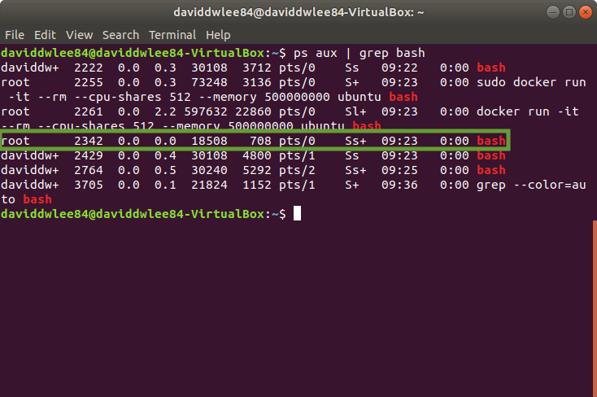
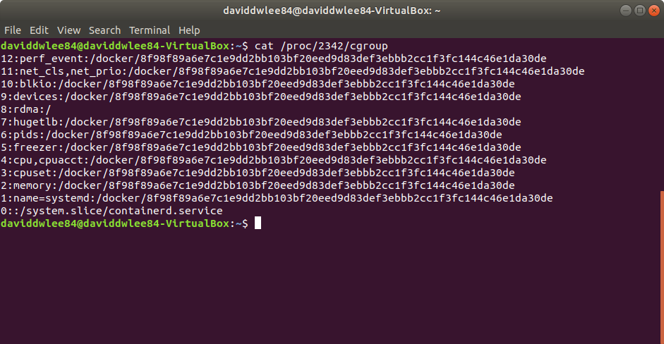
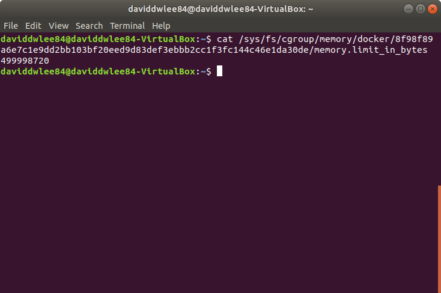
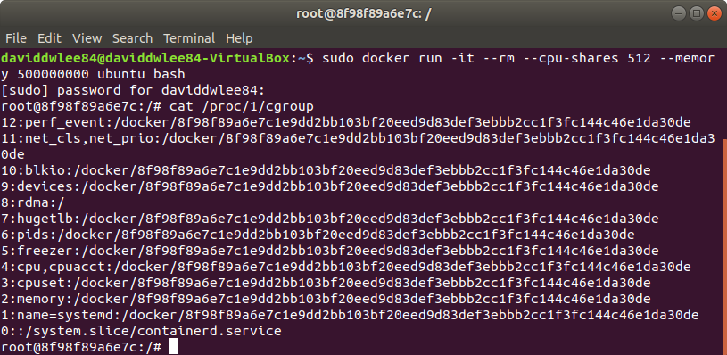
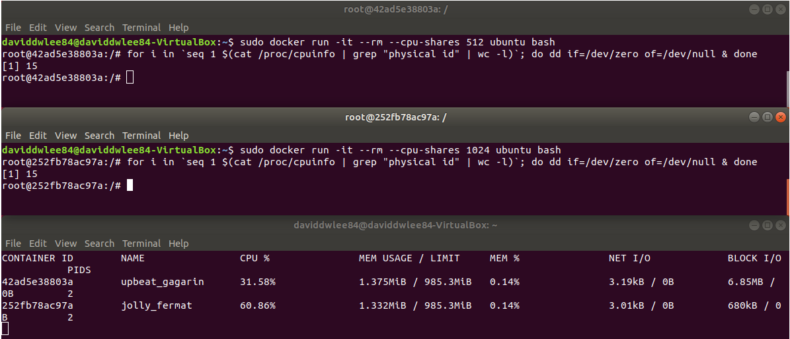

# Lab4: Docker Container and Resource Limitation

Through cgroup filesystem to examine the resource limitation of docker container:

Use docker command to start up a container with resouce limit and then goto cgroup filesystem examine the limitation given by docker.

> [Getting Docker CE for Ubuntu](https://docs.docker.com/install/linux/docker-ce/ubuntu/)

My Environment:

```sh
# Docker
$ docker -v
Docker version 18.09.6, build 481bc77

# Operating System
$ lsb_release -a
No LSB modules are available.
Distributor ID:	Ubuntu
Description:	Ubuntu 18.04.2 LTS
Release:	18.04
Codename:	bionic

# Linux Kernel
$ uname -r
4.18.0-16-generic
```

## Background

cgroups (control groups)

... TODO

### cgroups

TODO

* [Wiki - Cgroups](https://en.wikipedia.org/wiki/Cgroups)

## Knowledge

### Docker

* the "process" in docker container matches its host one by one.

#### Limitation parameter of `docker run`

> [docker run documnetation](https://docs.docker.com/engine/reference/commandline/run/)

* `--blokio-weight`: Block IO (relative weight), between 10 and 1000, or 0 to disable (default 0)
* `--blokio-weight-device`: Block IO weight (relative device weight)
* `--cgroup-parent`: Optional parent cgroup for the container
* `--cpu-quota`: Limit CPU CFS (Completely Fair Scheduler) quota
* `--cpu-rt-period`: API 1.25+ Limit CPU real-time period in microseconds
* `--cpu-rt-runtime`: API 1.25+ Limit CPU real-time runtime in microseconds
* `--cpu-shares`: CPU shares (relative weight)
* `--cpus`: API 1.25+ Number of CPUs
* `--cpuset-cpus`: CPUs in which to allow execution (0-3, 0,1)
* `--cpuset-mems`: MEMs in which to allow execution (0-3, 0,1)
* `--kernel-memory`: Kernel memory limit
* `--memory`: Memory limit
* `--memory-reservation`: Memory soft limit
* `--memory-swap`: Swap limit equal to memory plus swap: ‘-1’ to enable unlimited swap
* `--memory-swappiness`: Tune container memory swappiness (0 to 100)

### cgroups subsystem

* blkio — this subsystem sets limits on input/output access to and from block devices such as physical drives (disk, solid state, or USB).
* cpu — this subsystem uses the scheduler to provide cgroup tasks access to the CPU.
* cpuacct — this subsystem generates automatic reports on CPU resources used by tasks in a cgroup.
* cpuset — this subsystem assigns individual CPUs (on a multicore system) and memory nodes to tasks in a cgroup.
* devices — this subsystem allows or denies access to devices by tasks in a cgroup.
* freezer — this subsystem suspends or resumes tasks in a cgroup.
* memory — this subsystem sets limits on memory use by tasks in a cgroup and generates automatic reports on memory resources used by those tasks.
* perf_event — this subsystem identifies cgroup membership of tasks and can be used for performance analysis.
* net_cls — this subsystem tags network packets with a class identifier (classid) that allows the Linux traffic controller (tc) to identify packets originating from a particular cgroup task.
  * docker didn't direct use it

> * [IBM Knowledge Center - Control groups (cgroups) for limiting resource usage](https://www.ibm.com/support/knowledgecenter/en/SSZUMP_7.1.2/management_sym/cgroup_subsystems.html)
> * [Red Hat - Introduction to control groups (cgroups)](https://access.redhat.com/documentation/en-us/red_hat_enterprise_linux/6/html/resource_management_guide/ch01)

### Namespace in Linux

| Namespace | syscall parameter | seperated contents                          |
| --------- | ----------------- | ------------------------------------------- |
| UTS       | CLONE_NEWUTS      | host name and domain name                   |
| IPC       | CLONE_NEWIPC      | semaphore, imformation queue, shared memory |
| PID       | CLONE_NEWPID      | process identity                            |
| Network   | CLONE_NEWNET      | network device, stack, protocol             |
| Mount     | CLONE_NEWNS       | mounting point (file system)                |
| User      | CLONE_NEW_USER    | user and user group                         |
| Cgroup    | CLONE_NEWCGROUP   | cgroup information                          |

[include/uapi/linux/sched.h](https://github.com/torvalds/linux/blob/master/include/uapi/linux/sched.h)

```c
#define CLONE_NEWNS	0x00020000	/* New mount namespace group */

#define CLONE_NEWCGROUP		0x02000000	/* New cgroup namespace */
#define CLONE_NEWUTS		0x04000000	/* New utsname namespace */
#define CLONE_NEWIPC		0x08000000	/* New ipc namespace */
#define CLONE_NEWUSER		0x10000000	/* New user namespace */
#define CLONE_NEWPID		0x20000000	/* New pid namespace */
#define CLONE_NEWNET		0x40000000	/* New network namespace */
```

* [Wiki - Linux namespaces](https://en.wikipedia.org/wiki/Linux_namespaces)

## Experiment

### Examine memory limitation

1. Run a container with resource limit

    ```sh
    sudo docker run -it --rm --cpu-shares 512 --memory 500000000 ubuntu bash
    ```

    > If there is a warning:
    >
    > ```txt
    > WARNING: Your kernel does not support swap limit capabilities or the cgroup is not mounted. Memory limited without swap.
    > ```
    >
    > 1. Add the following line in `/etc/default/grub`
    >
    >     ```txt
    >     GRUB_CMDLINE_LINUX="cgroup_enable=memory swapaccount=1"
    >     ```
    >
    > 2. Updte grub and reboot
    >
    >     ```txt
    >     sudo update-grub
    >     reboot
    >     ```

2. Check the limit of cgroup
   1. Find the "bash" process using `ps aux | grep bash`, the process right under the `docker run ...` command is the one. (also the owner should be `root`)

        

   2. Use `cat /proc/PID/cgroup` to get the cgroup path

        

3. Find cgroup mounting point

    Default Ubuntu will mount cgroup under `/sys/fs/cgroup` (in my case this is true).

    If not, using this command to mount `sudo mount -t cgroup cgroup /cgroup`

4. Examine the cgroup fs status
   1. Using the cgoup path obtain from step 2, check the memory setting
   2. We can see that the number is 499998720 is less than 500000000 bytes and can be divided by 4KB (4096)!

        

5. Examine if the cgroup namespace of docker is enabled

    Execute `cat /proc/1/cgroup` "in docker" and we can found that it is exact the same as "host" (in step 2). That means in current version docker, the cgroup namespace is not enabled

    

### Examine CPU usage weight

1. Start two container with different `--cpu-shares` weight
   1. `sudo docker run -it --rm --cpu-shares 512 ubuntu bash`
   2. `sudo docker run -it --rm --cpu-shares 1024 ubuntu bash`
2. Both of them run the following command to take the 100% CPU in each container

    ```sh
    for i in `seq 1 $(cat /proc/cpuinfo | grep "physical id" | wc -l)`; do dd if=/dev/zero of=/dev/null & done
    ```

> * `cat /proc/cpuinfo | grep "physical id" | wc -l`: get CPU number
> * `seq 1 N`: generate an array from 1 to N (here is CPU number)
> * `dd if=/dev/zero of=/dev/null`: just taken all the CPU resources by running this fake I/O operation on each CPU

Here we can see the CPU status using `docker stats`



As we can see, the `CPU %` is about the ratio of 512:1024. As we expected.

### Trace the cgroup cpu subsystem source code in runc

See how docker `runc` implements the resource seperation of any cgroup subsystem (blkio, cpu, cpuacct, cpuset)

TODO

#### cpu

[opencontainers/runc - libcontainer/cgroups/fs/cpu.go](https://github.com/opencontainers/runc/blob/master/libcontainer/cgroups/fs/cpu.go)

#### blkio

[opencontainers/runc - libcontainer/cgroups/fs/blkio.go](https://github.com/opencontainers/runc/blob/master/libcontainer/cgroups/fs/blkio.go)

#### cpuacct

[opencontainers/runc - libcontainer/cgroups/fs/cpuacct.go](https://github.com/opencontainers/runc/blob/master/libcontainer/cgroups/fs/cpuacct.go)

#### cpuset

[opencontainers/runc - libcontainer/cgroups/fs/cpuset.go](https://github.com/opencontainers/runc/blob/master/libcontainer/cgroups/fs/cpuset.go)
