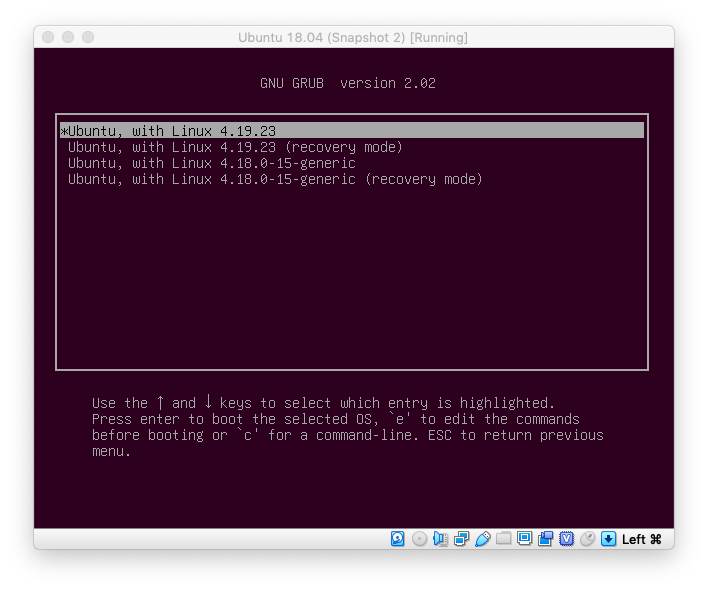
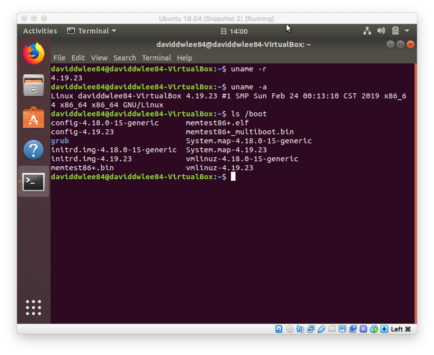

# Homework 1: Compile Linux Kernel

## Brief Description

In this practice I'll use Ubuntu 18.04 running on VirtualBox.

## Download Essential

### Linux Kernel Source Code

[Linux Kernel](https://www.kernel.org/)

In this practice I'll use 4.19.23 version kernel.

```sh
$ wget https://cdn.kernel.org/pub/linux/kernel/v4.x/linux-4.19.23.tar.xz
$ tar xvf linux-4.19.23.tar.xz
```

### Essential Program

```sh
# for make (It's already included in build-essential)
# sudo apt install make-gui

# for gcc
sudo apt-get install build-essential

# for make menuconfig (ncurses packages)
sudo apt-get install libncurses5-dev bison flex

# for building (make -j4)
sudo apt-get install libelf-dev

# for openssl/bil.h (OpenSSL library)
sudo apt-get insatll libssl-dev
```

## Configure the Kernel

### Clean the project

* `make mrproper`: Remove all generated files, config and various backup files
* `make clean`: Remove most generated files but keep the config

### Configure the project

A special technique to copy current OS config

```sh
cp /boot/config-$(uname -r) .config
```

* `make config`: basic CLI configure
* `make menuconfig`: CLI interactive configure <= Better use this
* `make xconfig`: GUI interactive configure

- `make oldconfig`: make change on previous setting

+ `make x86_64_defconfig`
+ `make localmodconfig`

> I copy current OS config and use `make menuconfig`, but I don't know which should be change so I leave the setting original.

## Build the Kernel

* `make`
  * `make -jn`: n means job number. e.g. `make -j4`
* `make zImage`
* `make bzImage`

I use `make -j4` here.

```txt
...
Setup is 15580 bytes (padded to 15872 bytes).
System is 8145 kB
CRC b44da209
Kernel: arch/x86/boot/bzImge is ready  (#1)
```

## Install the Kernel

```sh
sudo make install
```

After this, you can find new kernel in `/boot`

* `config-4.19.23`
* `initrd.img-4.19.23`
* `System.map-4.19.23`
* `vmlinuz-4.19.23`

## Configure Booting Document

**GRUB** (GRand Unified Bootloader)

We need to update the GRUB after we've install the kernel.

```sh
sudo update-grub
```

We can also update some setting in `/etc/default/grub`.

For example set `GRUB_TIMEOUT` to 5 (default 0).

Don't forget to run `sudo update-grub` afterward to update settings.

## Reboot and Enter New Kernel

When reboot. Press *shift* we can select kernel.

> It's in *Advanced options for Ubuntu* option.



When login the system. Use `uname -a` we can check if our system version is 4.19.23 means success.

> I've faced some problem that when it's starting the OS it will flashing with red screen with some sentence on it. And I can't login since it stuck in the login page.
>
> But it somehow login successfully after few reboot...



## Resources

* [Linaro HowTo/KernelDeploy](https://wiki.linaro.org/Resources/HowTo/KernelDeploy) - Similar procedure.
