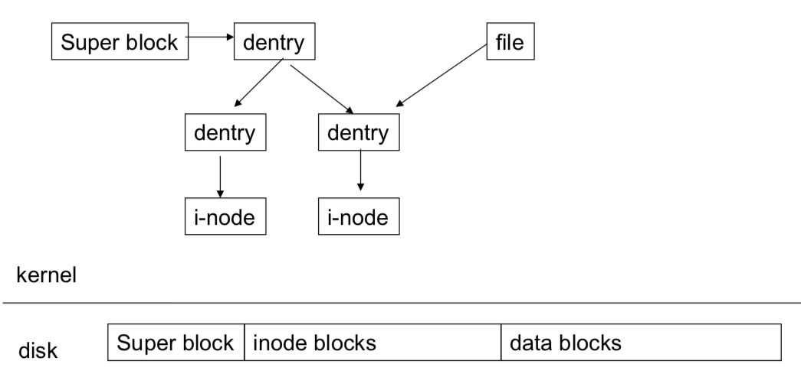

# Linux File System

## Linux VFS

VFS stands for virtual file system

* [Wiki - Virtual file system](https://en.wikipedia.org/wiki/Virtual_file_system)

### Linux File System Types

* Block Device-based File System
  * e.g. Ext3, NTFS
* Network-based File System
  * e.g. NFS, SMB
* Virtual/Pseudo File System
  * e.g. Proc, Sysfs
* Distruibuted File System
  * e.g. HDFS

### Special File System

TBD

### File System Abstraction Layer

```txt
-----------------------------------------
User space     e.g. write()
-----------------------------------------
VFS            e.g. sys_write()
-----------------------------------------
File system    filesystem's write method
-----------------------------------------
Physical media
-----------------------------------------
```


The VFS Layer

* Can be looked as Object-oriented
* Unified file system model => the Traditional Unix-like model

### VFS Data Structure (VFS Objects)

> Important: [Hard Disk vs. Kernel](#disk-vs-kernel)

The object types

* **Superblock**
  * Information about a mounted file system instance
  * May have disk counterpart (e.g. filesystem control block)
* **I-node**: Index Node
  * Information about a specific file
  * Each inode object is associated with an inode number, which uniquely identifies the file within the filesystem
  * May have disk counterpart (e.g. file control block (FCB))
* **Dentry**: Directory Entry
  * About *directory tree* or about a *name path*
  * Each disk-based filesystem stores this information in its own particular way on disk
* **File**: only exist in memory when we "open file"
  * Information about the interaction *between an open file and a process*
  * *Exists only in kernel memory* during the period when a process has the file open

> Understanding the Linux Kernel page 306

[](https://www.researchgate.net/publication/221550933_Model-Checking_the_Linux_Virtual_File_System)

#### Disk vs Kernel



#### VFS Objects Common Ground

* Reference counter for each object
* Cache
* Abstract objects
* Object and its operations

#### VFS Object Methods

### Pathname Lookup

TBD

## VFS Data Structure in Detail

> Basically define in [`include/linux/fs.h`](https://github.com/torvalds/linux/blob/master/include/linux/fs.h)

### File System Type

> * linked list
> * `s_type` in Superblock

* [`struct file_system_type`](https://github.com/torvalds/linux/blob/master/include/linux/fs.h#L2180)
  * Multiple fs instances per `file_system_type`
  * main fields
    * `name`
    * `fs_flags`
    * `mount`
    * `kill_sb`
    * `fs_supers`
    * `owner`

Register a file system

TBD

### Superblock

> * doubly linked list

* [`struct super_block`](https://github.com/torvalds/linux/blob/master/include/linux/fs.h#L1408)

In [`fs/super.c`](https://github.com/torvalds/linux/blob/master/fs/super.c#L45)

```c
static DEFINE_SPINLOCK(sb_lock);
```

### Inode

* Inode number is unique for a fs instance

* [`struct inode`](https://github.com/torvalds/linux/blob/master/include/linux/fs.h#L621)
  * main fields
    * `i_ino`, `i_sb`: inode number and superblock
    * `i_mapping`: address space
    * `i_fop`: file operations
    * `i_op`: inode operations
    * `i_hash`, `i_sb_list`: lists
    * `i_uid`, `i_gid`, `i_mode`, `i_atime`: attributes
    * `i_count`: reference count

### Dentry

> This is define in `include/linux/dcache.h`

* [`struct dentry`](https://github.com/torvalds/linux/blob/master/include/linux/dcache.h#L89)

### File

* [`struct file`](https://github.com/torvalds/linux/blob/master/include/linux/fs.h#L922)
  * main fields
    * `f_op`: file operations (for documents)
    * `f_dentry`: file's dentry
    * `f_mode`/`f_owner`: file attributes
    * `fu_list`: link to superblock
      * remount should check opened files
    * `f_pos`: read/write position
    * `f_count`: reference count
* [`struct file_operations`](https://github.com/torvalds/linux/blob/master/include/linux/fs.h#L1791)
  * main fields
    * `open`
    * `write/read`
    * `llseek`: set file read/write position
    * `mmap`: called when doing mmap syscall, memory maps the given file onto the given address space
    * `release`: called when closing a file
    * `poll`: called when doing select/poll syscall
    * `loctl`
    * ...

#### Structures associated with a process

* `struct task_struct` has two fields related with fs
  * [`struct fs_struct *fs`](https://github.com/torvalds/linux/blob/master/include/linux/sched.h#L854)
  * [`struct files_struct *files`](https://github.com/torvalds/linux/blob/master/include/linux/sched.h#L857)

```c
struct task_struct {
    ...

    /* Filesystem information: */
    struct fs_struct		*fs;

    /* Open file information: */
    struct files_struct		*files;
}
```

* [`struct fs_struct`](https://github.com/torvalds/linux/blob/master/include/linux/fs_struct.h#L9)
  * about task's filesystem environment
  * `struct path`
    * `root`: Root mountpoint (vfsmount), root dentry: Mounted filesystem object of the root directory
    * `pwd`: Pwd mountpoint (vfsmount), pwd dentry: Mounted filesystem object of the current working directory

* [`struct files_struct`](https://github.com/torvalds/linux/blob/master/include/linux/fdtable.h#L48)
  * about *opened files* of a task
  * `struct file __rcu * fd_array[NR_OPEN_DEFAULT];`

#### vfsmount

* [`struct vfsmount`](https://github.com/torvalds/linux/blob/master/include/linux/mount.h#L68)

## Buffer

* Linux use Radix Tree to manage page buffer

### Page Buffer - Radix Tree

[`struct radix_tree_node`](https://github.com/torvalds/linux/blob/master/include/linux/radix-tree.h#L35)

### Block Buffer

## Address Space

* [`struct address_space`](https://github.com/torvalds/linux/blob/master/include/linux/fs.h#L442)
  * main fields
    * `inode`
    * `page_tree`
    * `nrpages`
    * `i_mmap`
    * `backing_dev_info`
    * `private_list`
    * `flags`: GFP

[](https://tofutu.blogspot.com/2011/10/chapter-17-page-frame-reclaiming.html)


## Specific Linux File System

### Ext2 File System

```txt
Layout of an Ext2 partition and of an Ext2 block group
+-------+---------------+-----+---------------+
| Boot  | Block group 0 | ... | Block group n |
| Block |               |     |               |
+-------+---------------+-----+---------------+
        /                \
       /                  \
      /                    \
+-------+-------------+------------+--------+-------+-------------+
| Super | Group       | Data block | inode  | inode | Data blocks |
| Block | Descriptors | Bitmap     | Bitmap | Table |             |
+-------+-------------+------------+--------+-------+-------------+
 1 block   n blocks     1 block     1 block  n blocks   n blocks
```

TBD

### Ext3 File System

> a journaling filesystem

### Ext4 File System

TBD

Bigger filesystem/file size

Ext4 adds **48-bit block addressing**

* 1 EB of maximum filesystem size
* 16TB of maximum file size

**Extents**: a bunch of *contiguous* physical blocks

## Resources

* [Shichao's Notes -  Chapter 13. The Virtual Filesystem](https://notes.shichao.io/lkd/ch13/)

### Book

Understanding Linux Kernel

* Ch12. The Virtual Filesystem
  * Ch12.1 The Role of the VFS
  * Ch12.2 VFS Data Structure
    * Ch12.2.1 Superblock Objects
    * Ch12.2.2 Inode Objects
    * Ch12.2.3 File Objects
    * Ch12.2.4 Special Handling for Directory File Objects
    * Ch12.2.5 Dentry Objects
    * Ch12.2.6 The Dentry Cache
    * Ch12.2.7 Files Associated with a Process
  * Ch12.3 Filesystem Mounting
  * Ch12.4 Pathname Lookup
  * Ch12.5 Implementations of VFS System Calls
  * Ch12.6 File Locking
  * Ch12.7 Anticipating Linux 2.4
* Ch17 The Ext2 Filesystem
* Ch18 Process Communication
  * Ch18.1 Pipes
