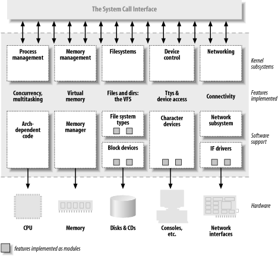

# Overview of Linux Kernel




## Concept

### Linux Kernel Module

```txt
┌-----------------┐                   ┌-----------------┐
|   USER SPACE    | ---- syscall ---> |   KERNEL SPACE  |
|   standard      |                   |   Operating     |
|   "runtime"     |                   |   System        |
|   libraries     | <--- sysret ----- |   kernel        |
└-----------------┘                   └-----------------┘
 ret |  call^                            ret |  call^
     v      |                                v      |
┌-----------------┐                   ┌-----------------┐
|   application   |                   |     module      |
└-----------------┘                   └-----------------┘
                                               ^
                                               |
Linux allow us to write our own installable kernel modules
and add them to a running system
```

## Resource

* [wiki - Linux kernel](https://en.wikipedia.org/wiki/Linux_kernel)
* [torvalds/linux](https://github.com/torvalds/linux) - Linux kernel source tree
