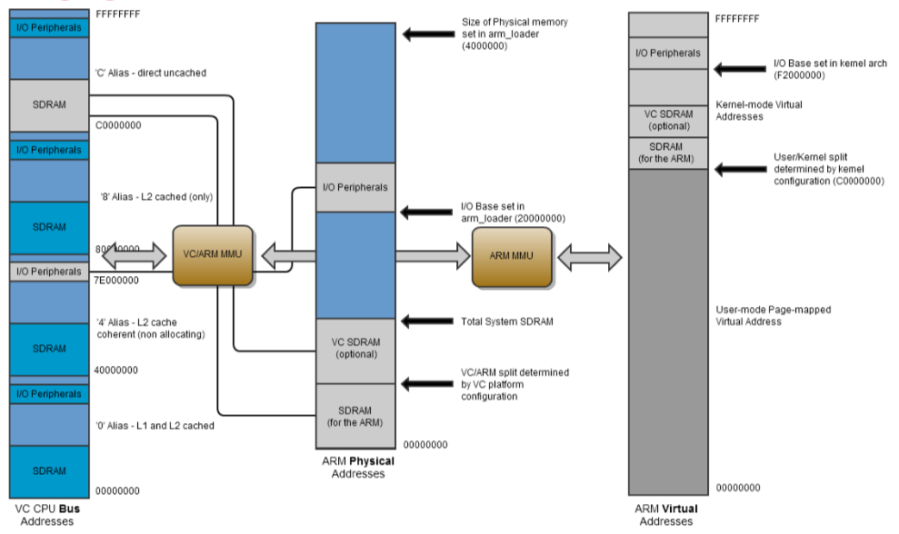

# Analysis

> * priniple analysis
> * data structure
> * source code analysis

## Raspberry Pi Linux Kernel

The Raspberry Pi Linux Kernel is a little different from the Torvalds Linux Kernel.

The kernel include is put in `include/linux/`. So the include should be like `#include <linux/header.h>`.
(if you're using a header that is not start with `linux`, you should check if you mis-use the "user space" header)

### GPIO in Kernel Space

[`include/linux/gpio.h`](https://github.com/raspberrypi/linux/blob/rpi-4.19.y/include/linux/gpio.h)

| Function                                                            | Detail                                              | Line in code |
| ------------------------------------------------------------------- | --------------------------------------------------- | ------------ |
| `static inline int gpio_request(unsigned gpio, const char *label)`  | Request the GPIO pin and assign with a string label | 115          |
| `static inline void gpio_free(unsigned gpio)`                       | Free a GPIO                                         | 131          |
| `static inline int gpio_direction_output(unsigned gpio, int value)` | Set a GPIO to output mode                           | 152          |
| `static inline void gpio_set_value(unsigned int gpio, int value)`   | Get the value of a GPIO                             | 69           |

### Kernel Thread

[`include/linux/kthread.h`](https://github.com/raspberrypi/linux/blob/rpi-4.19.y/include/linux/kthread.h)

| Function / Data Struct / Macro                      | Detail                                                | Line in code |
| --------------------------------------------------- | ----------------------------------------------------- | ------------ |
| `#define kthread_run(threadfn, data, namefmt, ...)` | Assign a function to run and its data and name        | 44           |
| `int kthread_stop(struct task_struct *k);`          | Stop a running thread                                 | 56           |
| `bool kthread_should_stop(void);`                   | For some reason that check if it need to stop running | 57           |

[`include/linux/sched.h)`](https://github.com/raspberrypi/linux/blob/rpi-4.19.y/include/linux/sched.h)

| Function / Data Struct                                                                 | Detail                                        | Line in code |
| -------------------------------------------------------------------------------------- | --------------------------------------------- | ------------ |
| `struct task_struct`                                                                   | i.e. the PCB                                  | 593          |
| `extern int sched_setscheduler(struct task_struct *, int, const struct sched_param *)` | Put a thread in the scheduler with a priority | 1530         |

```c
// define a sched_param like this by yourself
struct sched_param
{
    int sched_priority;
};
```

* `current`: this is the current thread

#### Delay

[`include/linux/delay.h`](https://github.com/raspberrypi/linux/blob/rpi-4.19.y/include/linux/delay.h)

| Function                                                  | Detail                          | Line in code |
| --------------------------------------------------------- | ------------------------------- | ------------ |
| `void msleep(unsigned int msecs)`                         | Delay for milliseconds (unused) | 58           |
| `void usleep_range(unsigned long min, unsigned long max)` | Delay for some microseconds     | 60           |

> Should distinguish from `usleep()` in `unistd.h`. That is in user space.

### Sysfs - The Pseudo-file

> It is include in `<linux/module.h>`

[`include/linux/kobject.h`](https://github.com/raspberrypi/linux/blob/rpi-4.19.y/include/linux/kobject.h)

| Function / Data Struct / Macro                                                                          | Detail                                              | Line in code |
| ------------------------------------------------------------------------------------------------------- | --------------------------------------------------- | ------------ |
| `extern struct kobject * __must_check kobject_create_and_add(const char *name, struct kobject *parent)` | Create a directory under `/sys`                     | 106          |
| `extern void kobject_put(struct kobject *kobj)`                                                         | Remove a directory from the sysfs                   |
| `struct kobj_attribute`                                                                                 | Structure to store some attribute of the pseudofile | 163          |

[`include/linux/sysfs.h`](https://github.com/raspberrypi/linux/blob/rpi-4.19.y/include/linux/sysfs.h)

| Macro                                         | Detail                        | Line in code |
| --------------------------------------------- | ----------------------------- | ------------ |
| `#define __ATTR(_name, _mode, _show, _store)` | Set a `struct kobj_attribute` | 101          |

```c
#define __ATTR(_name, _mode, _show, _store) {				\
	.attr = {.name = __stringify(_name),				\
		 .mode = VERIFY_OCTAL_PERMISSIONS(_mode) },		\
	.show	= _show,						\
	.store	= _store,						\
}
```

[`include/linux/kernel.h`](https://github.com/raspberrypi/linux/blob/rpi-4.19.y/include/linux/kernel.h)

| Macro                                     | Detail                                | Line in code |
| ----------------------------------------- | ------------------------------------- | ------------ |
| `#define VERIFY_OCTAL_PERMISSIONS(perms)` | Check the permission of the file mode | 1024         |

[`include/linux/stat.h`](https://github.com/raspberrypi/linux/blob/rpi-4.19.y/include/linux/stat.h) and [`include/uapi/linux/stat.h`](https://github.com/raspberrypi/linux/blob/rpi-4.19.y/include/uapi/linux/stat.h)

| Macro                                       | Detail                                    | Line in code |
| ------------------------------------------- | ----------------------------------------- | ------------ |
| `#define S_IWUSR 00200`                     | Write permission by owner                 | 31           |
| `#define S_IWGRP 00020`                     | Write permission by group                 | 36           |
| `#define S_IWOTH 00002`                     | Write permission by others                | 41           |
| `#define S_IRUGO (S_IRUSR|S_IRGRP|S_IROTH)` | Give everyone read permission (i.e. 0444) | 11           |

## Source Code Analysis

### 7 Segment Display Helper Functions

[`seven_seg.h`](Code_KernelDelayThread_UseGPIO_H/seven_seg.h)

Macros

* `TotalLED`: LEDs a 7-segment dispaly can have (8)
  * A, B, C, D, E, F, G, digital dot (unused)
* `PinUsed`: Actual LED that we need (7)
* `TotalDigits`: Maximum digits a 7-segment display that we support (4)
* `DigitUsed`: Actual digits that we use in our case(2)
* `DISP_DELAY_US`: For each digit display for a duration (10000)

Global Constants

* `const short SegmentPin[TotalLED]`: The pinout of BCM that we want to assign for the LEDs
* `const short DigitPin[TotalDigits]`: The pinout of BCM that we want to assign for the digit pin
* `const short NumTable[10 + 1][PinUsed]`: The truth table for each decimal number (the `+1` is for the "empty" number (10))

[`seven_seg.c`](Code_KernelDelayThread_UseGPIO_H/seven_seg.c)

Global Variable

* `short NumToShow[TotalDigits]`: Store the number to be displayed. (initial with "empty")

Functions

* `void init_7seg_gpio(void)`: Require and initialize the gpio pins (set to output mode) that we need

    ```c
    void init_7seg_gpio(void)
    {
        int i;
        for (i = 0; i < PinUsed; i++)
        {
            gpio_request(SegmentPin[i], GPIO_REQUEST_LABEL);
            gpio_direction_output(SegmentPin[i], 0);
        }
        for (i = 0; i < DigitUsed; i++)
        {
            gpio_request(DigitPin[i], GPIO_REQUEST_LABEL);
            gpio_direction_output(DigitPin[i], 1);
        }
    }
    ```

* `void free_7seg_gpio(void)`: Free the gpio pins that we've required

    ```c
    void free_7seg_gpio(void)
    {
        int i;
        for (i = 0; i < PinUsed; i++)
        {
            gpio_free(SegmentPin[i]);
        }
        for (i = 0; i < DigitUsed; i++)
        {
            gpio_free(DigitPin[i]);
        }
    }
    ```

* `void setDigit(int digit)`: Set the output LED to be the "digit" using the NumTable

    ```c
    void setDigit(int digit)
    {
        int i;
        for (i = 0; i < PinUsed; i++)
        {
            gpio_set_value(SegmentPin[i], NumTable[digit][i]);
        }
    }
    ```

* `void showDigit(int pos)`: Set the specific digit pin to be low-state to show the digit on the "pos"

    ```c
    void showDigit(int pos)
    {
        int i;
        for (i = 0; i < DigitUsed; i++)
        {
            gpio_set_value(DigitPin[i], (pos != i));
        }
    }
    ```

* `void clearDisplay(void)`: Set all the number of NumToShow to be "empty" number (10)

```c
void clearDisplay(void)
{
    int pos;
    for (pos = 0; pos < DigitUsed; pos++)
    {
        NumToShow[pos] = 10;
    }
}
```

* `void setNumber(int number)`: Read the number and assign to the NumToShow. And if the number is negative number, then clear the display.

    ```c
    void setNumber(int number)
    {
        int pos;
        if (number < 0)
        {
            // If receive negative number, then clear the display.
            clearDisplay();
            return;
        }
        for (pos = 0; pos < DigitUsed; pos++)
        {
            // If the number position greater than 10 is 0 then don't display it!
            if (number == 0 && pos > 0)
                NumToShow[pos] = 10;
            else
            {
                NumToShow[pos] = number % 10;
                number /= 10;
            }
        }
    }
    ```

* `void showAllDigits(unsigned int duration)`: Scan through all the digits to display the NumToShow

    ```c
    void showAllDigits(unsigned int duration)
    {
        int t, pos;
        for (t = 0; t < duration; t += DISP_DELAY_US)
        {
            for (pos = 0; pos < DigitUsed; pos++)
            {
                showDigit(pos);
                setDigit(NumToShow[pos]);
                usleep_range(DISP_DELAY_US, DISP_DELAY_US);
            }
        }
    }
    ```

### Kernel Module

[`rpi_7seg_module.c`](Code_KernelDelayThread_UseGPIO_H/rpi_7seg_module.c)

#### GPIO

For GPIO just call the `init_7seg_gpio()` and `free_7seg_gpio` define in `seven_seg.h`

```c
void rpi_7seg_gpio_init(void)
{
    printk(KERN_INFO "RPi7Seg: starting gpio...");
    init_7seg_gpio();
    printk(KERN_INFO "RPi7Seg: starting gpio done.");
}

void rpi_7seg_gpio_exit(void)
{
    printk(KERN_INFO "RPi7Seg: stopping gpio...");
    free_7seg_gpio();
    printk(KERN_INFO "RPi7Seg: stopping gpio done.");
}
```

#### Pseudofile and Sysfs manipulation

Set the function that will read the file write to the pseudofile buffer

```c
static ssize_t set_7seg(struct kobject *kobj, struct kobj_attribute *attr, const char *buff, size_t count)
{
    int number;
    sscanf(buff, "%d", &number);
    printk(KERN_INFO "RPi7Seg: received number: %d\n", number);
    setNumber(number);

    return count;
}
```

Setting up a kobject's attribute to have permision "0666"

Note that we need to undefine the `VERIFY_OCTAL_PERMISSIONS`, or the compiler won't let you compile, since I've given "user" to have the write permission.

```c
/* warning! need write-all permission so overriding check */
#undef VERIFY_OCTAL_PERMISSIONS
#define VERIFY_OCTAL_PERMISSIONS(perms) (perms)
#define PERMISSION (S_IWUSR | S_IRUGO | S_IWGRP | S_IWOTH)
static struct kobj_attribute rpi_7seg_attribute = __ATTR(PSEUDO_FILENAME, PERMISSION, NULL, set_7seg);
```

Create the kobject under the `/sys/rpi_7seg` and called `display`

```c
#define PSEUDO_FILENAME display

static struct kobject *g_kobject;

void rpi_7seg_sysfs_init(void)
{
    printk(KERN_INFO "RPi7Seg: starting sysfs...");
    g_kobject = kobject_create_and_add("rpi_7seg", NULL);
    if (sysfs_create_file(g_kobject, &rpi_7seg_attribute.attr))
    {
        pr_debug("failed to create rpi_7seg sysfs!\n");
    }
    printk(KERN_INFO "RPi7Seg: starting sysfs done.");
}
```

To remove the pseudofile when remove the module

```c
void rpi_7seg_sysfs_exit(void)
{
    printk(KERN_INFO "RPi7Seg: stopping sysfs...");
    kobject_put(g_kobject);
    printk(KERN_INFO "RPi7Seg: stopping sysfs done.");
}
```

#### Thread

Define a thread function and create a kernel thread with priority 45 and with name "rpi_7seg"

1. The thread will be put in the scheduler with 45 priority
2. And then run in an infinity loop
   1. Keeping scaning/displaying the 7-segment display
   2. Only when interrupt by the `kthread_should_stop()` it will stop running

```c
#define THREAD_PRIORITY 45

struct task_struct *g_task;

struct sched_param
{
    int sched_priority;
};

int rpi_7seg_thread(void *data)
{
    struct task_struct *TSK;
    struct sched_param PARAM = {.sched_priority = MAX_RT_PRIO - 50};
    TSK = current;

    PARAM.sched_priority = THREAD_PRIORITY;
    sched_setscheduler(TSK, SCHED_FIFO, &PARAM);

    while (1)
    {
        // Display the minimal time in case of the number change
        showAllDigits(DISP_DELAY_US * DigitUsed);
        if (kthread_should_stop())
            break;
    }
    return 0;
}
```

Use macro `kthread_run` to run the thread, and stop the thread when remove the kernel module.

```c
#define THREAD_NAME "rpi_7seg"

void rpi_7seg_thread_init(void)
{
    printk(KERN_INFO "RPi7Seg: starting thread...");
    g_task = kthread_run(rpi_7seg_thread, NULL, THREAD_NAME);
    printk(KERN_INFO "RPi7Seg: starting thread done.");
}

void rpi_7seg_thread_exit(void)
{
    printk(KERN_INFO "RPi7Seg: stopping thread...");
    kthread_stop(g_task);
    printk(KERN_INFO "RPi7Seg: stopping thread done.");
}
```

> When running
>
> ```sh
> $ ps aux | grep rpi_7seg
> USER       PID %CPU %MEM    VSZ   RSS TTY      STAT START   TIME COMMAND
> root     19300  0.2  0.0      0     0 ?        D    18:02   0:39 [rpi_7seg]
> ```

#### Module

Simply call the initializer and freer that we've defined earlier.

```c
static int __init rpi_7seg_init(void)
{
    printk(KERN_INFO "RPi7Seg: staring...");
    rpi_7seg_gpio_init();
    rpi_7seg_thread_init();
    rpi_7seg_sysfs_init();
    printk(KERN_INFO "RPi7Seg: staring done.");
    return 0;
}

static void __exit rpi_7seg_exit(void)
{
    printk(KERN_INFO "RPi7Seg: stopping...");
    rpi_7seg_sysfs_exit();
    rpi_7seg_thread_exit();
    rpi_7seg_gpio_exit();
    printk(KERN_INFO "RPi7Seg: stopping done.");
}

module_init(rpi_7seg_init);
module_exit(rpi_7seg_exit);
```

### Makefile and Build Script

[`Makefile`](Code_KernelDelayThread_UseGPIO_H/Makefile)

```makefile
ifeq ($(KERNELRELEASE),)

	KERNELDIR ?= /lib/modules/$(shell uname -r)/build
	PWD := $(shell pwd)

modules:
	make -C $(KERNELDIR) M=$(PWD) modules

clean:
	rm -rf *.o *~ core .depend .*.cmd *.ko *.mod.c .tmp_versions

.PHONY: modules clean

else

	# called from kernel build system: just declare what our modules are
	obj-m := rpi_7seg.o

	rpi_7seg-objs := rpi_7seg_module.o seven_seg.o

endif
```

The kernel module builder will automatically find the `*.c` file for each "object" that we need it to compile.

The style of the Makefile is vary from the [user space version](Code_UserSpaceTest/Makefile)

> For more detail about compiling kernel module check out the book
> Linux Kernel Development 3ed. Ch17 Devices and Modules

And the building script [`smart_install.sh`](Code_KernelDelayThread_UseGPIO_H/smart_install.sh)

```sh
#!/bin/sh

BLUE="\033[34m"
END="\033[0m"

echo $BLUE "Compiling rpi_7seg..." $END
make
echo $BLUE "Check if the rpi_7seg module is existing..." $END
lsmod | grep rpi_7seg
if [ "$?" = "0" ]
then
    echo $BLUE "Found the rpi_7seg, remove the old one..." $END
    sudo rmmod rpi_7seg
fi
echo $BLUE "Installing the rpi_7seg module..." $END
sudo insmod rpi_7seg.ko

echo $BLUE "The install info of dmesg (/var/log/syslog)" $END
dmesg --color=always | tail -n 7

echo $BLUE "Checking the permission / file mode of the \"/sys/rpi_7seg/display\"" $END
ls -lh /sys/rpi_7seg/display

echo $BLUE "The rpi_7seg is successfully installed at \"/sys/module/rpi_7seg\"!" $END
echo $BLUE "And you should be able to manipulate the 7-segment display using the pseudo-file \"/sys/rpi_7seg/display\"!" $END
```

### Test Scripts

[`dice.py`](TestScriptsForKernelSysfs/dice.py)

Just passing a number as a stdin argument.

The for loop is to simulate the dice slowly stop on a number after a duration.

```py
#!/usr/bin/python3
import random
import sys
import time

MAX_ROUND = 50

if len(sys.argv) < 2:
    print("Usage: dice.py max_num (this will show a random number between 1~max_num)")
elif int(sys.argv[1]) < 0:
    print("Please input positive number!")
else:
    max_num = int(sys.argv[1])

    with open('/sys/rpi_7seg/display', 'w') as rpi:
        rpi.write(str(-1))  # first clean the display

    for i in range(MAX_ROUND):
        number = random.randrange(1, 1 + max_num)
        with open('/sys/rpi_7seg/display', 'w') as rpi:
            rpi.write(str(number))
        time.sleep(i * 0.003)  # make the dice effect
```

For other test scripts

* [`EightySeven.sh`](TestScriptsForKernelSysfs/EightySeven.sh)
* [`random.sh`](TestScriptsForKernelSysfs/random.sh)

--

## Appendix: BCM2837 Direct Register Access

First read the datasheet: [bcm2837 datasheet](https://cs140e.sergio.bz/docs/BCM2837-ARM-Peripherals.pdf)



### Direct Memory / Peripheral Access

* `open("/dev/mem")`
* `mmap()`
* ...

TODO

### User Space Register Access

* [`BCM2837_GPIO.h`](Code_UserSpaceTest/header/BCM2837_GPIO.h)
* [`BCM2837_GPIO.c`](Code_UserSpaceTest/gpio/BCM2837_GPIO.c)

> For more detail checkout the following links
> ("YOU SHOULD CHECK THE CHIP OF YOUR PI IS THE SAME AS THE TUTORIAL, OR THE ADDRESS MAY DIFFER!!")
>
> * [**Low Level Programming of the Raspberry Pi in C**](https://www.pieter-jan.com/node/15)
>   * [github](https://github.com/Pieter-Jan/PJ_RPI)
> * [**RPi GPIO Code Samples**](https://elinux.org/RPi_GPIO_Code_Samples#Direct_register_access)
>   * [讓你的 Raspberry Pi 透過 GPIO 閃爍 LED 燈](https://coldnew.github.io/f7349436/)
> * [**SlideShare - 深入淺出Raspberry Pi GPIO**](https://www.slideshare.net/raspberrypi-tw/raspberry-pigpiolookinside)
>   * [LED example](https://github.com/raspberrypi-tw/tutorial/tree/master/gpio/led/c)
> * [**Raspberry Pi And The IoT In C - Memory Mapped GPIO**](https://www.iot-programmer.com/index.php/books/22-raspberry-pi-and-the-iot-in-c/chapters-raspberry-pi-and-the-iot-in-c/59-raspberry-pi-and-the-iot-in-c-memory-mapped-gpio)
> * Embedded Linux Youtube Videos
>   * [Embedded Linux: Raspberry Pi B+ LED Blink thru GPIO in C Programming](https://youtu.be/ayxYBZbAWAo)
>   * [Embedded Linux: GPIO/LED control on Raspberry Pi through sysfs](https://youtu.be/Si1R2gaqE64)

### Kernel Space Register Access

> * [Embedded Linux: Raspberry Pi B+ LED Blink thru GPIO using Kernel Driver or Linux Module](https://youtu.be/RlNPtBEZRkY)
