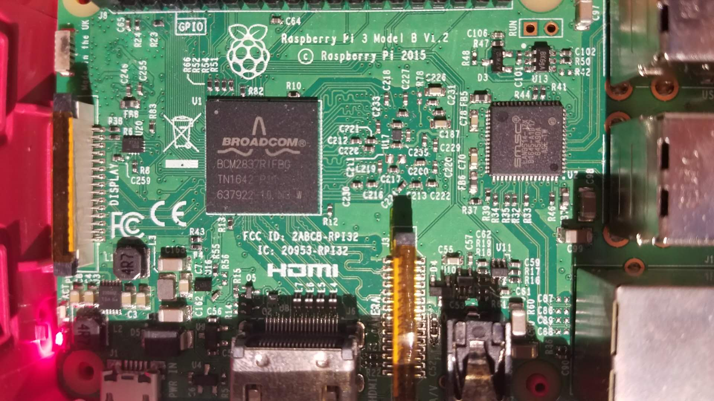
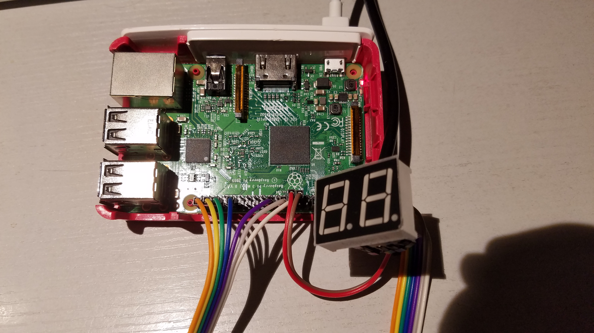
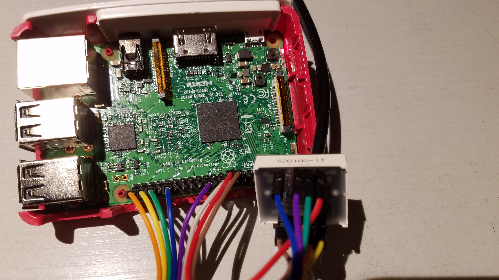
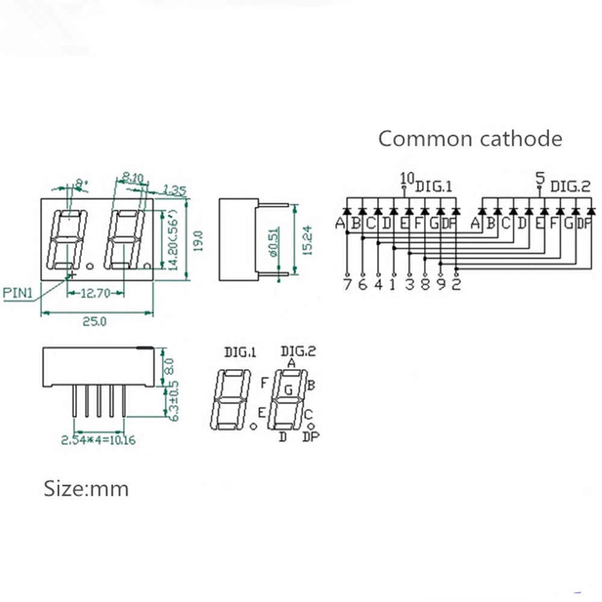

# Experiment

> * screenshots
> * experiment environment and its settings
> * experiment principle, steps, conclusion

## Experiment Envirounmant

* Raspberry Pi 3 Model B Rev 1.2
* Chip: BCM2837
* Kernel version: 4.19.42-v7+
* Operating system: Raspbian GNU/Linux 9.9 (stretch)



```txt
# Kernel Version
$ uname --all
Linux raspberrypi 4.19.42-v7+ #1219 SMP Tue May 14 21:20:58 BST 2019 armv7l GNU/Linux

# OS Version
$ lsb_release -a
No LSB modules are available.
Distributor ID:	Raspbian
Description:	Raspbian GNU/Linux 9.9 (stretch)
Release:	9.9
Codename:	stretch

$ cat /etc/os-release
PRETTY_NAME="Raspbian GNU/Linux 9 (stretch)"
NAME="Raspbian GNU/Linux"
VERSION_ID="9"
VERSION="9 (stretch)"
ID=raspbian
ID_LIKE=debian
HOME_URL="http://www.raspbian.org/"
SUPPORT_URL="http://www.raspbian.org/RaspbianForums"
BUG_REPORT_URL="http://www.raspbian.org/RaspbianBugs"

$ echo $OSTYPE
linux-gnueabihf
```

> * [How To for Raspberry – Checking the Raspbian version (update & upgrade)](https://www.meccanismocomplesso.org/en/how-to-for-raspberry-checking-the-raspbian-version-update-upgrade/)

## Principle

### Hardware

Raspberry Pi 3 Technical Specifications ([link](https://components101.com/microcontrollers/raspberry-pi-3-pinout-features-datasheet))

| Item                                          | Detail                                     |
| --------------------------------------------- | ------------------------------------------ |
| Microprocessor                                | Broadcom BCM2837 64bit Quad Core Processor |
| Processor Operating Voltage                   | 3.3V                                       |
| Maximum current through each I/O pin          | 16mA                                       |
| Maximum total current drawn from all I/O pins | 54mA                                       |

7-segment Display Specification

| Parameter                          | Detail                     |
| ---------------------------------- | -------------------------- |
| Forward Voltage                    | 1.84V (measured with 10mA) |
| Maximum Continuous Forward Current | 20mA                       |

#### Choose of Resistor

> For each LED (i.e. 7 for A, B, ..., G)

Approximately

3.3V/330𝛀 = 10mA < 16mA

> I've placed the resistor between the DuPont Line.

### 7-segment Display

This is the truth table of each decimal number to each LED on 7-segment display.

|  Num | a   | b   | c   | d   | e   | f   | g   |
| ---: | --- | --- | --- | --- | --- | --- | --- |
|    0 | 1   | 1   | 1   | 1   | 1   | 1   | 0   |
|    1 | 0   | 1   | 1   | 0   | 0   | 0   | 0   |
|    2 | 1   | 1   | 0   | 1   | 1   | 0   | 1   |
|    3 | 1   | 1   | 1   | 1   | 0   | 0   | 1   |
|    4 | 0   | 1   | 1   | 0   | 0   | 1   | 1   |
|    5 | 1   | 0   | 1   | 1   | 0   | 1   | 1   |
|    6 | 1   | 0   | 1   | 1   | 1   | 1   | 1   |
|    7 | 1   | 1   | 1   | 0   | 0   | 0   | 0   |
|    8 | 1   | 1   | 1   | 1   | 1   | 1   | 1   |
|    9 | 1   | 1   | 1   | 1   | 0   | 1   | 1   |

This is the GPIO layout. The "LED" field is the pin which the 7-segment display is connecting to.

```txt
 +-----+-----+---------+------+---+---Pi 3B--+---+------+---------+-----+-----+
 | BCM | LED |   Name  | Mode | V | Physical | V | Mode | Name    | LED | BCM |
 +-----+-----+---------+------+---+----++----+---+------+---------+-----+-----+
 |     |     |    3.3v |      |   |  1 || 2  |   |      | 5v      |     |     |
 |   2 |     |   SDA.1 |   IN | 1 |  3 || 4  |   |      | 5v      |     |     |
 |   3 |     |   SCL.1 |   IN | 1 |  5 || 6  |   |      | 0v      |     |     |
 |   4 |     | GPIO. 7 |  OUT | 0 |  7 || 8  | 1 | ALT5 | TxD     |     | 14  |
 |     |     |      0v |      |   |  9 || 10 | 1 | ALT5 | RxD     |     | 15  |
 |  17 |     | GPIO. 0 |  OUT | 0 | 11 || 12 | 0 | OUT  | GPIO. 1 |     | 18  |
 |  27 |  D1 | GPIO. 2 |  OUT | 0 | 13 || 14 |   |      | 0v      |     |     |
 |  22 |  D0 | GPIO. 3 |  OUT | 0 | 15 || 16 | 0 | OUT  | GPIO. 4 | G   | 23  |
 |     |     |    3.3v |      |   | 17 || 18 | 0 | OUT  | GPIO. 5 | F   | 24  |
 |  10 |     |    MOSI |   IN | 0 | 19 || 20 |   |      | 0v      |     |     |
 |   9 |     |    MISO |   IN | 0 | 21 || 22 | 0 | OUT  | GPIO. 6 | E   | 25  |
 |  11 |     |    SCLK |   IN | 0 | 23 || 24 | 1 | IN   | CE0     |     | 8   |
 |     |     |      0v |      |   | 25 || 26 | 1 | IN   | CE1     |     | 7   |
 |   0 |     |   SDA.0 |   IN | 1 | 27 || 28 | 1 | IN   | SCL.0   |     | 1   |
 |   5 |     | GPIO.21 |   IN | 1 | 29 || 30 |   |      | 0v      |     |     |
 |   6 |     | GPIO.22 |   IN | 1 | 31 || 32 | 0 | OUT  | GPIO.26 | D   | 12  |
 |  13 |     | GPIO.23 |   IN | 0 | 33 || 34 |   |      | 0v      |     |     |
 |  19 |     | GPIO.24 |   IN | 0 | 35 || 36 | 0 | OUT  | GPIO.27 | C   | 16  |
 |  26 |     | GPIO.25 |   IN | 0 | 37 || 38 | 0 | OUT  | GPIO.28 | B   | 20  |
 |     |     |      0v |      |   | 39 || 40 | 0 | OUT  | GPIO.29 | A   | 21  |
 +-----+-----+---------+------+---+----++----+---+------+---------+-----+-----+
 | BCM | LED |   Name  | Mode | V | Physical | V | Mode | Name    | LED | BCM |
 +-----+-----+---------+------+---+---Pi 3B--+---+------+---------+-----+-----+
```





#### Common Cathode Two Digits



```txt
 D2  G  F  A  B
+---------------+
|10  9  8  7  6 |
|    Front      |
| 1  2  3  4  5 |
+---------------+
  D  .  E  C  D1
```

#### Visual persistence

To reduce the number of pinout. In practical we "scan" through each digit.

Because the 7-segment display is common cathode, thus

1. Light up the LEDs (i.e. A, B, ..., G) by given 1 (high voltage)
2. Select a digit to show by given 0 (low voltage) to digit pin (i.e. D0, D1)

### Raspberry Pi Linux Kernel

* [raspberrypi/linux](https://github.com/raspberrypi/linux/tree/rpi-4.19.y) - Kernel source tree for Raspberry Pi Foundation-provided kernel builds

> For more detail code tracing check out [here](Analysis.md#Raspberry-Pi-Linux-Kernel)

## Experiment Steps

### 1. Setup the hardware

1. Prepare the following things
   * DuPont Line x 16
     * 7 x 2 for each LED
     * 2 for the digit pin
   * 330𝛀 Resistor x 7 (for each LED)
   * Raspberry Pi 3 Model B
      > If the Raspberry Pi model is different, then that means different chips (in my case, BCM2837), the memory address may differ! Just checkout the "datasheet" of you're model version
2. (optional) Update the kernel version to 4.19.42-v7+
   * If the Raspberry Pi Linux Kernel version is different, then you may probably need check if any of my usage of kernel function is different.

   ```sh
   $ sudo apt-get update
   $ sudo apt-get upgrade
   ```

### 2. Test if the environment is able to compile kernel module

Just check out if the directory exist `/lib/modules/$(shell uname -r)/build`

If not, run the following command to get the headers

```sh
$ sudo apt-get install raspberrypi-kernel-headers
```

Then you're ready to go.

### (Optional) 3. Direct Register Access GPIO in User Space

Before dive into kernel module programming, first playing around with the GPIO in user space will be more "familier" (maybe).

Checkout the [`Code_UserSpaceTest`](Code_UserSpaceTest) for the source code to play with.

You can use `make` or `compile_test.sh` to compile. And then `sudo test.out` to run the test.

```txt
Code_UserSpaceTest
├── Makefile
├── compile_test.sh
├── gpio
│   ├── BCM2837_GPIO.c
│   └── seven_seg.c
├── header
│   ├── BCM2837_GPIO.h
│   └── seven_seg.h
└── test
    └── test.c          => main
```

### 4. GPIO Manipulation in Kernel Space using Kernel Thread and As a Pseudofile in Sysfs (Main Part)

Checkout the [`Code_KernelDelayThread_UseGPIO_H`](Code_KernelDelayThread_UseGPIO_H) for source code.

Just use `./smart_install.sh` to compile and install the kernel module. (For more detail just check out the [script](Code_KernelDelayThread_UseGPIO_H/smart_install.sh))

And you will found the module being installed in `/sys/module/rpi_7seg` and the pseudofile in `/sys/rpi_7seg` as the file `display` (`echo` a positive number to assign to the 7-segment display, if the number is negative that means clear the display).

You should also use the example script to play with the pseudofile. Just checkout the [`TestScriptsForKernelSysfs`](TestScriptsForKernelSysfs).

```txt
Code_KernelDelayThread_UseGPIO_H
├── Makefile
├── rpi_7seg_module.c
├── seven_seg.c
├── seven_seg.h
└── smart_install.sh      => the all in one script that I'm highly recommand to use
TestScriptsForKernelSysfs
├── EightySeven.sh        => simply showing 87 on the screen and clear it in one second
├── dice.py               => "./dice.py [number]" will generate a number between 1~number
└── random.sh             => collecting lots of methods to generate random number and show them
```

## Conclusion

The purpose of chosing this topic as the final project is mainly tend to combine my previous majoy in Electornic Engineering.

I was used to master in Embedding system, but most of them is just focusing on the "functionality".
So I was almost using the driver library and bascially in user space.

This time I want to deal with the headware in lower-level way. Like direct register access or in the kernel space.

I was tried to access the register in the kernel space, (we shouldn't use the same "open memory" way like in user space, since we should prevent calling the user space syscall in kernel), but keep getting the `Unable to handle kernel paging request at virtual address f2200008` error which cause the segment fault when I was installing the kernel module.

And I found the `<linux/gpio.h>` in Raspberry Pi Linux Kernel is quite different then the Torvalds one. The most challenge part is to tracing the kernel headers to try to understand how to manipulate with them. And the information is much harder to search (compare with the resources of user space programming).

Finally, experienced

1. how to manipulate GPIO without any driver in high-level chip
2. how to create a kernel thread
3. how to create a pseudofile in sysfs and playing with it

> Additionally, in kernel space you should prevent from
>
> 1. using "floating point" calculation
> 2. using user space function call including syscall
