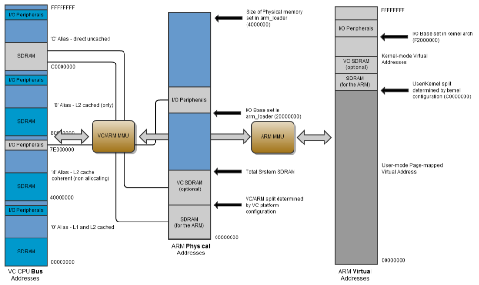

# Final Project: Manipulating Raspberry Pi GPIO with Direct Register Access in Kernel Space

## Overview

### 7-Segment Display

* Common Cathode 共陰極 (in this experiment)
* Common Anode 共陽極


|  Num | a   | b   | c   | d   | e   | f   | g   |
| ---: | --- | --- | --- | --- | --- | --- | --- |
|    0 | 1   | 1   | 1   | 1   | 1   | 1   | 0   |
|    1 | 0   | 1   | 1   | 0   | 0   | 0   | 0   |
|    2 | 1   | 1   | 0   | 1   | 1   | 0   | 1   |
|    3 | 1   | 1   | 1   | 1   | 0   | 0   | 1   |
|    4 | 0   | 1   | 1   | 0   | 0   | 1   | 1   |
|    5 | 1   | 0   | 1   | 1   | 0   | 1   | 1   |
|    6 | 1   | 0   | 1   | 1   | 1   | 1   | 1   |
|    7 | 1   | 1   | 1   | 0   | 0   | 0   | 0   |
|    8 | 1   | 1   | 1   | 1   | 1   | 1   | 1   |
|    9 | 1   | 1   | 1   | 1   | 0   | 1   | 1   |

```txt
 +-----+-----+---------+------+---+---Pi 3B--+---+------+---------+-----+-----+
 | BCM | LED |   Name  | Mode | V | Physical | V | Mode | Name    | LED | BCM |
 +-----+-----+---------+------+---+----++----+---+------+---------+-----+-----+
 |     |     |    3.3v |      |   |  1 || 2  |   |      | 5v      |     |     |
 |   2 |     |   SDA.1 |   IN | 1 |  3 || 4  |   |      | 5v      |     |     |
 |   3 |     |   SCL.1 |   IN | 1 |  5 || 6  |   |      | 0v      |     |     |
 |   4 |  D3 | GPIO. 7 |  OUT | 0 |  7 || 8  | 1 | ALT5 | TxD     |     | 14  |
 |     |     |      0v |      |   |  9 || 10 | 1 | ALT5 | RxD     |     | 15  |
 |  17 |  D2 | GPIO. 0 |  OUT | 0 | 11 || 12 | 0 | OUT  | GPIO. 1 | dp  | 18  |
 |  27 |  D1 | GPIO. 2 |  OUT | 0 | 13 || 14 |   |      | 0v      |     |     |
 |  22 |  D0 | GPIO. 3 |  OUT | 0 | 15 || 16 | 0 | OUT  | GPIO. 4 | G   | 23  |
 |     |     |    3.3v |      |   | 17 || 18 | 0 | OUT  | GPIO. 5 | F   | 24  |
 |  10 |     |    MOSI |   IN | 0 | 19 || 20 |   |      | 0v      |     |     |
 |   9 |     |    MISO |   IN | 0 | 21 || 22 | 0 | OUT  | GPIO. 6 | E   | 25  |
 |  11 |     |    SCLK |   IN | 0 | 23 || 24 | 1 | IN   | CE0     |     | 8   |
 |     |     |      0v |      |   | 25 || 26 | 1 | IN   | CE1     |     | 7   |
 |   0 |     |   SDA.0 |   IN | 1 | 27 || 28 | 1 | IN   | SCL.0   |     | 1   |
 |   5 |     | GPIO.21 |   IN | 1 | 29 || 30 |   |      | 0v      |     |     |
 |   6 |     | GPIO.22 |   IN | 1 | 31 || 32 | 0 | OUT  | GPIO.26 | D   | 12  |
 |  13 |     | GPIO.23 |   IN | 0 | 33 || 34 |   |      | 0v      |     |     |
 |  19 |     | GPIO.24 |   IN | 0 | 35 || 36 | 0 | OUT  | GPIO.27 | C   | 16  |
 |  26 |     | GPIO.25 |   IN | 0 | 37 || 38 | 0 | OUT  | GPIO.28 | B   | 20  |
 |     |     |      0v |      |   | 39 || 40 | 0 | OUT  | GPIO.29 | A   | 21  |
 +-----+-----+---------+------+---+----++----+---+------+---------+-----+-----+
 | BCM | LED |   Name  | Mode | V | Physical | V | Mode | Name    | LED | BCM |
 +-----+-----+---------+------+---+---Pi 3B--+---+------+---------+-----+-----+
```

```txt
 D2  G  F  A  B
+---------------+
|10  9  8  7  6 |
|    Front      |
| 1  2  3  4  5 |
+---------------+
  D  .  E  C  D1
```

This pin number is correct! (but seems not the same product model)

[](https://www.aliexpress.com/i/32821412846.html)

#### 5261AS(Common Cathode) (NOT THIS)


#### MCD5621Cx (NOT THIS)

> WITHOUT PIN 6, 8 WTF

* [MCD-5621Cx-Dx (DUAL DIGIT LED DISPLAY) Datasheet](http://mcdelectronics.com/userfiles/1185/files/LED%20Displays/dual_digit_7_segment_display_GND-5621Cx-Dx.pdf)

> NOT THIS EITHER
>
> 

### GPIO Registers of Raspberry Pi

* [**Low Level Programming of the Raspberry Pi in C**](https://www.pieter-jan.com/node/15)
  * [github](https://github.com/Pieter-Jan/PJ_RPI)
* [**RPi GPIO Code Samples**](https://elinux.org/RPi_GPIO_Code_Samples#Direct_register_access)
  * [讓你的 Raspberry Pi 透過 GPIO 閃爍 LED 燈](https://coldnew.github.io/f7349436/)
* [**SlideShare - 深入淺出Raspberry Pi GPIO**](https://www.slideshare.net/raspberrypi-tw/raspberry-pigpiolookinside)
  * [LED example](https://github.com/raspberrypi-tw/tutorial/tree/master/gpio/led/c)
  * [Raspberry Pi硬體暫存器的設定方式](http://blog.ittraining.com.tw/2015/05/raspberry-pi_23.html) - Others notes
* [Memory Mapped GPIO](http://merkles.com/Using_GPIOs/Memory_Mapped_GPIO.html)
* [**Raspberry Pi And The IoT In C - Memory Mapped GPIO**](https://www.iot-programmer.com/index.php/books/22-raspberry-pi-and-the-iot-in-c/chapters-raspberry-pi-and-the-iot-in-c/59-raspberry-pi-and-the-iot-in-c-memory-mapped-gpio)

#### BCM2835 (THIS IS OLD CHIP)

> * [bcm2835 datasheet](https://www.raspberrypi.org/app/uploads/2012/02/BCM2835-ARM-Peripherals.pdf)
>   * [BCM2835 datasheet errata](https://elinux.org/BCM2835_datasheet_errata)
> * [bcm2835 library manual](http://www.airspayce.com/mikem/bcm2835/)
>   * [source code](http://www.airspayce.com/mikem/bcm2835/bcm2835-1.59.tar.gz)

* 1.2 Address map
  * 1.2.1 Diagrammatic overview:
    
  * 1.2.2 ARM virtual addresses (standard Linux kernel only)
    * Addressing: virtual address -> physical address -> bus address
  * 1.2.3 ARM physical addresses
    * Physical address: 0x3F000000 ~ 0x3FFFFFFF
  * 1.2.4 Bus addresses
    * Bus address: 0x7E000000 ~
* 6.1 Register view
  | Address    | Register Name | Description            | Size | Read/Write |
  | ---------- | ------------- | ---------------------- | ---- | ---------- |
  | 0x7E200000 | GPFSEL0       | GPIO Function Select 0 | 32   | R/W        |
  * Table 6-1 GPIO Function Select Registers (GPFSELn)
    * FSEL29: 29~27 bits
      * 000 = GPIO Pin is an input
      * 001 = GPIO Pin is an output
      * 100 = GPIO Pin takes alternate function 0
      * 101 = GPIO Pin takes alternate function 1
      * 110 = GPIO Pin takes alternate function 2
      * 111 = GPIO Pin takes alternate function 3
      * 011 = GPIO Pin takes alternate function 4
      * 010 = GPIO Pin takes alternate function 5

This is mentioned in the [wiringPi library source code](https://github.com/WiringPi/WiringPi/blob/master/wiringPi/wiringPi.c#L97)

```c
// The BCM2835 has 54 GPIO pins.
//	BCM2835 data sheet, Page 90 onwards.
//	There are 6 control registers, each control the functions of a block
//	of 10 pins.
//	Each control register has 10 sets of 3 bits per GPIO pin - the ALT values
//
//	000 = GPIO Pin X is an input
//	001 = GPIO Pin X is an output
//	100 = GPIO Pin X takes alternate function 0
//	101 = GPIO Pin X takes alternate function 1
//	110 = GPIO Pin X takes alternate function 2
//	111 = GPIO Pin X takes alternate function 3
//	011 = GPIO Pin X takes alternate function 4
//	010 = GPIO Pin X takes alternate function 5
//
// So the 3 bits for port X are:
//	X / 10 + ((X % 10) * 3)

// Port function select bits

#define	FSEL_INPT		0b000
#define	FSEL_OUTP		0b001
#define	FSEL_ALT0		0b100
#define	FSEL_ALT1		0b101
#define	FSEL_ALT2		0b110
#define	FSEL_ALT3		0b111
#define	FSEL_ALT4		0b011
#define	FSEL_ALT5		0b010
```

And also in BCM2835 library. The [`bcm2835.h`](http://www.airspayce.com/mikem/bcm2835/bcm2835_8h_source.html) as [`bcm2835FunctionSelect`](http://www.airspayce.com/mikem/bcm2835/group__constants.html#ga485a5a69e864565b0cd18b33ae1f59f2).

```c
/*!   \brief bcm2835PortFunction
  Port function select modes for bcm2835_gpio_fsel()
*/
typedef enum
{
    BCM2835_GPIO_FSEL_INPT  = 0x00,   /*!< Input 0b000 */
    BCM2835_GPIO_FSEL_OUTP  = 0x01,   /*!< Output 0b001 */
    BCM2835_GPIO_FSEL_ALT0  = 0x04,   /*!< Alternate function 0 0b100 */
    BCM2835_GPIO_FSEL_ALT1  = 0x05,   /*!< Alternate function 1 0b101 */
    BCM2835_GPIO_FSEL_ALT2  = 0x06,   /*!< Alternate function 2 0b110, */
    BCM2835_GPIO_FSEL_ALT3  = 0x07,   /*!< Alternate function 3 0b111 */
    BCM2835_GPIO_FSEL_ALT4  = 0x03,   /*!< Alternate function 4 0b011 */
    BCM2835_GPIO_FSEL_ALT5  = 0x02,   /*!< Alternate function 5 0b010 */
    BCM2835_GPIO_FSEL_MASK  = 0x07    /*!< Function select bits mask 0b111 */
} bcm2835FunctionSelect;
```

#### BCM2837

> * [bcm2837 datasheet](https://cs140e.sergio.bz/docs/BCM2837-ARM-Peripherals.pdf)

THE IMPORTANT THING:

In the prevous notes and the related tutorial shows the GPIO peripheral base is 0x2000000.
But this is the value for old chip. (for Model A, Model AP, ALpha, Zero)

The new one is 0x3F000000. More detail can be found at wiringPi's source code [here](https://github.com/WiringPi/WiringPi/blob/master/wiringPi/wiringPi.c#L216) and [here](https://github.com/WiringPi/WiringPi/blob/master/wiringPi/wiringPi.c#L2260)

```c
#define	GPIO_PERI_BASE_OLD	0x20000000
#define	GPIO_PERI_BASE_NEW	0x3F000000

...

int wiringPiSetup (void)
{
  ...
  switch (model)
  {
    case PI_MODEL_A:	case PI_MODEL_B:
    case PI_MODEL_AP:	case PI_MODEL_BP:
    case PI_ALPHA:	case PI_MODEL_CM:
    case PI_MODEL_ZERO:	case PI_MODEL_ZERO_W:
      piGpioBase = GPIO_PERI_BASE_OLD ;
      break ;

    default:
      piGpioBase = GPIO_PERI_BASE_NEW ;
      break ;
  }

  ...
}
```

### Raspberry Pi Memory

* `/proc/iomem`
* `/proc/device-tree/soc/ranges`
* `/sys/class/gpio/`
* `/dev/mem`

```sh
# to discover where devices are in memory
$ sudo cat /proc/iomem
00000000-3b3fffff : System RAM
  00008000-00afffff : Kernel code
  00c00000-00d468af : Kernel data
3f006000-3f006fff : dwc_otg
3f007000-3f007eff : /soc/dma@7e007000
3f00b840-3f00b84e : /soc/vchiq
3f00b880-3f00b8bf : /soc/mailbox@7e00b880
3f100000-3f100027 : /soc/watchdog@7e100000
3f101000-3f102fff : /soc/cprman@7e101000
3f200000-3f2000b3 : /soc/gpio@7e200000
3f201000-3f201fff : /soc/serial@7e201000
  3f201000-3f201fff : /soc/serial@7e201000
3f202000-3f2020ff : /soc/mmc@7e202000
3f206000-3f2060ff : /soc/pixelvalve@7e206000
3f207000-3f2070ff : /soc/pixelvalve@7e207000
3f212000-3f212007 : /soc/thermal@7e212000
3f215000-3f215007 : /soc/aux@0x7e215000
3f215040-3f21507f : /soc/serial@7e215040
3f300000-3f3000ff : /soc/mmc@7e300000
3f400000-3f405fff : /soc/hvs@7e400000
3f805000-3f805fff : /soc/i2c@7e805000
3f806000-3f806fff : /soc/vec@7e806000
3f807000-3f8070ff : /soc/pixelvalve@7e807000
3f808000-3f8080ff : /soc/hdmi@7e902000
3f902000-3f9025ff : /soc/hdmi@7e902000
3f980000-3f98ffff : dwc_otg
3fc00000-3fc00fff : /soc/v3d@7ec00000
```

## Linux Library

* [`include/linux/module.h`](https://github.com/torvalds/linux/blob/master/include/linux/module.h)

### Linux Kernel Thread

* [`include/linux/kthread.h`](https://github.com/torvalds/linux/blob/master/include/linux/kthread.h)

* Playing with Systems Blog
  * [Kernel Threads](https://sysplay.in/blog/linux-kernel-internals/2015/04/kernel-threads/)
  * [Kernel Threads Continued](https://sysplay.in/blog/linux-kernel-internals/2015/05/kernel-threads-continued/)

### Linux GPIO ~~(we don't use this. instead use direct register access)~~

> ~~But I decide to manipulate the BCM2835's registers by myself. Just take some notes.~~

* [`include/linux/gpio.h`](https://github.com/torvalds/linux/blob/master/include/linux/gpio.h)

    ```c
    /*
    * <linux/gpio.h>
    *
    * This is the LEGACY GPIO bulk include file, including legacy APIs. It is
    * used for GPIO drivers still referencing the global GPIO numberspace,
    * and should not be included in new code.
    *
    * If you're implementing a GPIO driver, only include <linux/gpio/driver.h>
    * If you're implementing a GPIO consumer, only include <linux/gpio/consumer.h>
    */
    ```

* [**Linux PSP GPIO Driver Guide**](http://processors.wiki.ti.com/index.php/Linux_PSP_GPIO_Driver_Guide#Useful_docs)
* [The Linux driver implementer’s API guide - General Purpose Input/Output (GPIO)](https://www.kernel.org/doc/html/v4.17/driver-api/gpio/index.html)
* [Documentation/gpio.txt](https://www.mjmwired.net/kernel/Documentation/gpio.txt)
* [Linux GPIO Driver Guide](https://shyuanliang.blogspot.com/2012/08/linux-gpio-driver-guide.html)

### Linux Kernel Sysfs

* [sysfs.txt](https://www.kernel.org/doc/Documentation/filesystems/sysfs.txt)
  * sysfs - _The_ filesystem for exporting kernel objects.
  * A `struct kobject` represents a kernel object, maybe a device or so, such as the things that show up as directory in the `sysfs` filesystem

* [**The Kernel Kobject device model explained**](https://medium.com/@nayangadre/the-kernel-kobject-device-model-explained-89d02350fa03)
* [**The zen of kobjects**](https://lwn.net/Articles/51437/)
* [14.1. Kobjects, Ksets, and Subsystems](http://www.makelinux.net/ldd3/chp-14-sect-1.shtml)
* [**總算有點了解 sysfs 了**](http://blog.linux.org.tw/~asho/archives/001816.html)
* [Linux設備模型(2)_Kobject](http://www.wowotech.net/device_model/kobject.html)

#### Kobject

* [Documentation/kobject.txt](https://github.com/torvalds/linux/blob/master/Documentation/kobject.txt)

#### Kset


#### Kattribute

## Compiling Raspberry Kernel Module

* [How compile a loadable kernel module without recompiling kernel](https://raspberrypi.stackexchange.com/questions/39845/how-compile-a-loadable-kernel-module-without-recompiling-kernel)

Originally in the Raspbian image, you won't found the directory `/lib/modules/$(shell uname -r)/build`

Just install with the following commands

```sh
# make sure the system is the latest
sudo apt-get update -y
sudo apt-get upgrade -y

sudo rpi-update # not sure if this is necessary

# Install the kernel headers
sudo apt-get install raspberrypi-kernel-headers
```

After update, you'll found the directory under `/lib/modules` is upgraded (if you're previous system is not the latest). But calling the `uname -r` will still return the previous version. So just `sudo reboot`.

Finally in this project, it will be using the `4.19.42-v7+` Raspberry Pi kernel.

> Try with my [HelloWorld example](../Week1_BuildBasicKernel/HelloWorld) code to test the environment.

## Advanced Kernel Module Compile notes

* [Stackoverflow - What is the purpose of .PHONY in a makefile?](https://stackoverflow.com/questions/2145590/what-is-the-purpose-of-phony-in-a-makefile)
* [What is the difference between the GNU Makefile variable assignments =, ?=, := and +=?](https://stackoverflow.com/questions/448910/what-is-the-difference-between-the-gnu-makefile-variable-assignments-a?rq=1)
* [Linux Kernel Makefiles](https://www.kernel.org/doc/Documentation/kbuild/makefiles.txt)

`$(obj-m)` specifies object files which are built as loadable kernel modules.

* [Managing Projects with GNU Make, 3rd Edition by Robert Mecklenburg - Chapter 6. Managing Large Projects](https://www.oreilly.com/library/view/managing-projects-with/0596006101/ch06.html)

Check if a header exist

`dpkg -S <header_name>` or `dpkg -S <header_path>`

* [**KernelNewbies: KernelHeaders**](https://kernelnewbies.org/KernelHeaders)
  * Linux kernel header is `<linux/header.h>`
  * User space header is `<header.h>`
* [**How to include local header files in linux kernel module**](https://unix.stackexchange.com/questions/18143/how-to-include-local-header-files-in-linux-kernel-module)

### Delay in Kernel Space

> `usleep` is in `unistd.h` but is in user space

* `include/linux/delay.h`

```c
void msleep(unsigned int msecs);
void usleep_range(unsigned long min, unsigned long max);

static inline void ssleep(unsigned int seconds)
{
        msleep(seconds * 1000);
}
```

* [**Read/write files within a Linux kernel module**](https://stackoverflow.com/questions/1184274/read-write-files-within-a-linux-kernel-module)
  * You should be aware that that you should avoid file I/O when possible. The main idea is to go "one level deeper" and call VFS level functions instead of the syscall handler directly
* [Reading Files From The Linux Kernel Space (Module/Driver) (Fedora 14)](https://www.howtoforge.com/reading-files-from-the-linux-kernel-space-module-driver-fedora-14)

## Uncategorized Notes

> `tail /var/log/syslog` is equivalent to `dmesg | tail`

* [`include/linux/gpio.h`](https://github.com/raspberrypi/linux/blob/rpi-4.19.y/include/linux/gpio.h)
* [`include/soc/bcm2835/raspberrypi-firmware.h`](https://github.com/raspberrypi/linux/blob/rpi-4.19.y/include/soc/bcm2835/raspberrypi-firmware.h)
* [`include/linux/dma-mapping.h`](https://github.com/raspberrypi/linux/blob/rpi-4.19.y/include/linux/dma-mapping.h)

    ```c
    struct dma_map_ops {
      void* (*alloc)(struct device *dev, size_t size,
            dma_addr_t *dma_handle, gfp_t gfp,
            unsigned long attrs);
      void (*free)(struct device *dev, size_t size,
                void *vaddr, dma_addr_t dma_handle,
                unsigned long attrs);
      int (*mmap)(struct device *, struct vm_area_struct *,
            void *, dma_addr_t, size_t,
            unsigned long attrs);

      int (*get_sgtable)(struct device *dev, struct sg_table *sgt, void *,
            dma_addr_t, size_t, unsigned long attrs);

      dma_addr_t (*map_page)(struct device *dev, struct page *page,
                unsigned long offset, size_t size,
                enum dma_data_direction dir,
                unsigned long attrs);
      void (*unmap_page)(struct device *dev, dma_addr_t dma_handle,
            size_t size, enum dma_data_direction dir,
            unsigned long attrs);
    ```

```txt
[ 1331.728710] RPi7Seg: staring...
[ 1331.728717] RPi7Seg: starting gpio...
[ 1331.728883] RPi7Seg: starting gpio done.
[ 1331.728888] RPi7Seg: starting thread...
[ 1331.729768] RPi7Seg: starting thread done.
[ 1331.729775] RPi7Seg: starting sysfs...
[ 1331.729820] RPi7Seg: starting sysfs done.
```

### File Mode Mask

Define in `sys/_types/_s_ifmt.h`

```c
/* File mode */
/* Read, write, execute/search by owner */
#define S_IRWXU         0000700         /* [XSI] RWX mask for owner */
#define S_IRUSR         0000400         /* [XSI] R for owner */
#define S_IWUSR         0000200         /* [XSI] W for owner */
#define S_IXUSR         0000100         /* [XSI] X for owner */
/* Read, write, execute/search by group */
#define S_IRWXG         0000070         /* [XSI] RWX mask for group */
#define S_IRGRP         0000040         /* [XSI] R for group */
#define S_IWGRP         0000020         /* [XSI] W for group */
#define S_IXGRP         0000010         /* [XSI] X for group */
/* Read, write, execute/search by others */
#define S_IRWXO         0000007         /* [XSI] RWX mask for other */
#define S_IROTH         0000004         /* [XSI] R for other */
#define S_IWOTH         0000002         /* [XSI] W for other */
#define S_IXOTH         0000001         /* [XSI] X for other */

#define S_ISUID         0004000         /* [XSI] set user id on execution */
#define S_ISGID         0002000         /* [XSI] set group id on execution */
#define S_ISVTX         0001000         /* [XSI] directory restrcted delete */
```

This is used to specify the model of the kobject's attribute.

But originally, when compiling it will check the permission. And if user have write permission then due to the portection it won't let you compile.

So you have to disable the `VERIFY_OCTAL_PERMISSIONS` macro right before you define the kobj_attribute wih `__ATTR` macro.
(If you just want the `0644` i.e. `(S_IWUSR | S_IRUGO)`, then you don't have to do this)

```c
#undef VERIFY_OCTAL_PERMISSIONS
#define VERIFY_OCTAL_PERMISSIONS(perms) (perms)
#define PERMISSION (S_IWUSR | S_IRUGO | S_IWGRP | S_IWOTH)
static struct kobj_attribute rpi_7seg_attribute = __ATTR(PSEUDO_FILENAME, PERMISSION, NULL, handler_function);
```

### Others

* [Is there any way to keep text passed to head, tail, less, etc. to be colored?](https://superuser.com/questions/417957/is-there-any-way-to-keep-text-passed-to-head-tail-less-etc-to-be-colored)

## Trouble Shooting

### ttyUSB0 not found (PL2303TA USB to TTL)

> Already connect GND, TX, RX on the Raspberry Pi

OS X doesn't create a /dev entry for raw access to USB devices, and there's no way to access them as TTY devices. ([Stackoverflow - Mac OS analog to /dev/ttyUSBxx](https://stackoverflow.com/questions/11784248/mac-os-analog-to-dev-ttyusbxx))

```sh
# Before plugin device
$ lsusb
Bus 020 Device 003: ID 0a5c:4500 Broadcom Corp. BRCM20702 Hub
Bus 020 Device 004: ID 05ac:828f Apple Inc. Bluetooth USB Host Controller
Bus 000 Device 001: ID 1d6b:IWPT Linux Foundation USB 3.0 Bus
$ ioreg -p IOUSB
+-o Root  <class IORegistryEntry, id 0x100000100, retain 15>
  +-o AppleUSBXHCI Root Hub Simulation@14000000  <class AppleUSBRootHubDevice, id 0x10000033c, registered, matched, activ$
    +-o BRCM20702 Hub@14300000  <class AppleUSBDevice, id 0x100025273, registered, matched, active, busy 0 (15706 ms), re$
      +-o Bluetooth USB Host Controller@14330000  <class AppleUSBDevice, id 0x100025287, registered, matched, active, bus$

# After plugin device
$ lsusb
Bus 020 Device 003: ID 0a5c:4500 Broadcom Corp. BRCM20702 Hub
Bus 020 Device 004: ID 05ac:828f Apple Inc. Bluetooth USB Host Controller
Bus 020 Device 009: ID 067b:2303 Prolific Technology, Inc. Composite Device
Bus 000 Device 001: ID 1d6b:IWPT Linux Foundation USB 3.0 Bus
$ ioreg -p IOUSB
+-o Root  <class IORegistryEntry, id 0x100000100, retain 15>
  +-o AppleUSBXHCI Root Hub Simulation@14000000  <class AppleUSBRootHubDevice, id 0x10000033c, registered, matched, activ$
    +-o BRCM20702 Hub@14300000  <class AppleUSBDevice, id 0x100025273, registered, matched, active, busy 0 (15706 ms), re$
    | +-o Bluetooth USB Host Controller@14330000  <class AppleUSBDevice, id 0x100025287, registered, matched, active, bus$
    +-o IOUSBHostDevice@14100000  <class AppleUSBDevice, id 0x100032509, registered, matched, active, busy 0 (15 ms), ret$
```

> `ioreg -r -c IOUSBHostDevice -l` It will print all the USB host devices, and it will print out all properties from the subtree of each device.

The device is this "Bus 020 Device 009: ID 067b:2303 Prolific Technology, Inc. Composite Device"

We can see that the device ID is

* VID: 067B
* PID: 2303

And I found a [PL2303 Mac OS X Driver](http://www.prolific.com.tw/us/showproduct.aspx?p_id=229&pcid=41). In its `readme.txt` it shows the same device ID like the following.

```txt
Release Note, PL-2303 Mac OS X driver v1.6.1
For Mac OS X 10.9 (Mavericks), 10.10 (Yosemite), 10.11 (El Capitan), 10.12 (Sierra), 10.13 (High Sierra)
Prolific Edition
=================================================================================

Supported device ID:
====================  
    VID:067B
    PID:2303

Kernel extension filename:
==========================  
    ProlificUsbSerial.kext

Device base name:
===================  
    usbserial

Device descriptions:
======================  
    USB-Serial Controller

Driver version:
====================  
    1.6.1
```

Just execute the `PL2303_MacOSX_1.6.1_20160309.pkg` and it will need to restart the computer.

After that you should be able to find `/dev/tty.usbserial` and `/dev/cu.usbserial`

* [**Adafruit's Raspberry Pi Lesson 5. Using a Console Cable Learn how to Connect to your Raspberry Pi**](https://learn.adafruit.com/adafruits-raspberry-pi-lesson-5-using-a-console-cable/overview)
  * [the cable](https://www.adafruit.com/product/954)

Connect the device: (Raspberry Pi default UART baud rate 115200)

* Use `screen`: `screen /dev/cu.usbserial 115200`

#### Concept of USB ID

* [ttyUSB not created when plugging in USB devices](https://www.raspberrypi.org/forums/viewtopic.php?f=28&t=160400&sid=b9c2ecd4e9bad794e7291f3dcc4142ec#p1040390)
* [The USB ID Repository](http://www.linux-usb.org/usb-ids.html)

### Compile Error: function declaration isn't a prototype

* [Stackoverflow - function declaration isn't a prototype](https://stackoverflow.com/questions/42125/function-declaration-isnt-a-prototype)

### Kernel Compile WARNING and can't install

The CPU don't support float clacluation, so don't use `float` or `double` and it will be fine.

```txt
WARNING: "__aeabi_i2d" [/home/pi/Code_KernelDelayThread/rpi_7seg.ko] undefined!
WARNING: "__aeabi_dcmpgt" [/home/pi/Code_KernelDelayThread/rpi_7seg.ko] undefined!
WARNING: "__aeabi_dcmplt" [/home/pi/Code_KernelDelayThread/rpi_7seg.ko] undefined!
```

### Some Kernel Message in dmesg

> ```txt
> [46451.122659] Under-voltage detected! (0x00050005)
> ```

#### Accidentally access virtual address in Kernel

> `[  106.581957] Hardware name: BCM2835` ???

```txt
$ sudo insmod rpi_7seg.ko

Message from syslogd@raspberrypi at May 24 11:42:09 ...
 kernel:[  106.494713] Internal error: Oops: 5 [#1] SMP ARM

Message from syslogd@raspberrypi at May 24 11:42:09 ...
 kernel:[  106.636725] Process insmod (pid: 1532, stack limit = 0x21797912)

Message from syslogd@raspberrypi at May 24 11:42:09 ...
 kernel:[  106.642813] Stack: (0x8bd73d58 to 0x8bd74000)

Message from syslogd@raspberrypi at May 24 11:42:09 ...
 kernel:[  106.647227] 3d40:                                                       7f87e040 7f881000

Message from syslogd@raspberrypi at May 24 11:42:09 ...
 kernel:[  106.655521] 3d60: 80d04d48 00000000 8bfd1f80 00000001 8bd73d8c 8bd73d80 7f87c10c 7f87c2a0

Message from syslogd@raspberrypi at May 24 11:42:09 ...
 kernel:[  106.663816] 3d80: 8bd73d9c 8bd73d90 7f881024 7f87c0f4 8bd73e14 8bd73da0 8010304c 7f88100c

Message from syslogd@raspberrypi at May 24 11:42:09 ...
 kernel:[  106.672110] 3da0: 8025b410 80826e3c 00000000 006000c0 8bd73dcc 8bd73dc0 80826e3c 80292ef8

Message from syslogd@raspberrypi at May 24 11:42:09 ...
 kernel:[  106.680403] 3dc0: 8bd73e14 8bd73dd0 80292ef8 8029fd44 80294350 802937d8 00000001 00007a43

Message from syslogd@raspberrypi at May 24 11:42:09 ...
 kernel:[  106.688696] 3de0: 8bf90d40 a0000013 bc7f4000 28f702a8 7f87e040 7f87e040 7f87e040 8bf90e80

Message from syslogd@raspberrypi at May 24 11:42:09 ...
 kernel:[  106.696989] 3e00: 80d04d48 8bfd1f80 8bd73e3c 8bd73e18 801b7798 80103008 8bd73e3c 8bd73e28

Message from syslogd@raspberrypi at May 24 11:42:09 ...
 kernel:[  106.705282] 3e20: 80280efc 8bd73f30 7f87e040 00000001 8bd73f0c 8bd73e40 801b6828 801b7730

Message from syslogd@raspberrypi at May 24 11:42:09 ...
 kernel:[  106.713577] 3e40: 7f87e04c 00007fff 7f87e040 801b3754 00000000 80ad7690 7f87e23c 7f87e154

Message from syslogd@raspberrypi at May 24 11:42:09 ...
 kernel:[  106.721871] 3e60: 7f87e170 00000000 8bfd1f88 7f87e088 8bd73e94 80af0070 802a8f68 802a8dd4

Message from syslogd@raspberrypi at May 24 11:42:09 ...
 kernel:[  106.730164] 3e80: 8bd73ea0 8bf539c0 00000000 00000000 00000000 00000000 00000000 00000000

Message from syslogd@raspberrypi at May 24 11:42:09 ...
 kernel:[  106.738457] 3ea0: 6e72656b 00006c65 00000000 00000000 00000000 00000000 00000000 00000000

Message from syslogd@raspberrypi at May 24 11:42:09 ...
 kernel:[  106.746751] 3ec0: 00000000 00000000 00000000 00000000 00000000 00000000 00000000 28f702a8

Message from syslogd@raspberrypi at May 24 11:42:09 ...
 kernel:[  106.755044] 3ee0: 7fffffff 80d04d48 00000000 00000003 0002cd30 7fffffff 00000000 0000017b

Message from syslogd@raspberrypi at May 24 11:42:09 ...
 kernel:[  106.763339] 3f00: 8bd73fa4 8bd73f10 801b6f70 801b4998 7fffffff 00000000 00000003 00000000

Message from syslogd@raspberrypi at May 24 11:42:09 ...
 kernel:[  106.771633] 3f20: 00000000 bc7f4000 00002d14 00000000 bc7f487e bc7f4c00 bc7f4000 00002d14

Message from syslogd@raspberrypi at May 24 11:42:09 ...
 kernel:[  106.779926] 3f40: bc7f674c bc7f65d8 bc7f5c04 00003000 000034d0 00000000 00000000 00000000

Message from syslogd@raspberrypi at May 24 11:42:09 ...
 kernel:[  106.788220] 3f60: 00001c3c 00000022 00000023 00000016 0000001b 0000000f 00000000 28f702a8

Message from syslogd@raspberrypi at May 24 11:42:09 ...
 kernel:[  106.796514] 3f80: 5f5b4200 00000002 0003f040 0000017b 801011c4 8bd72000 00000000 8bd73fa8

Message from syslogd@raspberrypi at May 24 11:42:09 ...
 kernel:[  106.804808] 3fa0: 80101000 801b6ec0 5f5b4200 00000002 00000003 0002cd30 00000000 00000000

Message from syslogd@raspberrypi at May 24 11:42:09 ...
 kernel:[  106.813102] 3fc0: 5f5b4200 00000002 0003f040 0000017b 00000000 000297d8 00000002 00000003

Message from syslogd@raspberrypi at May 24 11:42:09 ...
 kernel:[  106.821397] 3fe0: 7eba7600 7eba75f0 0002212c 76f0e960 60000010 00000003 00000000 00000000

Message from syslogd@raspberrypi at May 24 11:42:09 ...
 kernel:[  106.918973] Code: e1570001 e0685145 e0633596 e6bf5075 (e7948105)
[1]    1528 segmentation fault  sudo insmod rpi_7seg.ko

$ dmesg

[  106.480011] rpi_7seg: loading out-of-tree module taints kernel.
[  106.480941] RPi7Seg: staring...
[  106.480950] RPi7Seg: starting gpio...
[  106.480968] Unable to handle kernel paging request at virtual address f2200008
[  106.488321] pgd = 6ec7e232
[  106.491076] [f2200008] *pgd=00000000
[  106.494713] Internal error: Oops: 5 [#1] SMP ARM
[  106.499397] Modules linked in: rpi_7seg(O+) ipt_MASQUERADE nf_conntrack_netlink nfnetlink iptable_nat nf_nat_ipv4 xt_addrtype iptable_filter xt_conntrack nf_nat nf_conntrack nf_defrag_ipv6 nf_defrag_ipv4 br_netfilter bridge stp llc fuse rfcomm bnep hci_uart btbcm serdev bluetooth ecdh_generic overlay vc4 drm_kms_helper brcmfmac drm brcmutil drm_panel_orientation_quirks sha256_generic cfg80211 snd_soc_core snd_compress snd_pcm_dmaengine syscopyarea rfkill sysfillrect sysimgblt fb_sys_fops snd_bcm2835(C) snd_pcm raspberrypi_hwmon hwmon snd_timer snd bcm2835_v4l2(C) bcm2835_codec(C) v4l2_common v4l2_mem2mem videobuf2_vmalloc bcm2835_mmal_vchiq(C) videobuf2_dma_contig videobuf2_memops videobuf2_v4l2 videobuf2_common i2c_bcm2835 vc_sm_cma(C) videodev media fixed uio_pdrv_genirq uio i2c_dev ip_tables x_tables
[  106.571876]  ipv6
[  106.573838] CPU: 1 PID: 1532 Comm: insmod Tainted: G         C O      4.19.42-v7+ #1219
[  106.581957] Hardware name: BCM2835
[  106.585424] PC is at init_7seg_gpio+0x60/0x100 [rpi_7seg]
[  106.590901] LR is at 0x7
[  106.593470] pc : [<7f87c2f4>]    lr : [<00000007>]    psr: 20000013
[  106.599829] sp : 8bd73d58  ip : 00000001  fp : 8bd73d7c
[  106.605128] r10: 8bfd1fa4  r9 : 00000001  r8 : 00000000
[  106.610429] r7 : 7f87d032  r6 : 0000000a  r5 : 00000002  r4 : f2200000
[  106.617047] r3 : 00000001  r2 : 7f87e010  r1 : 7f87d026  r0 : 66666667
[  106.623665] Flags: nzCv  IRQs on  FIQs on  Mode SVC_32  ISA ARM  Segment user
[  106.630900] Control: 10c5383d  Table: 0bf2406a  DAC: 00000055
[  106.636725] Process insmod (pid: 1532, stack limit = 0x21797912)
[  106.642813] Stack: (0x8bd73d58 to 0x8bd74000)
[  106.647227] 3d40:                                                       7f87e040 7f881000
[  106.655521] 3d60: 80d04d48 00000000 8bfd1f80 00000001 8bd73d8c 8bd73d80 7f87c10c 7f87c2a0
[  106.663816] 3d80: 8bd73d9c 8bd73d90 7f881024 7f87c0f4 8bd73e14 8bd73da0 8010304c 7f88100c
[  106.672110] 3da0: 8025b410 80826e3c 00000000 006000c0 8bd73dcc 8bd73dc0 80826e3c 80292ef8
[  106.680403] 3dc0: 8bd73e14 8bd73dd0 80292ef8 8029fd44 80294350 802937d8 00000001 00007a43
[  106.688696] 3de0: 8bf90d40 a0000013 bc7f4000 28f702a8 7f87e040 7f87e040 7f87e040 8bf90e80
[  106.696989] 3e00: 80d04d48 8bfd1f80 8bd73e3c 8bd73e18 801b7798 80103008 8bd73e3c 8bd73e28
[  106.705282] 3e20: 80280efc 8bd73f30 7f87e040 00000001 8bd73f0c 8bd73e40 801b6828 801b7730
[  106.713577] 3e40: 7f87e04c 00007fff 7f87e040 801b3754 00000000 80ad7690 7f87e23c 7f87e154
[  106.721871] 3e60: 7f87e170 00000000 8bfd1f88 7f87e088 8bd73e94 80af0070 802a8f68 802a8dd4
[  106.730164] 3e80: 8bd73ea0 8bf539c0 00000000 00000000 00000000 00000000 00000000 00000000
[  106.738457] 3ea0: 6e72656b 00006c65 00000000 00000000 00000000 00000000 00000000 00000000
[  106.746751] 3ec0: 00000000 00000000 00000000 00000000 00000000 00000000 00000000 28f702a8
[  106.755044] 3ee0: 7fffffff 80d04d48 00000000 00000003 0002cd30 7fffffff 00000000 0000017b
[  106.763339] 3f00: 8bd73fa4 8bd73f10 801b6f70 801b4998 7fffffff 00000000 00000003 00000000
[  106.771633] 3f20: 00000000 bc7f4000 00002d14 00000000 bc7f487e bc7f4c00 bc7f4000 00002d14
[  106.779926] 3f40: bc7f674c bc7f65d8 bc7f5c04 00003000 000034d0 00000000 00000000 00000000
[  106.788220] 3f60: 00001c3c 00000022 00000023 00000016 0000001b 0000000f 00000000 28f702a8
[  106.796514] 3f80: 5f5b4200 00000002 0003f040 0000017b 801011c4 8bd72000 00000000 8bd73fa8
[  106.804808] 3fa0: 80101000 801b6ec0 5f5b4200 00000002 00000003 0002cd30 00000000 00000000
[  106.813102] 3fc0: 5f5b4200 00000002 0003f040 0000017b 00000000 000297d8 00000002 00000003
[  106.821397] 3fe0: 7eba7600 7eba75f0 0002212c 76f0e960 60000010 00000003 00000000 00000000
[  106.829738] [<7f87c2f4>] (init_7seg_gpio [rpi_7seg]) from [<7f87c10c>] (rpi_7seg_gpio_init+0x24/0x34 [rpi_7seg])
[  106.840068] [<7f87c10c>] (rpi_7seg_gpio_init [rpi_7seg]) from [<7f881024>] (rpi_7seg_init+0x24/0x1000 [rpi_7seg])
[  106.850492] [<7f881024>] (rpi_7seg_init [rpi_7seg]) from [<8010304c>] (do_one_initcall+0x50/0x218)
[  106.859586] [<8010304c>] (do_one_initcall) from [<801b7798>] (do_init_module+0x74/0x220)
[  106.867794] [<801b7798>] (do_init_module) from [<801b6828>] (load_module+0x1e9c/0x23c8)
[  106.875914] [<801b6828>] (load_module) from [<801b6f70>] (sys_finit_module+0xbc/0xcc)
[  106.883856] [<801b6f70>] (sys_finit_module) from [<80101000>] (ret_fast_syscall+0x0/0x28)
[  106.892146] Exception stack(0x8bd73fa8 to 0x8bd73ff0)
[  106.897266] 3fa0:                   5f5b4200 00000002 00000003 0002cd30 00000000 00000000
[  106.905560] 3fc0: 5f5b4200 00000002 0003f040 0000017b 00000000 000297d8 00000002 00000003
[  106.913852] 3fe0: 7eba7600 7eba75f0 0002212c 76f0e960
[  106.918973] Code: e1570001 e0685145 e0633596 e6bf5075 (e7948105)
[  106.925152] ---[ end trace c2afd9d144d87069 ]---
```

> Mis-access the physicall address (0x3F000000) in kernel space
>
> ```txt
> $ dmesg
>
> [46729.396074] RPi7Seg: staring...
> [46729.396087] RPi7Seg: starting gpio...
> [46729.396106] Unable to handle kernel paging request at virtual address 3f200008
> [46729.403460] pgd = 9da3c330
> [46729.406293] [3f200008] *pgd=00000000
> [46729.409940] Internal error: Oops: 5 [#1] SMP ARM
> [46729.414624] Modules linked in: rpi_7seg(O+) binfmt_misc ipt_MASQUERADE nf_conntrack_netlink nfnetlink iptable_nat nf_nat_ipv4 xt_addrtype iptable_filter xt_conntrack nf_nat nf_conntrack nf_defrag_ipv6 nf_defrag_ipv4 br_netfilter bridge stp llc fuse rfcomm bnep hci_uart btbcm serdev bluetooth ecdh_generic overlay vc4 brcmfmac drm_kms_helper brcmutil drm sha256_generic drm_panel_orientation_quirks cfg80211 snd_soc_core snd_compress snd_pcm_dmaengine syscopyarea rfkill sysfillrect sysimgblt fb_sys_fops snd_bcm2835(C) raspberrypi_hwmon snd_pcm hwmon snd_timer bcm2835_codec(C) snd v4l2_mem2mem bcm2835_v4l2(C) bcm2835_mmal_vchiq(C) videobuf2_dma_contig v4l2_common videobuf2_vmalloc i2c_bcm2835 videobuf2_memops videobuf2_v4l2 videobuf2_common videodev vc_sm_cma(C) media fixed uio_pdrv_genirq uio i2c_dev
> [46729.486479]  ip_tables x_tables ipv6
> [46729.490123] CPU: 2 PID: 21446 Comm: insmod Tainted: G         C O      4.19.42-v7+ #1219
> [46729.498330] Hardware name: BCM2835
> [46729.501797] PC is at init_7seg_gpio+0x60/0x100 [rpi_7seg]
> [46729.507274] LR is at 0x7
> [46729.509841] pc : [<7f877148>]    lr : [<00000007>]    psr: 20000013
> [46729.516199] sp : 98c91d60  ip : 00000001  fp : 98c91d84
> [46729.521499] r10: 90ebeae4  r9 : 00000001  r8 : 00000000
> [46729.526799] r7 : 7f878032  r6 : 0000000a  r5 : 00000002  r4 : 3f200000
> [46729.533421] r3 : 00000001  r2 : 7f879010  r1 : 7f878026  r0 : 66666667
> [46729.540045] Flags: nzCv  IRQs on  FIQs on  Mode SVC_32  ISA ARM  Segment user
> [46729.547282] Control: 10c5383d  Table: 18c7006a  DAC: 00000055
> [46729.553108] Process insmod (pid: 21446, stack limit = 0x17682e26)
> [46729.559285] Stack: (0x98c91d60 to 0x98c92000)
> [46729.563703] 1d60: 7f879040 7f87c000 80d04d48 00000000 90ebeac0 00000001 98c91d9c 98c91d88
> [46729.571997] 1d80: 7f87c030 7f8770f4 7f879040 7f87c000 98c91e14 98c91da0 8010304c 7f87c00c
> [46729.580291] 1da0: 8025b410 80826e3c 00000000 006000c0 98c91dcc 98c91dc0 80826e3c 80292ef8
> [46729.588586] 1dc0: 98c91e14 98c91dd0 80292ef8 8029fd44 80294350 802937d8 00000001 0005337f
> [46729.596879] 1de0: 90ebe2c0 a0000013 bd542000 28f702a8 7f879040 7f879040 7f879040 90ebe780
> [46729.605173] 1e00: 80d04d48 90ebeac0 98c91e3c 98c91e18 801b7798 80103008 98c91e3c 98c91e28
> [46729.613467] 1e20: 80280efc 98c91f30 7f879040 00000001 98c91f0c 98c91e40 801b6828 801b7730
> [46729.621760] 1e40: 7f87904c 00007fff 7f879040 801b3754 00000000 80ad7690 7f87923c 7f879154
> [46729.630055] 1e60: 7f879170 00000000 90ebeac8 7f879088 98c91e94 80af0070 802a8f68 802a8dd4
> [46729.638348] 1e80: 98c91ea0 99f5bc00 00000000 00000000 00000000 00000000 00000000 00000000
> [46729.646640] 1ea0: 6e72656b 00006c65 00000000 00000000 00000000 00000000 00000000 00000000
> [46729.654934] 1ec0: 00000000 00000000 00000000 00000000 00000000 00000000 00000000 28f702a8
> [46729.663228] 1ee0: 7fffffff 80d04d48 00000000 00000003 0002cd30 7fffffff 00000000 0000017b
> [46729.671521] 1f00: 98c91fa4 98c91f10 801b6f70 801b4998 7fffffff 00000000 00000003 00000000
> [46729.679815] 1f20: 00000000 bd542000 00002a44 00000000 bd542816 bd542b40 bd542000 00002a44
> [46729.688109] 1f40: bd54447c bd544308 bd543ab4 00003000 00003470 00000000 00000000 00000000
> [46729.696403] 1f60: 00001b64 00000022 00000023 00000016 0000001b 0000000f 00000000 28f702a8
> [46729.704697] 1f80: c3a44c00 00000002 0003f040 0000017b 801011c4 98c90000 00000000 98c91fa8
> [46729.712991] 1fa0: 80101000 801b6ec0 c3a44c00 00000002 00000003 0002cd30 00000000 00000000
> [46729.721284] 1fc0: c3a44c00 00000002 0003f040 0000017b 00000000 000297d8 00000002 00000003
> [46729.729577] 1fe0: 7e907600 7e9075f0 0002212c 76e5c960 60000010 00000003 00000000 00000000
> [46729.737921] [<7f877148>] (init_7seg_gpio [rpi_7seg]) from [<7f87c030>] (rpi_7seg_init+0x30/0x1000 [rpi_7seg])
> [46729.747991] [<7f87c030>] (rpi_7seg_init [rpi_7seg]) from [<8010304c>] (do_one_initcall+0x50/0x218)
> [46729.757085] [<8010304c>] (do_one_initcall) from [<801b7798>] (do_init_module+0x74/0x220)
> [46729.765293] [<801b7798>] (do_init_module) from [<801b6828>] (load_module+0x1e9c/0x23c8)
> [46729.773412] [<801b6828>] (load_module) from [<801b6f70>] (sys_finit_module+0xbc/0xcc)
> [46729.781355] [<801b6f70>] (sys_finit_module) from [<80101000>] (ret_fast_syscall+0x0/0x28)
> [46729.789645] Exception stack(0x98c91fa8 to 0x98c91ff0)
> [46729.794766] 1fa0:                   c3a44c00 00000002 00000003 0002cd30 00000000 00000000
> [46729.803059] 1fc0: c3a44c00 00000002 0003f040 0000017b 00000000 000297d8 00000002 00000003
> [46729.811351] 1fe0: 7e907600 7e9075f0 0002212c 76e5c960
> [46729.816472] Code: e1570001 e0685145 e0633596 e6bf5075 (e7948105)
> [46729.822753] ---[ end trace cc164981ff544b71 ]---
> ```

## Possible Improvement

* [ ] Direct Register Access in kernel space (currently will cause [segment fault](#Accidentally-access-virtual-address-in-Kernel) when `insmod`)
* [ ] Using timer instead of delay (but if use timer, then its not necessary to run a thread)
* [ ] More functionality or usage (e.g. 4 digits 7-segment display for time display)

## Resources

* [How Many Inputs? (GPIO/I₂C)](https://www.raspberrypi.org/forums/viewtopic.php?t=161950)
  * There are 28 GPIO routed to pins on the expansion header. 2 GPIO are reserved for system use. The remaining pins are connected to the 5V, 3V3, and ground rails.
* [RPi Low-level peripherals](https://elinux.org/RPi_Low-level_peripherals)
* [Raspberry Pi hardware document](https://www.raspberrypi.org/documentation/hardware/raspberrypi/)
  * BCM2835: The Broadcom processor used in Raspberry Pi 1 and Zero
  * **BCM2837**: The Broadcom processor used in Raspberry Pi 3 (and later Raspberry Pi 2) => In this project
  * BCM2837B0: The Broadcom processor used in Raspberry Pi 3B+ and 3A+
    * [Raspberry Pi Compute Module 3+ Datasheet](https://www.raspberrypi.org/documentation/hardware/computemodule/datasheets/rpi_DATA_CM3plus_1p0.pdf)

Kernel Module

* [2.2. Compiling Kernel Modules](https://www.tldp.org/LDP/lkmpg/2.6/html/x181.html)
* [garyachy/Makefile](https://gist.github.com/garyachy/1dc7fcb52bde291cece426f4e49b52de) - Linux kernel module makefile

Book

* Linux Kernel Development 3ed.
  * Ch17 Devices and Modules
    * Modules

### Raspberry Pi Kernel Project

* [The Beginner’s Guide to Linux Kernel Module, Raspberry Pi and LED Matrix](https://blog.fazibear.me/the-beginners-guide-to-linux-kernel-module-raspberry-pi-and-led-matrix-790e8236e8e9)
  * [GitHub Gist -  fazibear/pix_mod.c](https://gist.github.com/fazibear/f1fe97c9799501e0e0955859e12ef4f8) - The Beginner’s Guide to Linux Kernel Module, Raspberry Pi and LED Matrix
* [Embedded Linux: Raspberry Pi B+ LED Blink thru GPIO using Kernel Driver or Linux Module](https://youtu.be/RlNPtBEZRkY)
  * [Embedded Linux: Raspberry Pi B+ LED Blink thru GPIO in C Programming](https://youtu.be/ayxYBZbAWAo)
  * [Embedded Linux: GPIO/LED control on Raspberry Pi through sysfs](https://youtu.be/Si1R2gaqE64)

### Raspberry Pi

* [Raspberry Pi Documentation GPIO](https://www.raspberrypi.org/documentation/usage/gpio/)
* [RPi Serial Connection](https://elinux.org/RPi_Serial_Connection)
* [Raspberry Pi Linux Kernel](https://github.com/raspberrypi/linux)

#### Pinout

* [**Raspberry Pi Pinout**](https://pinout.xyz/)
  * `pinout` command
* [Raspberry Pi B+ Pinout Leaf](https://github.com/splitbrain/rpibplusleaf)
* [sparkfun - Raspberry gPIo](https://learn.sparkfun.com/tutorials/raspberry-gpio/gpio-pinout)
* [Pin Numbering - Raspberry Pi 3 Model B](https://pi4j.com/1.2/pins/model-3b-rev1.html)
* [GPIO Pin Numbering](https://www.raspberrypi.org/forums/viewtopic.php?t=196696)


#### Beginner Tutorial

* [The Pi Hut](https://thepihut.com/)
  * [An introduction to Raspberry Pi GPIO](https://thepihut.com/blogs/raspberry-pi-tutorials/an-introduction-to-raspberry-pi-gpio) - Python
  * [Turning on an LED with your Raspberry Pi's GPIO Pins](https://thepihut.com/blogs/raspberry-pi-tutorials/27968772-turning-on-an-led-with-your-raspberry-pis-gpio-pins) - Scratch
* [Physical Computing with Python](https://projects.raspberrypi.org/en/projects/physical-computing)
* [How to drive a 7 segment display directly on Raspberry Pi in Python](https://raspi.tv/2015/how-to-drive-a-7-segment-display-directly-on-raspberry-pi-in-python)

Video

* [Raspberry Pi GPIO Tutorial: The Basics Explained](https://www.youtube.com/watch?v=6PuK9fh3aL8)
* [Raspberry Pi3 Pinout Explained](https://www.youtube.com/watch?v=eQBcgYyB1vk)

### Library/Module/Package

#### C

* [**WiringPi**](http://wiringpi.com/) - [github](https://github.com/WiringPi/WiringPi)
  * [wiringPi Pin numbering](https://projects.drogon.net/wiringpi-pin-numbering/)
  * [WiringPi: GPIO Pin Numbering Tables](http://wiringpi.com/wp-content/uploads/2013/03/pins.pdf)
  * `gpio readall` command
* [RaspberryPi-GPIO](https://github.com/alanbarr/RaspberryPi-GPIO)

#### Python

* [**GPIO Zero**](https://gpiozero.readthedocs.io/en/stable/) - [github](https://github.com/RPi-Distro/python-gpiozero/)
  * [Raspberry Pi Documentation GPIO in Python](https://www.raspberrypi.org/documentation/usage/gpio/python/README.md)
  * Raspbian Install - GPIO Zero is installed by default in the Raspbian desktop image
    * `sudo apt install python-gpiozero python3-gpiozero`
  * Other OS
    * `sudo pip install gpiozero`
* **RPi.GPIO** - [SourceForge](https://sourceforge.net/p/raspberry-gpio-python/wiki/Home/) - [PyPi](https://pypi.org/project/RPi.GPIO/)
  * `sudo apt-get install python-rpi.gpio python3-rpi.gpio` - The RPi.GPIO module is installed by default in Raspbian.
  * `import RPi.GPIO as GPIO`

#### Node.js

* **onoff** - [github](https://github.com/fivdi/onoff)
  * [w3schools - Node.js Raspberry Pi - GPIO Introduction](https://www.w3schools.com/nodejs/nodejs_raspberrypi_gpio_intro.asp)

#### Java

* [Pi4J](https://pi4j.com/1.2/)
  * `curl -sSL https://pi4j.com/install | sudo bash`

### Linux

* `linux/gpio.h`
* [GPIO in the kernel: an introduction](https://lwn.net/Articles/532714/)
* [Xilinx Wiki/Linux Drivers - Linux GPIO Driver](https://xilinx-wiki.atlassian.net/wiki/spaces/A/pages/18842398/Linux+GPIO+Driver)
