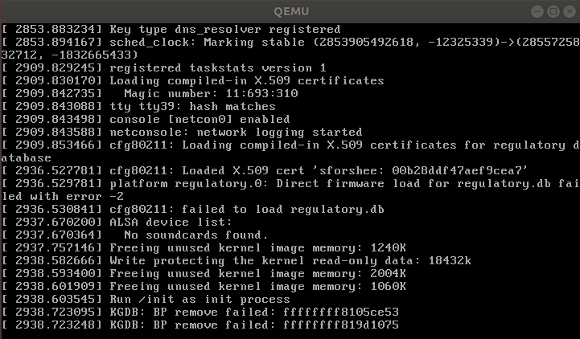

# Linux Process

## Create Process

> Use `fork()` and `vfork()` create process, and show thier difference

Comparison Chart

BASIS FOR COMPARISON|FORK()|VFORK()
--------------------|---------|--------
Basic|Child process and parent process has *separate* address spaces.|Child process and parent process *shares* the same address space.
Execution|Parent and child process *execute simultaneously*.|*Parent* process remains *suspended* till child process completes its execution.
Modification|If the child process alters any page in the address space, it is invisible to the parent process as the address space are separate.|If child process alters any page in the address space, it is visible to the parent process as they share the same address space.
Copy-on-write|fork() uses *copy-on-write* as an alternative where the parent and child shares same pages until any one of them modifies the shared page.|vfork() does not use copy-on-write.

For the following code

`fork.c`

```c
#include <stdio.h>
#include <unistd.h>
#include <stdlib.h>
#include <sys/wait.h>
#include <sys/types.h>

int main(int argc, char **argv) {

    int a = 87;
    int pid;

    printf("Result of fork()\n");
    printf("a before fork is %d\n", a);

    pid = fork();
    if(pid == 0) { // Child
        a += 3;
        exit(0);
    }
    // Parent
    wait(NULL);
    printf("a after fork is %d\n", a);
    exit(0);
}
```

`vfork.c`

```c
#include <stdio.h>
#include <unistd.h>
#include <stdlib.h>
#include <sys/wait.h>
#include <sys/types.h>

int main(int argc, char **argv) {

    int a = 87;
    int pid;

    printf("Result of vfork()\n");
    printf("a before vfork is %d\n", a);

    pid = vfork();
    if(pid == 0) { // Child
        a += 3;
        exit(0);
    }
    // Parent
    wait(NULL);
    printf("a after vfork is %d\n", a);
    exit(0);
}
```

Result

```txt
Result of fork()
a before fork is 87
a after fork is 87

Result of vfork()
a before vfork is 87
a after vfork is 90
```

**Explanation**:

`fork()` use COW. Thus when `a += 3` the child process copy the parent process's `a`. But then the child exit.
So the owner of a, the parent process, will have the original `a` value.

`vfork()` will share the variables with parent before calling `exec()` or `exit()`.
So they shared `a`. Thus the `a += 3` does impact parent's `a`.

## Important Process Information

> Explain at least the 10 most important process related information

* pid: process ID - The unique numeric identifier assigned to the process
  * used to indicate a process
  * the init process has pid 1
  * all the pid are unique pid in the same namespace
* ppid: parent process ID
  * the process's pid which create this process
* gid: process group ID
  * process group denotes a collection of one or more processes (POSIX)
  * is used to control the distribution of a signal
  * When a process replaces its image with a new image (by calling one of the `exec` functions), the new image is subjected to the same process group membership as the old image.
* sess: session ID
  * session denotes a collection of one or more process groups
  * A process group is not permitted to migrate from (join to) one session to another , and a process may not create a process group that belongs to another session.
  * A single process, the session leader, interacts with the controlling terminal in order to ensure that all programs are terminated when a user "hangs up" the terminal connection.
  * (in GUI session concept is replaced by other mechanism such as *X display manager*)
* tty (tt): terminal controlling the process
  * The tty device driver incorporates a notion of a *foreground process group*, to which it sends signals generated by keyboard interrupts
    * SIGINT ("interrupt", `Ctrl+C`)
    * SIGTSTP ("terminal stop", `Ctrl+Z`)
    * SIGQUIT ("quit", `Ctrl+\`)
* state (stat): symbolic process state
  * R: runni    ng
  * S: sleeping (may be interrupted)
  * D: sleeping (may not be interrupted)
    * used to indicate process is handling input/output
  * T: Stopped or being traced
  * Z: Zombie or "hung" process
* pri: scheduling priority
* rss: resident set size
  * the portion of memory occupied by a process that is held in main memory (RAM)
* vsz: virtual memory size
  * Size of the process in virtual memory expressed in KB
* parent
  * (this is not in the `ps`'s list)
  * Parent is the process that receives the SIGCHLD signal on child's termination
* real_parent
  * (this is not in the `ps`'s list)
  * Real parent is the thread that actually created a child process in a multithreaded environment

> In normal case parent and real_parent are the same, but for a *POSIX thread which acts as a process*, these two values may be different

```txt
$ man ps

...

KEYWORDS
     The following is a complete list of the available keywords and their meanings.  Several of them have
     aliases (keywords which are synonyms).

     %cpu       percentage CPU usage (alias pcpu)
     %mem       percentage memory usage (alias pmem)
     acflag     accounting flag (alias acflg)
     args       command and arguments
     comm       command
     command    command and arguments
     cpu        short-term CPU usage factor (for scheduling)
     etime      elapsed running time
     flags      the process flags, in hexadecimal (alias f)
     gid        processes group id (alias group)
     inblk      total blocks read (alias inblock)
     jobc       job control count
     ktrace     tracing flags
     ktracep    tracing vnode
     lim        memoryuse limit
     logname    login name of user who started the session
     lstart     time started
     majflt     total page faults
     minflt     total page reclaims
     msgrcv     total messages received (reads from pipes/sockets)
     msgsnd     total messages sent (writes on pipes/sockets)
     nice       nice value (alias ni)
     nivcsw     total involuntary context switches
     nsigs      total signals taken (alias nsignals)
     nswap      total swaps in/out
     nvcsw      total voluntary context switches
     nwchan     wait channel (as an address)
     oublk      total blocks written (alias oublock)
     paddr      swap address
     pagein     pageins (same as majflt)
     pgid       process group number
     pid        process ID
     ppid       parent process ID
     pri        scheduling priority
     re         core residency time (in seconds; 127 = infinity)
     rgid       real group ID
     rss        resident set size
     ruid       real user ID
     ruser      user name (from ruid)
     sess       session ID
     sig        pending signals (alias pending)
     sigmask    blocked signals (alias blocked)
     sl         sleep time (in seconds; 127 = infinity)
     start      time started
     state      symbolic process state (alias stat)
     svgid      saved gid from a setgid executable
     svuid      saved UID from a setuid executable
     tdev       control terminal device number
     time       accumulated CPU time, user + system (alias cputime)
     tpgid      control terminal process group ID
     tsess      control terminal session ID
     tsiz       text size (in Kbytes)
     tt         control terminal name (two letter abbreviation)
     tty        full name of control terminal
     ucomm      name to be used for accounting
     uid        effective user ID
     upr        scheduling priority on return from system call (alias usrpri)
     user       user name (from UID)
     utime      user CPU time (alias putime)
     vsz        virtual size in Kbytes (alias vsize)
     wchan      wait channel (as a symbolic name)
     wq         total number of workqueue threads
     wqb        number of blocked workqueue threads
     wqr        number of running workqueue threads
     wql        workqueue limit status (C = constrained thread limit, T = total thread limit)
     xstat      exit or stop status (valid only for stopped or zombie process)
```

* [30 Useful ‘ps Command’ Examples for Linux Process Monitoring](https://www.tecmint.com/ps-command-examples-for-linux-process-monitoring/)
* [14 Linux ps Command Practical Examples](https://linoxide.com/how-tos/linux-ps-command-examples/)
* Wikipedia
  * [Parent process](https://en.wikipedia.org/wiki/Parent_process)
  * [Process group](https://en.wikipedia.org/wiki/Process_group)
  * [Resident set size](https://en.wikipedia.org/wiki/Resident_set_size)
  * [Job control (Unix)](https://en.wikipedia.org/wiki/Job_control_(Unix))

## Find init Process

> Through kernel programming, use the relationship in `task_struct`
> to find the route to init process

* Candidate code (use `#L87` at the end of the URL will get you to the right line)
  * [`include/linux/sched.h`](https://github.com/torvalds/linux/blob/master/include/linux/sched.h#L585)
    * `task_struct`: 585
  * [`include/linux/init_task.h`](https://github.com/torvalds/linux/blob/master/include/linux/init_task.h)
  * [`kernel/fork.c`](https://github.com/torvalds/linux/blob/master/kernel/fork.c)
    * `#include <linux/init_task.h>`: 495
    * `/* Make it visible to the rest of the system, but dont wake it up yet. Need tasklist lock for parent etc handling! */`: 2015
    * `init_task_pid_links(p);`: 2052

```txt
(gdb) break init_task_pid_links
Breakpoint 2 at 0xffffffff8105ce53: file ./include/linux/list.h, line 660.
(gdb) continue
Continuing.
[Switching to Thread 7]

Thread 8 hit Breakpoint 2, copy_process (clone_flags=8421649, 
    stack_start=<optimized out>, stack_size=<optimized out>, 
    child_tidptr=<optimized out>, pid=0xffff88803b859200, 
    trace=<optimized out>, tls=<optimized out>, node=<optimized out>)
    at kernel/fork.c:2001
2001		init_task_pid_links(p);

...

(gdb) n
2011				if (is_child_reaper(pid)) {

...

2024				list_add_tail(&p->sibling, &p->real_parent->children);

...

(gdb) n
2040			attach_pid(p, PIDTYPE_PID);

...

(gdb) next
2050		cgroup_post_fork(p);

...

(gdb) n
cpu_cgroup_fork (task=0xffff88803c389880) at kernel/sched/core.c:6438
6438		update_rq_clock(rq);

...

(gdb) n
cgroup_post_fork (child=0xffff88803c389f84) at kernel/cgroup/cgroup.c:5625
5625		do_each_subsys_mask(ss, i, have_fork_callback) {

...

(gdb) n
copy_process (clone_flags=8421649, stack_start=<optimized out>, 
    stack_size=<optimized out>, child_tidptr=<optimized out>, 
    pid=0xffff88803b859200, trace=<optimized out>, tls=<optimized out>, 
    node=<optimized out>) at kernel/fork.c:2051

...

(gdb) n
kernel_thread (fn=<optimized out>, arg=<optimized out>, flags=<optimized out>)
    at kernel/fork.c:2236
2236	}
call_usermodehelper_exec_work (work=0xffff88803b859200) at kernel/umh.c:192
192			if (pid < 0) {

...

(gdb) n
process_one_work (worker=0xffff88803c0089c0, work=0xffff888034813300)
    at kernel/workqueue.c:2162

...

(gdb) n
process_one_work (worker=0xffff88803c2990c0, 
    work=0xffffffff82263860 <delayed_fput_work>) at kernel/workqueue.c:2184
2184		if (unlikely(cpu_intensive))

...

(gdb) n
worker_thread (__worker=0xffff88803c2990c0) at kernel/workqueue.c:2297
2297				if (unlikely(!list_empty(&worker->scheduled)))

...

(gdb) n
2296				process_one_work(worker, work);
(gdb) n
[Switching to Thread 562]

Thread 30 hit Breakpoint 2, copy_process (clone_flags=8421649, 
    stack_start=<optimized out>, stack_size=<optimized out>, 
    child_tidptr=<optimized out>, pid=0xffff88803b859600, 
    trace=<optimized out>, tls=<optimized out>, node=<optimized out>)
    at kernel/fork.c:2001
2001		init_task_pid_links(p);

...
```

> Then I found there are too meny threads, and they will all call `init_task_pid_links` in `copy_process`.
> So I use continue. And I found almost every thread will output single line in qemu.

```txt
(gdb) c
Continuing.
[Switching to Thread 2]

Thread 3 hit Breakpoint 2, copy_process (clone_flags=8390417, 
    stack_start=<optimized out>, stack_size=<optimized out>, 
    child_tidptr=<optimized out>, pid=0xffff88803b859700, 
    trace=<optimized out>, tls=<optimized out>, node=<optimized out>)
    at kernel/fork.c:2001
2001		init_task_pid_links(p);

QEMU:
[  1651.214970] Linux agpgart interface v0.103
```


```txt
(gdb) c
Continuing.
[New Thread 832]
[Switching to Thread 832]

Thread 47 hit Breakpoint 2, copy_process (clone_flags=8421649, 
    stack_start=<optimized out>, stack_size=<optimized out>, 
    child_tidptr=<optimized out>, pid=0xffff88803b859600, 
    trace=<optimized out>, tls=<optimized out>, node=<optimized out>)
    at kernel/fork.c:2001
2001		init_task_pid_links(p);

QEMU:
[  1668.251978] loop: module loaded
```

> But then I invoke continue about 20 times. It just show another one on qemu.

```txt
QEMU:
[  1996.659353] scsi host0: ata_piix
```

> Then after another few times invoking continue

```txt
QEMU:
[  2085.422561] scsi host1:ata_piix
[  2085.424221] ata1: PATA max MWDMA2 cmd 0x1f0 ctl 0x3f6 bmdma 0xc040 irq 14
[  2085.424374] ata2: PATA max MWDMA2 cmd 0x170 ctl 0x376 bmdma 0xc048 irq 15
```

> And then I'll just type some of the more important message (I thought) from qemu.

* e100: Intel(R) PRO/100 Network Driver and its Copyright
* e1000: Intel(R) PRO/1000 Network Driver and its Copyright
* PCI Interrupt Link [LNKC] enabled at IRQ 11
* .....
* ata1.00: ATA-7: QEMU HARDDISK
* ata2.00: ATAPI: QEMU DVD-ROM
* input: ImExPS/2 Generic Explorer Mouse as /devices/platform/i8042/serio1/input/input3
* scsi 0:0:0:0: Direct-Access ATA QEMU HARDDISK 2.5+ PQ: 0 ANSI: 5
* sd 0:0:0:0: Attached scsi generic sg0 type 0
* scsi 1:0:0:0: CD-ROM ....
* ......

> Now I found it is still creating New Thread. And the number is going up to exceed 1000...

* Internet... IPv6, IPv4....
* ...

> Then I missed after a quick click of continue...

* Freeing unused kernel image memory: 1024K
* Write protecting the kernel read-only data: 18432k
* Freeing unused kernel image memory: 2004K
* Freeing unused kernel image memory: 1060K
* [ 2938.603545] Run /init as init process
* ...


> So I decide to try to trace code again...

```sh
$ find . -name *.c | xargs grep -rn "as init process"
./init/main.c:1005:	pr_info("Run %s as init process\n", init_filename);
```



> Then I do it again... And I found the KGDB error will not always show after `Run /init as init process`... and the address are different

```txt
(gdb) break run_init_process
Breakpoint 1 at 0xffffffff810003d0: file init/main.c, line 1003.
(gdb) break init/main.c:1005
Breakpoint 2 at 0xffffffff810003d1: file init/main.c, line 1005.
(gdb) c
Continuing.
[New Thread 874]
[New Thread 875]
[New Thread 878]
[New Thread 881]
[New Thread 910]
[New Thread 916]
[New Thread 1009]

Thread 2 hit Breakpoint 1, run_init_process (
    init_filename=0xffffffff81fd251f "/init") at init/main.c:1003
1003	{
(gdb) n
```

> And it stuck... so I do it again...

```txt
(gdb) break init/main.c:1005
Breakpoint 2 at 0xffffffff810003d1: file init/main.c, line 1005.
(gdb) c
Continuing.
[New Thread 875]
[New Thread 876]
[New Thread 878]
[New Thread 881]
[New Thread 910]
[New Thread 919]
[New Thread 1009]

Thread 2 hit Breakpoint 1, run_init_process (
    init_filename=0xffffffff81fd251f "/init") at init/main.c:1005
1005		pr_info("Run %s as init process\n", init_filename);
(gdb) n
^C^CThe target is not responding to interrupt requests.
Stop debugging it? (y or n) Quit
```

> And again..., and even when I break the next line (i.e. init/main.c:1006) it will also stuck. (QEMU lastest output: hrtimer: interrupt took 19617210 ns)
>
> Anyway it's called by `run_init_process` and then run `/sbin/init`
